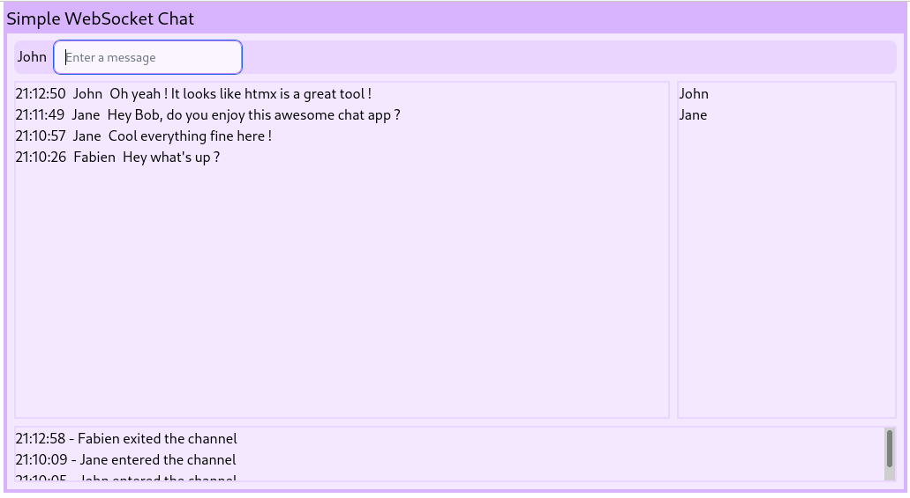

This post aims to introduce [htmx][htmx] usage through a very simple chat application.
We'll expose and explain some code snippet from our [sChat playground project][sChat].




The playground application is written in Haskell but htmx usage is not tied to a
specific language, the use  of another language like Python would have been possible.

## What is htmx ?

htmx provides an easy way to build dynamic WEB frontends without the need to write
a ton of Javascript code. htmx is itself a Javascript library that:

- reacts to HTML attributes to fire events like AJAX requests
- updates the DOM based on server responses

With htmx every HTML element can issue requests to the backend, and every element
can be updated via the backend (not just the entire page).

## Why ?

Htmx brings lot of facilities to build WEB applications using only your favorite backend
language and simply relying on htmx facilities for handling frontend events and
rendering frontend elements. Indeed it is often difficult to manage two different
toolchains for the backend and the frontend and even this is even worst when you expect to share data types between both.

## Usage of htmx to build the sChat application

To build the application we relied on serveral libraries:

* [Servant][Servant]: To build the web application (to handle routes and define route' handlers)
* [WebSockets][WebSockets]: To setup a WebSocket handler for enabling communication between the frontend and the backend
* [Lucid][Lucid]: A DSL to render HTML
* [htmx][htmx]: Run on the client's browser, to render the application
* [Tailwindcss][Tailwindcss]: Run on the client's browser, to apply CSS styles

But to keep this post short, we'll not dig into the usage of Servant or Lucid but just
focus on interactions between the frontend and the backend using htmx.

## htmx usage to build sChat

### Backend HTTP endpoints

sChat implements three endpoints under the following routes:

- "/": This handler returns plain HTML data. We'll serve a HTML bootstrap to connect to the WebSocket. 
- "xstatic": The handler serves static files. We'll serve htmx and tailwindcss JS libraries
- "ws": The WebSocket handler

This is defined by the following Servant type:

```haskell
-- | The sChat Servant API definition
type SChatAPIv1 =
  Get '[HTML] (Html ())
    :<|> "xstatic" :> Raw
    :<|> "ws" :> WebSocket
```

### The root "/" endpoint

```haskell
sChatHTMLHandler :: Html ()
sChatHTMLHandler = do
  doctypehtml_ $ do
    head_ $ do
      title_ "Simple WebSocket Chat "
      meta_ [name_ "viewport", content_ "width=device-width, initial-scale=1.0"]
      xstaticScripts xStaticFiles
    body_ $ do
      div_ [class_ "container mx-auto", hxWS "connect:/ws"] $
        div_ [id_ "schat"] ""

-- | We need static assets HTMX and Tailwindcss
xStaticFiles :: [XStatic.XStaticFile]
xStaticFiles = [XStatic.htmx, XStatic.tailwind]

hxWS = makeAttribute "hx-ws"
```

This function defines the HTML content to be returned to the client after a connection on "/".

The head returns `script` tags to tell the browser to load htmx and Tailwindcss.

The body defines a `div` with the `hx-ws` attribute to tell htmx to connect
on the `/ws` backend's endpoint. See [hx-ws][hx-ws] for details.

Notice the `id="schat"` attribute, the backend will reference it to update the client's DOM.

When the client's browser open sChat, the first and only thing it does is to connect
to the Web Socket.

### The '/ws' WebSocket handler

```haskell
-- This function loops until the client disconnect
wsChatHandler :: SChatS -> WS.Connection -> Handler ()
wsChatHandler state conn = do
  liftIO $ WS.withPingThread conn 5 (pure ()) $ do
    -- Send the rest of WEB UI to the client
    WS.sendTextData conn $ renderBS renderSChat
    -- Handle the client
    handleClient

-- The WEB app UI
renderSChat :: Html ()
renderSChat = do
  div_ [id_ "schat", class_ "h-auto"] $ do
    div_ [class_ "bg-purple-100 border-4 border-purple-300 w-full h-full"] $ do
      title
      chatInput Nothing
      chatDisplay
      chatNotices
  where
    title = p_ [class_ "mb-2 pb-1 bg-purple-300 text-xl"] "Simple WebSocket Chat"
    chatDisplay = do
      div_ [id_ "chatroom", class_ "flex flex-row space-x-2 mx-2 my-2 h-96"] $ do
        roomChat
        roomMembers
      where
        roomChat = do
          div_ [id_ "chatroom-chat", class_ "flex-auto w-3/4 h-full"] $ do
            div_
              [ id_ "chatroom-content",
                class_ "overflow-auto border-2 border-purple-200 h-full max-h-full"
              ]
              ""
        roomMembers = do
          div_
            [ id_ "chatroom-members",
              class_ "overflow-auto border-2 border-purple-200 flex-auto w-1/4 h-full max-h-full"
            ]
            ""
    chatNotices = do
      div_
        [ id_ "chatroom-notices",
          class_ "overflow-auto mb-2 mx-2 border-2 border-purple-200 h-16 max-h-full"
        ]
        $ ""

--  The chat's input field
chatInput :: Maybe Text -> Html ()
chatInput loginM = do
  let inputFieldName = if isJust loginM then "chatInputMessage" else "chatInputName"
  let inputFieldPlaceholder = if isJust loginM then "Enter a message" else "Enter your name"
  -- hx-ws attribute tells HTMX to send a payload on the WebSocket when the form is submitted
  form_ [hxWS "send:submit", id_ "chatroom-input", hxSwapOOB "innerHTML", class_ "mx-2 bg-purple-200 rounded-lg"] $ do
    span_ $ do
      maybe (span_ [] "") (\login -> span_ [class_ "pl-1 pr-2"] $ toHtml login) loginM
      input_
        [ type_ "text",
          class_ "text-sm rounded-lg bg-purple-50 border border-purple-300 focus:border-purple-400",
          -- The payload sent by HTMX can be identified via the name attribute
          name_ inputFieldName,
          id_ "chatroom-input-field",
          placeholder_ inputFieldPlaceholder
        ]
    -- Ensure the field got the focus
    script_ "htmx.find('#chatroom-input-field').focus()"
```

As soon as a new WS connection is established we enter in `wsChatHandler` with a reference to WS's conn object.

First, `wsChatHandler` sends the application UI as defined by `renderSChat` on the WS. `renderSchat` defines the following UI blocks:

- The title
- The input field that the user will use enter a login name and send messages
- The chat content block to display chat' messages
- The notice block to display notice' messages (like user connected, ...)
- The room members block to display connected clients

Some HTML tags own an id attribute mainly for htmx to be able to [swap][hx-swap-oob] the content based on the payload send back by the backend to the browser.

Furthermore we add some Tailwindcss classes to prettify the UI.

Here are the first bytes received from backend by the client over the WS:

```html
<div id="schat" class="h-auto"><div class="bg-purple-100  ...
```

As you could see, this is just pure HTML content. htmx swaps the content of the `chat` div
on DOM by the content received from the backend. At that point the UI on the browser is fully rendered.

#### Handling the client login


The `renderSchat` function renders an `input` field with a `chatInputMessage`'s name attribute. The parent's `form` (`chatroom-input`) set an attribute `hx-ws: "send:submit"`.

When the `form` is validated the following JSON payload is sent over the WebSocket by htmx.

```json
{
  "chatInputName": "Fabien",
  "HEADERS": {
    "HX-Request":"true",
    "HX-Trigger":"chatroom-input",
    "HX-Trigger-Name":null,
    "HX-Target":null,
    "HX-Current-URL":"http://127.0.0.1:8091/"
  }
}
```

Our backend needs to react to that payload. For sChat, we need to wait for a such payload
in order to validate the new client login. To do so, the `waitForLoginPayload` function blocks until a payload with a key name `chatInputName` is received on the WS.
Then, the function returns the login to the caller function.

```haskell
waitForLoginPayload :: IO Text
waitForLoginPayload = do
  -- Wait until the an input name
  wsD <- WS.receiveDataMessage conn
  case extractMessage wsD "chatInputName" of
    Just login -> pure login
    Nothing -> waitForLoginPayload

extractMessage :: WS.DataMessage -> Text -> Maybe Text
extractMessage dataMessage keyName =
  case dataMessage of
    WS.Text bs _ -> do
      case bs ^? key keyName of
        Just (String m) -> Just m
        _ -> Nothing
    _ -> Nothing
```

After the client's login we want to:

- refresh the input `form`
- display the login name in front of the `input` field
- change the `input` placeholder text

To so that, we simply send a new `form` (using the `renderInputChat` function) to
the client via the WS and rely on the [swap][hx-swap-oob] feature to get the form updated.
Note that, we use a bit of Javascript to ensure that the `input` field get the focus.

```haskell
  ...
  ncE <- tryAny waitForLogin
  case ncE of
    Right (Just client) -> do
      -- Replace the input login box with the input message box
      WS.sendTextData conn $ renderInputChat client.cLogin
      -- Start handling the acknowledged client
      handleConnected client
  ...

-- Helper to render the chat's input field
renderInputChat login = renderBS . chatInput $ Just login
```

#### Handling client messages

Handling messages (input and rendering) follows the same technic as of waiting for a
message input payload on the WS and updating the client DOM via the WS.

After a client is 'connected', sChat starts two threads:

- a `recv` thread that continuously waits for any message payload appearing on the WS.
- a `send` thread that continuously reads the client's queue and send back the right
  HTML payload via the WS to the client.

When a message payload appears on the WS then the `recv` thread calls the `extractMessage`
function and creates an `EMessage` data that is sent to all connected client's queue.
Then the `send` thread reads the queue and sends back the right payload via the WS to the client.

The `EMessage` is rendered using the `afterbegin` [swap][hx-swap] method. Which means
that we insert the response before previous `chatroom-message` elements.


```haskell
  ...
  case extractMessage wsD "chatInputMessage" of
    Just inputMsg -> do
      now <- getCurrentTime
      dispatchToAll $ EMessage (Message now myLogin inputMsg)
    Nothing -> pure ()
  ...
```

```haskell
  renderMessage :: Message -> Html ()
  renderMessage msg = do
    -- The id and hx-swap-oob tell HTMX which elements to update in the DOM
    div_ [id_ "chatroom-content", hxSwapOOB "afterbegin"] $ do
      div_ [id_ "chatroom-message"] $ do
        span_ [id_ "chatroom-message-date", class_ "pr-2"] . toHtml $ formatDate (msg.date)
        span_ [id_ "chatroom-message-login", class_ "pr-2"] . toHtml $ unpack (msg.mLogin)
        span_ [id_ "chatroom-message-content"] . toHtml $ unpack (msg.content)
```

We wont go over the `chatroom-members` and `chat-notices` divs update because
they are updated using the htmx's swap technic.

## To conclude

As you seen, relying on htmx, and especially thanks to its WebSocket feature, we were able
to build a dynamic WEB UI for our chat application without the need:

- to build a complex REST API.
- a Javascript client to perform I/O with our backend and render the client DOM.
- to use two different toolchains.

The use of the WebSocket was convenient for the chat application but htmx support
the regular HTTP verb (GET, POST, ...) which are more adapted for general purpose
WEB applications.

Personnaly, I feel really happy to have learnt a bit about HTMX and got the ability
to write pretty quickly a decent WEB frontend for server side applications. I'll look
forward to use htmx for more complex and dynamic applications.


[htmx]: https://htmx.org
[sChat]: https://github.com/morucci/schat/tree/434b27d34af95bd9c9282812c57e133a6bdd131c
[Servant]: https://docs.servant.dev
[WebSockets]: https://hackage.haskell.org/package/websockets
[Lucid]: https://chrisdone.com/posts/lucid/
[Tailwindcss]: https://tailwindcss.com/
[hx-ws]: https://htmx.org/attributes/hx-ws/
[hx-swap]: https://htmx.org/attributes/hx-swap/
[hx-swap-oob]: https://htmx.org/attributes/hx-swap-oob/
