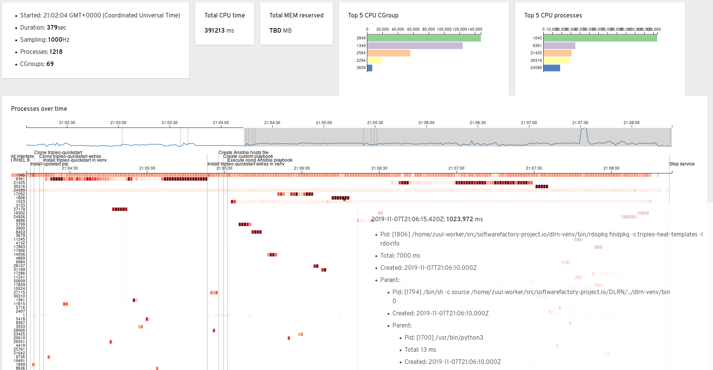
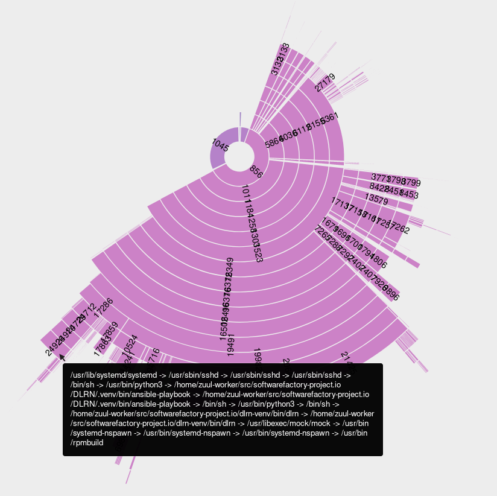

Using eBPF programs to profile Zuul CI builds
#############################################

:date: 2019-11-07 00:00
:category: blog
:authors: tristanC

This article introduces a new role named `ci-tracer`_ which leverages BPF technology
to profile `Zuul CI`_ jobs and gain new insights over builds' performance.

The Extended Berkeley Packet Filter
-----------------------------------

The `BPF`_ virtual machine is a general purpose RISC instruction set that
can interpret custom programs which are loaded from the user space.
While it was originally designed for network packet processing,
the Linux kernel implements an extended version, named `eBPF`_, that can be
used to safely attach programs to various tracepoints and inspect kernel data structures.
If you are running a modern Linux system, chances are you already use BPF programs:

.. code-block:: bash

   # List running BPF programs
   $ sudo ls -l /proc/*/fd | grep bpf

For the purpose of this article we are only going to use the **TRACEPOINT** and **KPROBE** types of programs.
Other types of programs are currently being used for all sorts of things, such as, the new
CgroupV2 which implements an eBPF based device controller.

While the BPF bytecode can be written by hand and loaded manually, we are going to use the `BCC`_
toolkit to implement the `ci-tracer`_ role.

BCC: BPF Compiler And Python Frontend
-------------------------------------

The `BCC`_ project provides an easy to use toolkit to load BPF programs using
Python. It comes with ready-to-use examples to get started, for example, `cpudist`_
can show the cpu time distribution of every processes running on a system:

.. code-block:: bash

   $ sudo /usr/share/bcc/tools/cpudist -P 5
   Tracing on-CPU time... Hit Ctrl-C to end.

   pid = 271090 emacs

     usecs               : count     distribution
         0 -> 1          : 0        |                                        |
         2 -> 3          : 0        |                                        |
         4 -> 7          : 0        |                                        |
         8 -> 15         : 0        |                                        |
        16 -> 31         : 1        |********************                    |
        32 -> 63         : 0        |                                        |
        64 -> 127        : 2        |****************************************|
       128 -> 255        : 2        |****************************************|
       256 -> 511        : 1        |********************                    |
       512 -> 1023       : 0        |                                        |
   [...]

This `cpudist`_ tool works by attaching a kprobe program to the *finish_task_switch*
function that gets evaluated each time the kernel switches tasks on a CPU.
The BPF program does the following:

* Record the start time of the next task.
* If it knows when the previous task started, it records how long the task spent on CPU.

The Python code only prints the recorded value periodically.

This is a very efficient process, as the intensive work is running inside the BPF virtual
machine which can interpret the program frequently with minimal overhead. Indeed such a low-level
*finish_task_switch* kprobe can be triggered millions of times per second on a busy system.

The `ci-tracer`_ implements a custom BPF program to collect fine grained information from `Zuul CI`_
builds.

Introducing ci-tracer
---------------------

A `Zuul CI`_ build is composed of Ansible tasks that execute processes on ephemeral test instances.
The `ci-tracer`_ is designed to load a custom BPF program in the test instance to gather information
about the processes. This initial implementation collects on-CPU times which this article will discuss
further in the conclusion.

The implementation is composed of two components:
* a BPF program `agent.c`_, and
* a Python service `agent.py`_.

Let's look at the BPF Program.

The BPF Program
^^^^^^^^^^^^^^^

From the kernel point of view, the unit of computing is a *task* that is represented by a *task_struct*.
A task (also called thread) is assigned an identifier named *pid* and multiple tasks can be grouped by a *tgid*.
Note that this differs from the user point of view where a *pid* is actually a *tgid*...
This is confusing when going back and forth between userland and kernelland, thus we will name:

* A process is an userland *pid*, kernelland *tgid*
* A task (or thread) is an userland *tid*, kernelland *pid*

This initial implementation doesn't collect individual task.
Instead the measurements are grouped by *tgid*.

On-CPU Measure
..............

Two data structures are used to measure the time each process spent on-cpu:

.. code-block:: c

   // Internal data to record next task start time
   BPF_HASH(start_time, u32, u64, PID_MAX);
   // Shared data of tgid and oncpu time
   BPF_HASH(oncpus, u32, u64, PID_MAX);

Then the *finish_task_switch* probe does the following:

.. code-block:: c

   int finish_task_switch(struct pt_regs *ctx, struct task_struct *prev)
   {
     // At this time, prev is not running, next is going to be scheduled
     u64 cur_time = bpf_ktime_get_ns();
     u32 pid = prev->pid;
     u32 tgid = prev->tgid;
     if (tgid) {
       u64 *prev_time = start_time.lookup(&pid);
       if (prev_time != NULL) {
         // Previous task start time was recorded, compute the time it spent oncpu
         u64 delta = (cur_time - *prev_time);
         if (delta > 0 && delta < INTERVAL_NS) {
           // Per tgid cpu info
           u64 *oncpu = oncpus.lookup(&tgid);
           if (oncpu != NULL) {
             delta += *oncpu;
           }
           // Record time per task group
           oncpus.update(&tgid, &delta);
         }
       }
     }

     // Record the start time of the next task
     u32 next_pid = bpf_get_current_pid_tgid() & 0xffffffff;
     cur_time = bpf_ktime_get_ns();
     start_time.update(&next_pid, &cur_time);
     return 0;
   }

This program updates the *oncpus* hash table with the processes (userland pid) as key and
the cpu times in nanoseconds as value.

By the time the Python service reads the *oncpus* hash table, the process may have died.
Thus, we use another probe to record the processes information.

Execution Event
...............

As demonstrated by the BCC `execsnoop`_ tool, we can get new processes information, with a *perf* channel:

.. code-block:: c

   // The exec perf channel
   BPF_PERF_OUTPUT(execs);

   // The type of event sent back to userland
   enum execs_perf_type {
     EVENT_TYPE_INIT,
     EVENT_TYPE_ARGS,
     EVENT_TYPE_EXEC,
     EVENT_TYPE_EXIT,
     EVENT_TYPE_FORK,
   };

   // The event structure
   struct exec_info_t {
     enum execs_perf_type type;
     u32 pid;
     u32 ppid;
     u32 cgroup;
     char arg[ARGSIZE];
   };

Then we attach multiple probes and tracepoints on the different process lifecycle steps:

* KPROBE on the clone syscall: when a thread is created (unused at the moment).
* TRACEPOINT_PROBE(sched, sched_process_fork): when a process forks.
* KPROBE on the execve syscall: when a process executes a command.
* KPROBE on the execve ret syscall: when a process succeeds in executing a command.
* TRACEPOINT_PROBE(sched, sched_process_exit): when a process exits.

Each probe can send process information through the *execs* perf channel created earlier,
for example, when a process forks:

.. code-block:: c

   TRACEPOINT_PROBE(sched, sched_process_fork)
   {
     struct exec_info_t inf = {};
     inf.type = EVENT_TYPE_FORK;
     inf.pid = args->child_pid;
     inf.ppid = args->parent_pid;
     inf.cgroup = bpf_get_current_cgroup_id() & 0xffffffff;
     execs.perf_submit(args, &inf, sizeof(inf));
     return 0;
   }

Check out the `agent.c`_ source code to see how the other execve probes are implemented.

The `ci-tracer`_ BPF program collects process lifecycle events and the time they spend on-cpu.
Next let's look at the Python service.

The Python Service
^^^^^^^^^^^^^^^^^^

The purpose of the Python service `agent.py`_ is to process the information collected by the
BPF program. It is composed of two parts:

* a callback for the *execs* perf event, and
* a main loop to read the *oncpus* measures.

Its goal is to serialize the measurements so that they can be analyzed after the build is completed.

BPF To Userland
...............

The callback is executed each time an *execs* perf event occurs, and it keeps track
of the processes information in a dictionary like so:

.. code-block:: python

   # Cache pid info
   pids: Dict[int, Process] = {}

   def handle_exec_event(event):
       """Process execs perf event"""
       try:
           if event.type == EventType.FORK:
               # Copy the parent process info
               parent = pids[event.ppid]
               pid = Process(event.pid, event.ppid, parent.cid, parent.argv)
               pid.start = int(monotonic() - start_time)
               pids[event.pid] = pid

           ...
       except KeyError:
           # Sometime pids are unknown when process clone or events are out of order.
           # It's ok, we only care about pids that successfully execve.
           # warn(f"Unknown {event.pid} {event.ppid} for {event.type} ({event.arg})")
           pass

   bpf.attach_kprobe(event=bpf.get_syscall_fnname("execve"), fn_name="syscall__execve")
   bpf.attach_kretprobe(event=bpf.get_syscall_fnname("execve"), fn_name="do_ret_sys_execve")
   bpf["execs"].open_perf_buffer(lambda c, d, s: handle_exec_event(bpf["execs"].event(d)))

Then main loop is in charge of collecting the *oncpus* measures and it generates the
report periodically:

.. code-block:: python

   def collect_cpu(oncpus: Dict[Perf, Perf]) -> None:
       """Periodically dump the oncpus content"""
       cpu_start = monotonic()
       interval_sec = args.interval / 1000
       while running:
           # Clock based sleep to take into account the serialization time below
           clock_time = interval_sec - (monotonic() - cpu_start)
           if clock_time > 0:
               sleep(clock_time)
           cpu_start = monotonic()
           buffer: List[Tuple[int, float]] = []

           # Fast loop to extract oncpus measures
           for k, v in oncpus.items():
               ts: float = v.value  / 1e6
               if args.min_cpu and ts < args.min_cpu:
                   continue
               pid: int = k.value
               if pid not in pids:
                   # Skip unknown pids
                   continue
               buffer.append((pid, ts))
           oncpus.clear()

           # Serialize events
           relnow = cpu_start - start_time
           tl = ['{"ts": %.2f},' % relnow]
           for pid, ts in buffer:
               inf = pids[pid]
               if inf.start == -1 or (relnow - inf.start) < .5:
                   # Process started less than .5 second ago
                   continue
               if pid not in pids_serialized:
                   # Put the pid informations in the report
                   inf.serialize()
                   pids_serialized.add(pid)
               tl.append('{"cpu": %d, "v": %.3f},' % (pid, ts))
           print("".join(tl), file=output)

   bpf.attach_kprobe(event="finish_task_switch", fn_name="finish_task_switch")
   collect_cpu(bpf["oncpus"])

The goal is to prevent overwhelming the report and have a low signal-to-noise ratio
while achieving a minimal overhead.

The Report Format
.................

The service produces a stream of JSON objects:

* When a new process is measured, its information such as start time,
  command line arguments, cgroups, and parents are serialized like so:

.. code-block:: json

   {"cgr": 2624, "v": "user.slice/user-1000.slice/session-55.scope"},
   {"pid": 5144, "ppid": 5105, "t": 110, "cg": 2624, "v": ["/bin/sh", "-c", "/usr/bin/python3 && sleep 0"]},
   {"pid": 5173, "ppid": 5144, "t": 110, "cg": 2624, "v": ["/usr/bin/python3"]},
   {"pid": 5278, "ppid": 5173, "t": 110, "cg": 2624, "v": ["/usr/bin/tox", "-e", "py37"]},

* Then periodically, the *oncpus* measures are dumped like so:

.. code-block:: json

   {"ts": 111.16}, {"cpu": 5173, "v": 41.357}, {"cpu": 5278, "v": 169.483}

To save space, all the timestamps are relative to the start time and the measures are in milliseconds.
With such reports, we can now build a visualization:

The Data Driven Document (D3js) Report
^^^^^^^^^^^^^^^^^^^^^^^^^^^^^^^^^^^^^^

The current report interface looks like this:

The time serie data points are grouped into a list of processes sorted by total CPU time
and represented as a heatmap.
The `D3js`_ library provides an efficient framework to render large datasets as it lets
us display each data point without normalizing the data:

.. code-block:: javascript

   // dates is a list of Date object created for each "ts" event

   const y = d3.scaleBand().range([0, height]).domain(data.map(d => (d.pid))).padding(0.1),
         x = d3.scaleUtc().range([0, width]).domain([startDate, endDate]),

   /* axis labels, notes, ... */

   // Each row is a group
   const row = svg.selectAll('.row')
         .data(data)
         .enter()
         .append('svg:g')
         .attr('class', 'row')

   // Each cpu_event result in a new cell
   const cell = row.selectAll('.cell')
       .data(d => d.cpu_events.map(e => ({
         y: d.id, x: dates[e[0]], v: e[1]
       })))
       .enter().append('rect')
       .attr('class', 'cell')

   // Redraw sets objects coordinates
   function redraw () {
     const domain = x.domain(),
           bw = width / ((domain[1] - domain[0]) / 1000)
     cell
       .attr('x', d => x(d.x) + 1)
       .attr('y', d => y(d.y))
       .attr('width', bw - 1)
       .attr('height', rowHeight - 1)
       .attr('fill', d => myColor(d.v / 1000))
   }

Thanks to the *scaleUtc* object it is easy to annotate the map with the Ansible task timestamps
and zoom in at particular areas of interest. Check out the code in the `web directory`_

Another interesting visualization is the sunburst where pid hierarchy are displayed on a circle:

Conclusion
----------

Using eBPF programs to profile CI jobs let us efficiently compile large amount of data to gain
new perspective on builds' performance.
While this initial version only collects on-CPU times, it accounts for less than 0.1% of the total job
load and it produces about 100KB of data per minute.

However this work is still in early development and the following are priorities:

* Better heatmap interface with cgroup navigation.
* Add more kprobes or task_struct data to measure:
  * Block devince IO,
  * Network traffic,
  * Memory pressure,
  * Syscalls count, ...
* Update the heatmap to split the cell for each type of measurements.
* Improve Ansible task process collection to get the actual module name.

If you would like to give this a try or get involved, please reach out by mail or on the
#softwarefactory and #zuul Freenode channels.

.. _`ci-tracer`: https://softwarefactory-project.io/cgit/software-factory/ci-tracer/tree/
.. _`Zuul CI`: https://zuul-ci.org/
.. _`BPF`: https://en.wikipedia.org/wiki/Berkeley_Packet_Filter
.. _`eBPF`: https://www.kernel.org/doc/html/latest/bpf/
.. _BCC: https://github.com/iovisor/bcc
.. _cpudist: https://github.com/iovisor/bcc/blob/master/tools/cpudist.py
.. _execsnoop: https://github.com/iovisor/bcc/blob/master/tools/execsnoop.py
.. _`D3js`: https://d3js.org
.. _`agent.c`: https://softwarefactory-project.io/cgit/software-factory/ci-tracer/tree/src/agent.c
.. _`agent.py`: https://softwarefactory-project.io/cgit/software-factory/ci-tracer/tree/src/agent.py
.. _`web directory`: https://softwarefactory-project.io/cgit/software-factory/ci-tracer/tree/src/web/
