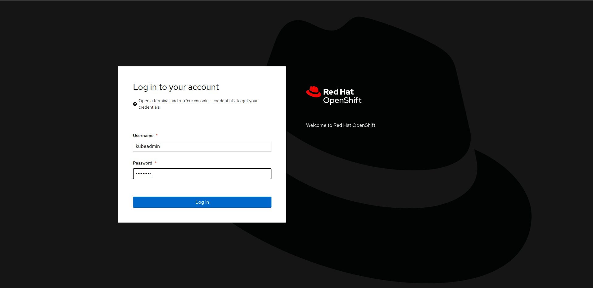
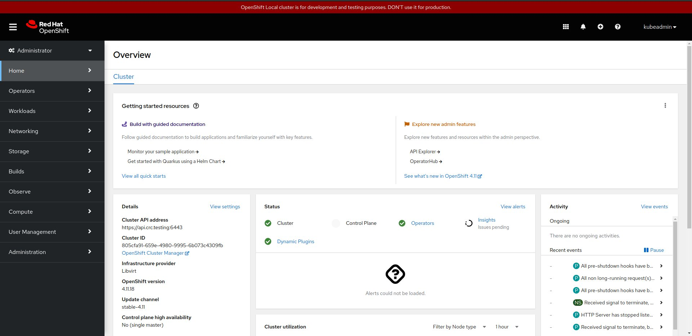
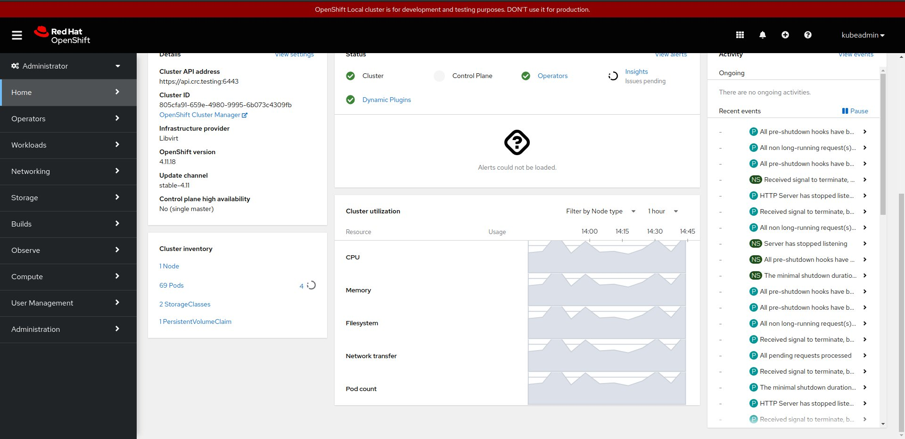
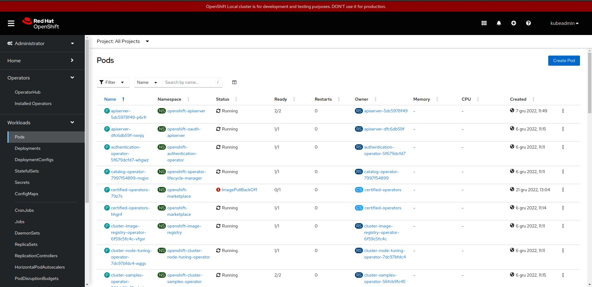
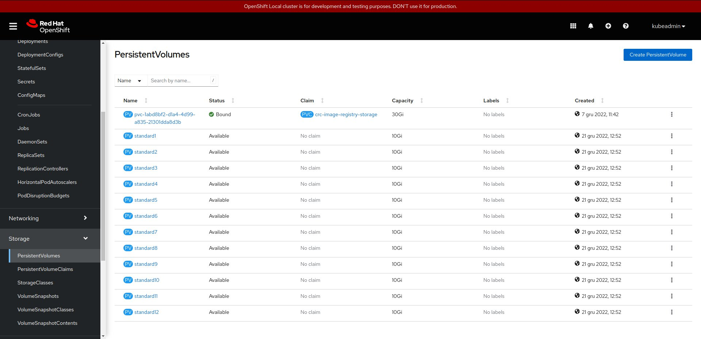
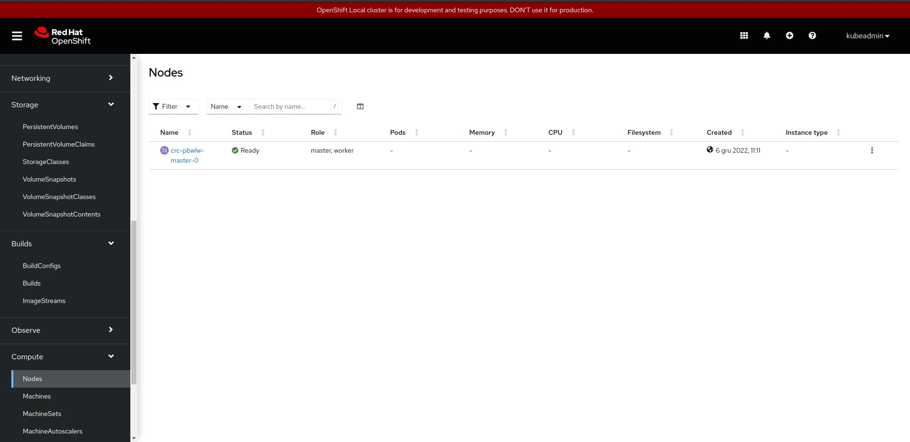

Ingress on CodeReady Containers
###############################

:date: 2022-12-22
:category: blog
:authors: dpawlik

CRC - CodeReady Containers
==========================

Why we are using it?
--------------------

The CRC (Red Hat CodeReady Containers) is a solution to deploy OpenShift
cluster on your local machine in minutes.
Red Hat OpenShift provides a complete solution that includes a stable Kubernetes
engine with robust security and many integrated capabilities required to
operate a complete application platform. It comes in several
editions including as a fully managed public cloud service or
self-managed on infrastructure across datacenters, public clouds, and edge. [`source <https://www.redhat.com/en/technologies/cloud-computing/openshift/red-hat-openshift-kubernetes#benefits>`]

That project requires is very resource-hungry, because it deploys a dedicated 
libvirt instance (virtual machine), configures network, deploys Kubernetes inside 
the instance (VM) and on the end deploys OpenShift with operators.
All new pods that would be spawned later by `sf-operator` would be running inside
that VM, that's why the minimum of our configuration to deploy CRC and `sf-operator`
took 14 GB of RAM, 6 vcpus and 60 GB of HDD.

The SF Operator project is already tested on a vanilla Kubernetes deployment, however
we cannot assume that all of Software Factory Project users are using it.
The future Software Factory release that would be based on Kubernetes deployment
should be also tested on different platform. That's why we aim to
create an universal operator, that would be possible to deploy on many
Kubernetes base clusters.

How to setup CRC?
-----------------

The CRC deployment is easy to deploy. The CRC community has simple `documentation <https://crc.dev/crc/>`.
Also the OpenStack community creates own repository to easy setup
the environment by following `manual <https://github.com/openstack-k8s-operators/install_yamls/tree/master/devsetup#crc-automation--tool-deployment>`.

The Software Factory Project uses the crc Ansible role, which
you can find in `sf-infra <https://softwarefactory-project.io/r/plugins/gitiles/software-factory/sf-infra>` repository.

Simply playbook to deploy CRC looks like:

NOTE: That playbook requires to reboot the host to apply nested
virtualization. It is also optional procedure that can improve performance.
However, it might not work with some CPUs.
More information `here <https://github.com/crc-org/crc/wiki/Nested-virtualization-setup>`

.. code-block:: yaml

   - hosts: crc.dev
     vars:
       crc_debug: true
       nested_virtualization: false
       openshift_pull_secret: |
         < ADD YOUR PULL-SECRET.TXT HERE>
     pre_tasks:
       - name: Update packages
         become: true
         package:
           name: '*'
           state: latest
       - name: Install packages
         become: true
         yum:
           name:
             - qemu-kvm-common
           state: present
       - name: Ensure CentOS runs with selinux permissive
         become: true
         selinux:
           policy: targeted
           state: permissive
     # NOTE: Enabling nested virtualization is optional, but
     # it will improve performance. It might not work on some CPUs!
     - name: Enable nested virtualization
       block:
         - name: Check if CPU vendor is Intel
           shell: |
             grep -qi intel /proc/cpuinfo
           register: _intel_vendor
         - name: Enable nested virtualization - Intel
           become: true
           lineinfile:
             path: /etc/modprobe.d/kvm.conf
             regexp: '^#options kvm_intel nested=1'
             line: 'options kvm_intel nested=1'
           when: _intel_vendor.rc == 0
           register: _nested_intel
         - name: Enable nested virtualization - AMD
           become: true
           lineinfile:
             path: /etc/modprobe.d/kvm.conf
             regexp: '^#options kvm_amd nested=1'
             line: 'options kvm_amd nested=1'
           when: _intel_vendor.rc == 1
           register: _nested_amd
         - name: Reboot host to apply nested virtualization change
           become: true
           reboot:
           when: _nested_intel.changed or _nested_amd.changed
       when: nested_virtualization | default(false)
     roles:
       - extra/crc
     ## NOTE: Below tasks are not neccesary to execute. There might be helpful
     ## on creating the VM snapshot after the deployment.
     #post_tasks:
     #  - name: Remove pull-secret file
     #    file:
     #      path: pull-secret.txt
     #      state: absent
     #  - name: Ensure cloud-init is installed
     #    become: true
     #    package:
     #      name:
     #        - cloud-init
     #        - golang
     #      state: present
     #  - name: Cleanup dnf cache
     #    become: true
     #    shell: dnf clean all
     #  - name: Create crontab entry to generate local ssh keys
     #    become: true
     #    copy:
     #      content: |
     #        @reboot root /usr/bin/ssh-keygen -A; systemctl start sshd
     #      dest: /etc/cron.d/ssh_gen
     #  - name: Set proper selinux label
     #    become: true
     #    shell: |
     #      /usr/bin/chcon system_u:object_r:system_cron_spool_t:s0 /etc/cron.d/ssh_gen
     #  - name: Remove pull secret content from the OpenShift Cluster
     #    shell: |
     #      mc_before_removing_pullsecret=$(/usr/local/bin/oc get mc --sort-by=.metadata.creationTimestamp --no-headers -oname)
     #      /usr/local/bin/oc replace -f https://raw.githubusercontent.com/crc-org/snc/master/pull-secret.yaml
     #      mc_after_removing_pullsecret=$(/usr/local/bin/oc get mc --sort-by=.metadata.creationTimestamp --no-headers -oname)
     #      while [ "${mc_before_removing_pullsecret}" == "${mc_after_removing_pullsecret}" ]; do
     #          echo "Machine config is still not rendered"
     #          mc_after_removing_pullsecret=$(/usr/local/bin/oc get mc --sort-by=.metadata.creationTimestamp --no-headers -oname)
     #      done

where the pull-secret.txt can be generated `here <https://cloud.redhat.com/openshift/create/local>`.

Ingress - how it's done for testing purpose
-------------------------------------------

As you might know, ingress exposes HTTP and HTTPS routes from outside the
cluster to services within the cluster. Traffic routing is controlled by
rules defined on the Ingress resource. [`source <https://kubernetes.io/docs/concepts/services-networking/ingress/#what-is-ingress>`]

At the very beginning of the creation of the `sf-operator`, tests were performed
on `Kind <https://kind.sigs.k8s.io/>` tool, which got a dedicated configuration
to enable `extraPortMapping <https://kind.sigs.k8s.io/docs/user/ingress/#setting-up-an-ingress-controller>`.

Similar solution we have applied on Kubernetes deployment for testing purpose.
Soon there will be a new post on our blog about testing `sf-operator` on
Kubernetes.

By default, the VM L0 (the VM where you are deploying CRC), creates a new
network that is also routed on that VM. In most cases, the ip address of the
crc services are bound to `192.168.130.11`.
It means, that to communicate with the services such as Openshift Web Console
or sf-operator deployed services, it requires to:

- add security group rules to your instance (if you are deploying CRC in Cloud Provider VM),
- setup HAProxy that will redirect queries to the services working in CRC network.

How to add the security group rules should be described in your Cloud Provider
documentation, so I will skip that step.

How to enable CRC Console by using HAProxy
------------------------------------------

The manual is based on blog `post <https://nerc-project.github.io/nerc-docs/other-tools/kubernetes/crc/#using-crc-web-interface>`.
How to enable:

- install required services

.. code-block:: shell

   sudo dnf install -y haproxy policycoreutils-python-utils

- configure environment variables

.. code-block:: shell

   export SERVER_IP=$(hostname --ip-address |cut -d\  -f3)
   export CRC_IP=$(crc ip)

- create HAProxy configuration

.. code-block:: shell

   cat <<EOF | sudo tee /etc/haproxy/haproxy.cfg
   global

   defaults
   log global
   mode http
   timeout connect 0
   timeout client 0
   timeout server 0

   frontend apps
   bind ${SERVER_IP}:80
   bind ${SERVER_IP}:443
   option tcplog
   mode tcp
   default_backend apps

   backend apps
   mode tcp
   balance roundrobin
   option ssl-hello-chk
   server webserver1 ${CRC_IP}:443 check

   frontend api
   bind ${SERVER_IP}:6443
   option tcplog
   mode tcp
   default_backend api

   backend api
   mode tcp
   balance roundrobin
   option ssl-hello-chk
   server webserver1 ${CRC_IP}:6443 check
   EOF

- add SELinux policy (if you did not set SELinux to permissive)

.. code-block:: shell

   sudo semanage port -a -t http_port_t -p tcp 6443

- start the service

.. code-block:: shell

   sudo systemctl start haproxy
   sudo systemctl enable haproxy

- optionally, generate the /etc/hosts entries (execute that on crc host, but add into your local VM)

.. code-block:: shell

   echo "$(ip route get 1.2.3.4 | awk '{print $7}' | tr -d '\n') console-openshift-console.apps-crc.testing api.crc.testing canary-openshift-ingress-canary.apps-crc.testing default-route-openshift-image-registry.apps-crc.testing downloads-openshift-console.apps-crc.testing oauth-openshift.apps-crc.testing apps-crc.testing" | sudo tee -a /etc/hosts

Above steps are automatically done by Ansible due it has been included in
`extra/crc` role in `sf-infra` project.

After applying that, the OpenShift WebUI console should be available on
`https://console-openshift-console.apps-crc.testing/`.

|

|

|

|

|

Remove CRC pull-secret.txt from the cluster
===========================================

If you would like to make a snapshot of the CRC VM and remove sensitive
content from the cluster, it is required to perform an action:

.. code-block:: shell

   # From https://github.com/crc-org/snc/blob/master/snc.sh#L241
   mc_before_removing_pullsecret=$(/usr/local/bin/oc get mc --sort-by=.metadata.creationTimestamp --no-headers -oname)
   /usr/local/bin/oc replace -f https://raw.githubusercontent.com/crc-org/snc/master/pull-secret.yaml
   mc_after_removing_pullsecret=$(/usr/local/bin/oc get mc --sort-by=.metadata.creationTimestamp --no-headers -oname)
   while [ "${mc_before_removing_pullsecret}" == "${mc_after_removing_pullsecret}" ]; do
       echo "Machine config is still not rendered"
       mc_after_removing_pullsecret=$(/usr/local/bin/oc get mc --sort-by=.metadata.creationTimestamp --no-headers -oname)
   done

The local-path-provisioner
--------------------------

Local Path Provisioner provides a way for the Kubernetes users to utilize
the local storage in each node. Based on the user configuration,
the Local Path Provisioner will create either hostPath or local based
persistent volume on the node automatically. [`source <https://github.com/rancher/local-path-provisioner#overview>`].

For the CI deployment, we did not provide dynamic persistent volume, but
we create few local persistent volume, which is storing the service
content on the CRC VM disk.
To create the PVs, we choose the solution proposed by `OpenStack K8S Operators project <https://github.com/openstack-k8s-operators/install_yamls>`.

Connect to the CRC VM
---------------------

Sometimes for debuging purpose you would like to connect to the
CRC instance and check for example the VM logs. The `crc` community
has prepared a `documment <https://github.com/crc-org/crc/wiki/Debugging-guide>` how to do it.
Below simple script to connect to the VM.

.. code-block:: shell

   CRC_IP="192.168.130.11"
   cat << EOF >> ~/.ssh/config
   Host crc
       Hostname ${CRC_IP}
       User core
       IdentityFile ~/.crc/machines/crc/id_rsa
       IdentityFile ~/.crc/machines/crc/id_ecdsa
       StrictHostKeyChecking no
       UserKnownHostsFile /dev/null
    EOF

    chmod 0600 ~/.ssh/config
    ssh -i ~/.crc/machines/crc/id_ecdsa -o StrictHostKeyChecking=no -o UserKnownHostsFile=/dev/null  core@${CRC_IP}
