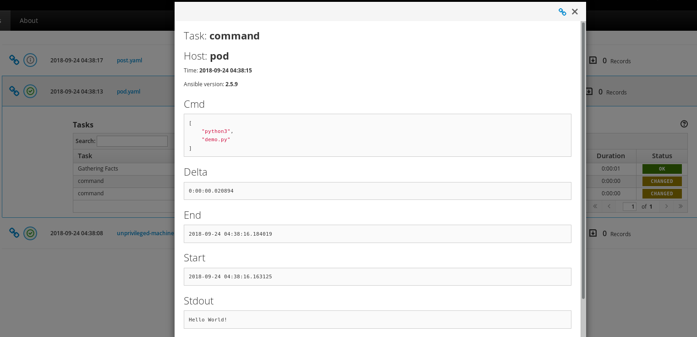

Kubernetes Nodepool Driver Tech-Preview
#######################################

:date: 2018-09-24
:category: blog
:authors: tristanC

.. note::

   The Kubernetes Driver is a tech-preview whose implementation
   is still under review `upstream <https://review.openstack.org/535557>`_.

This article demonstrates how to use Kubernetes as a Nodepool resource provider.

Setup kube/config
-----------------

The driver requires cluster admin access to a Kubernetes service. For example,
on Openshift the cluster admin can be created using these commands:

.. code-block:: bash

   oc login -u system:admin
   oc create sa nodepool-k8s
   oc adm policy add-cluster-role-to-user cluster-admin --serviceaccount=nodepool-k8s
   oc policy add-role-to-user admin --serviceaccount=nodepool-k8s
   oc sa get-token nodepool-k8s

Then the cluster admin user needs to be configured for the nodepool service:

.. code-block:: bash

   sudo -u nodepool oc login CLUSTER_URL --token SA_TOKEN

Alternatively, the new provider could be configured in
/etc/software-factory/sfconfig.yaml nodepool provider section.
In this case, the sfconfig playbook would install
the token to the nodepool .kube/config automatically.

Once the token is installed, use this command to get the context name:

.. code-block:: bash

   sudo -u nodepool oc config get-contexts
   CURRENT   NAME               CLUSTER                     AUTHINFO  NAMESPACE
   *         ...:nodepool-k8s   managesf-sftests-com:8443   ...       myproject

Setup provider
--------------

Add this nodepool configuration file:

.. code-block:: yaml

   # /root/config/nodepool/k8s.yaml
   ---
   labels:
     - name: linter-pod
       min-ready: 1

   providers:
     - name: my-k8s
       driver: kubernetes
       context: CONTEXT_NAME
       pools:
         - name: nodepool
           labels:
             - name: linter-pod
               type: pod
               image: docker.io/fedora:29

Merge this file, wait for the config-update job and
check the nodepool launcher.log for any issues.
If there are no exceptions, then Nodepool has automatically
created a new namespace and a pod:

.. code-block:: bash

   nodepool list
   +------------+----------+------------+---------------------+-------+-------------+--------+
   | ID         | Provider | Label      | Server ID           | State | Age         | Locked |
   +------------+----------+------------+---------------------+-------+-------------+--------+
   | 0000000000 | my-k8s   | linter-pod | nodepool-0000000000 | ready | 00:00:00:05 | locked |
   +------------+----------+------------+---------------------+-------+-------------+--------+

   sudo -u nodepool oc --namespace=nodepool-0000000000 get pods
   NAME         READY     STATUS    RESTARTS   AGE
   linter-pod   1/1       Running   0          1m

After a job used that namespace, Nodepool automatically
destroys it and re-creates one.

Setup job
---------

Kubernetes pod doesn't work with *synchronize* task.
Jobs that use a Kubernetes pod based nodeset need a
a special parent job to push the test project source on the pod
(in SF, the job_ is already configured and it is named: base-openshift-pod_):

.. code-block:: yaml

   # demo-project/.zuul.yaml
   ---
   - job:
       name: linter-job
       parent: base-openshift-pod
       nodeset:
         nodes:
           - name: pod
             label: linter-pod
       run: linter.yaml

Here is the linter test playbook:

.. code-block:: yaml

   # demo-project/pod.yaml
   ---
   - hosts: pod
     tasks:
       - command: ls -la
         args:
           chdir: "{{ zuul.project.src_dir }}"

       - command: python3 demo.py
         args:
           chdir: "{{ zuul.project.src_dir }}"

|

Here is the running job status:

.. image:: images/k8s-job/job-status.png

|

Here is the job review:

.. image:: images/k8s-job/job-review.png

|

And here is the job result:

.. note::

   Kubectl task execution output is not reported in the console-output because
   the zuul_stream callback requires a direct TCP connection to the test
   instance. However, the task output is available in the A.R.A. report.

.. _job: https://softwarefactory-project.io/cgit/software-factory/sf-config/tree/ansible/roles/sf-repos/templates/config/zuul.d/_jobs-openshift.yaml.j2#n29
.. _base-openshift-pod: https://softwarefactory-project.io/cgit/software-factory/sf-config/tree/ansible/roles/sf-repos/templates/config/playbooks/openshift/unprivileged-machine.yaml.j2
