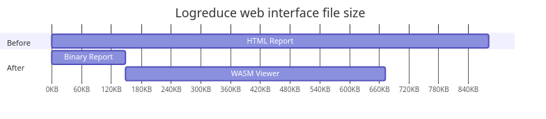

Logreduce WASM based web interface
##################################

:date: 2023-09-18
:category: blog
:authors: tristanC

.. raw:: html

   

.. raw:: html

   <!-- This work is licensed under the Creative Commons Attribution 4.0 International License.
        To view a copy of this license, visit http://creativecommons.org/licenses/by/4.0/
        or send a letter to Creative Commons, PO Box 1866, Mountain View, CA 94042, USA.
   -->

This post introduces a new Web Assembly (WASM) based web interface to
visualize logreduce's report.

In three parts, I present:

-  The logreduce report format.
-  WASM and Web APIs.
-  HTML macro examples.

Context and problem statement
=============================

Logreduce produces a `report`_ containing the anomalies context along
with metadata such as read errors and unknown files. By default the
report is printed to the standard output, but it can also be saved as an
HTML file.

The HTML export is significantly larger than the report itself. Indeed,
each log line needs to be wrapped inside an HTML element, while the
report can be tightly packed using the bincode serialization format.
Moreover the HTML export is static and it can't be re-imported, for
example to search for known anomalies.

In the next sections, I present a more efficient implementation using
WASM.

Web Assembly (WASM)
===================

WASM is a portable binary instruction format that can be executed by web
clients. Since Rust has extensive support for this compilation target, I
decided to implement the logreduce report interface with WASM. The main
benefits are:

-  Leverage Rust type system.
-  Re-use the existing logreduce's source code.

..

   Checkout the `rustwasm book`_ to learn more.

In the next sections I present how to create a web application.

Web APIs
========

WASM program doesn't have direct access to the Web APIs. For Rust, the
`web-sys`_ library provides the necessary bindings to manipulate the
DOM. Here is how the hello world demo looks like:

.. code-block:: rust

   #[wasm_bindgen(start)]
   pub fn run() -> Result<(), JsValue> {
       let window = web_sys::window().expect("no global `window` exists");
       let document = window.document().expect("should have a document on window");
       let body = document.body().expect("document should have a body");

       let val = document.create_element("p")?;
       val.set_text_content(Some("Hello from Rust!"));

       body.append_child(&val)?;

       Ok(())
   }

..

   Checkout the `wasm-bindgen documentation`_ to learn more.

Similar to React and Angular, there are libraries built on top of
web-sys to implements higher level APIs.

In the next section I present the libraries I used.

Functional Reactive Programming (FRP)
=====================================

In an earlier implementation, I used `yew`_ which provides a React style
API. Here is how the report was being fetched:

.. code-block:: rust

   #[function_component(App)]
   fn app() -> Html {
       let report: UseStateHandle<Option<Result<Report, String>>> = use_state(|| None);
       {
           let report = report.clone();
           use_effect_with_deps(
               move |_| {
                   let report = report.clone();
                   wasm_bindgen_futures::spawn_local(async move {
                       let result = get_report("report.bin").await;
                       report.set(Some(result));
                   });
                   || ()
               },
               (),
           );
       }

       match report.deref() {
           Some(Ok(report)) => render_report(report),
           Some(Err(err)) => html!(
{err}
),
           None => html!(
{"loading..."}
),
       };
   }

Unfortunately such ``use`` hooks only work inside components and they
require a bit of boilerplate to pass properties. Instead I switched to a
lower level library named `dominator`_ which provides FRP APIs I find
easier to work with.

Here is the equivalent code where the hooks are replaced with a signal:

.. code-block:: rust

   struct App {
       report: Mutable<Option<Result<Report, String>>>,
   }

   pub fn main() {
       console_error_panic_hook::set_once();
       let app = Arc::new(App {report: Mutable::new(None)});
       spawn_local(clone!(app => async move {
           let result = get_report("report.bin").await;
           app.report.replace(Some(result));
       }));
       dominator::append_dom(&dominator::body(), render_app(&app));
   }

   fn render_app(state: &Arc<App>) -> Dom {
       html!("div", {.child_signal(state.report.signal_ref(|data| Some(match data {
           Some(Ok(report)) => render_report(report),
           Some(Err(err)) => html!("div", {.children(&mut [text("Error: "), text(err)])}),
           None => html!("div", {.text("loading...")}),
       })))})
   }

Even though the *html!* macro is less pretty, it is much more flexible
as it lets you build reactive elements without relying on a virtual DOM
and clunky properties.

Conclusion
==========

Thanks to the Rust WASM target, logreduce can now produce efficient
reports. For a typical CI build, the report size is reduced from a 881
KiB report.html, down to a 148 KiB report.bin. The WASM payload to
decode the binary report is 525 KiB, which combined with the binary
report, is still smaller than the static HTML. Moverover the payload can
be hosted on a content delivery network so that it is re-used for every
reports.

WASM is a fascinating system, and I am looking forward making more use
of it. In particular, it would be interesting to compile the whole
logreduce process to produce the report directly on the client side.

.. _report: https://github.com/logreduce/logreduce/blob/main/crates/report/src/report.rs
.. _rustwasm book: https://rustwasm.github.io/docs/book/
.. _web-sys: https://docs.rs/web-sys
.. _wasm-bindgen documentation: https://rustwasm.github.io/wasm-bindgen/
.. _yew: https://yew.rs/
.. _dominator: https://github.com/Pauan/rust-dominator#readme
