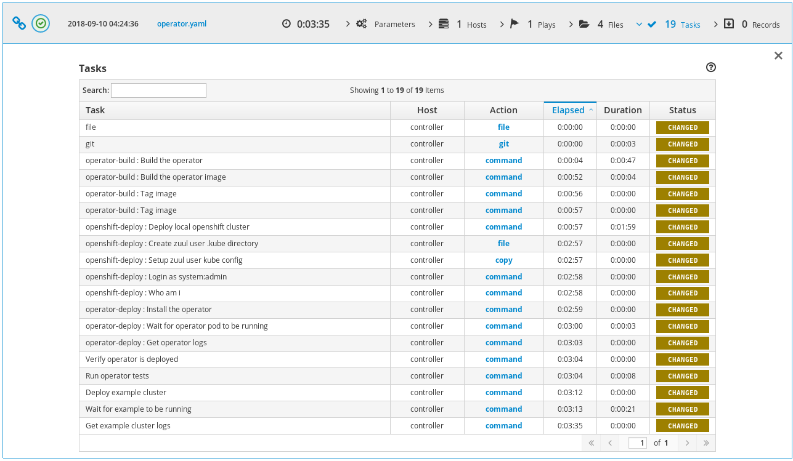
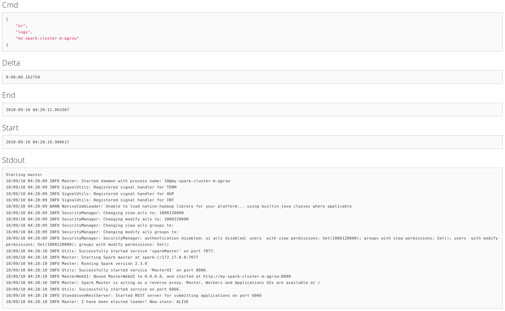
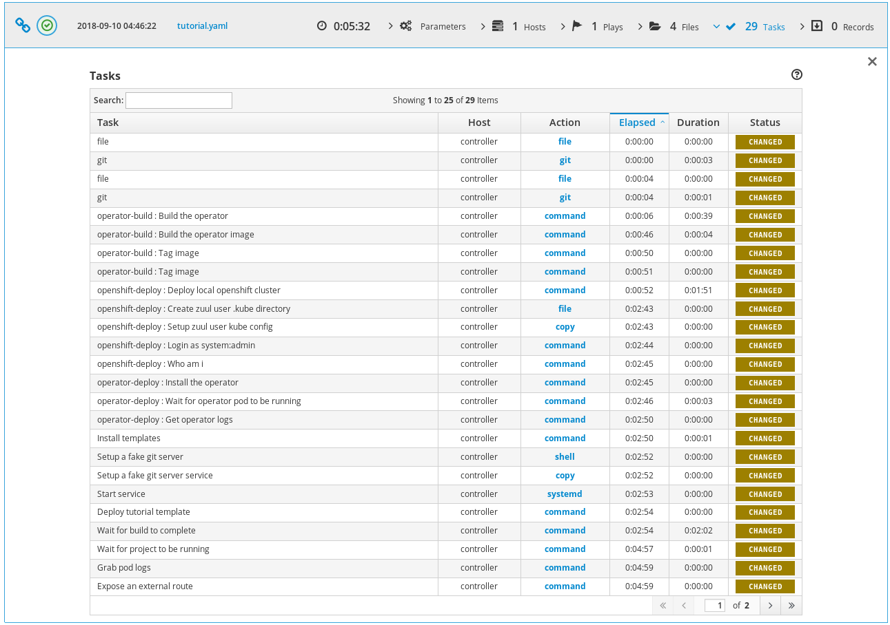
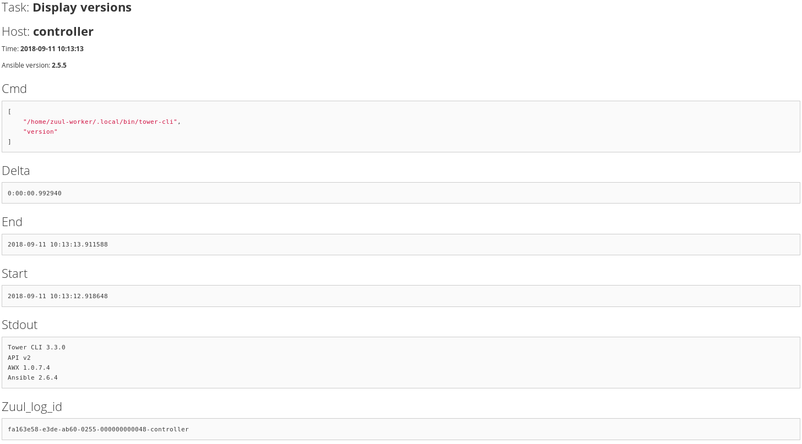

OpenShift Integration Testing with Zuul
#######################################

:date: 2018-09-20
:category: blog
:authors: tristanC

This article demonstrates how Zuul can be used to run integration tests on
OpenShift.
It presents a couple of jobs to test Operator and CRD templates as well
as regular application deployment on OpenShift.
Note that this is different from the Nodepool OpenShift driver as these jobs
use a local OpenShift cluster.

Base Job and Roles
------------------

First, I wrote a job to install the requirements.
It uses an origin_version variable to test different versions of OpenShift:

.. code-block:: yaml

   # zuul.d/openshift-job.yaml
   ---
   - job:
       name: openshift-integration
       description: |
         An abstract that installs requirements and pulls origin images.
       pre-run: playbooks/openshift/requirements.yaml
       abstract: yes
       nodeset:
         nodes:
           - name: controller
             label: centos-7
       vars:
         origin_repo: centos-release-openshift-origin310
         origin_version: v3.10

Here is the requirements.yaml pre-run playbook:

.. code-block:: yaml

   # playbooks/openshift/requirements.yaml
   ---
   - hosts: controller
     become: yes
     tasks:
       - name: Install origin repository
         yum:
           name: "{{ origin_repo }}"

       - name: Install requirements
         yum:
           name: "{{ item }}"
         with_items:
           - origin
           - docker
           - make
           - maven

       - name: Fix docker start options
         lineinfile:
           dest: /etc/sysconfig/docker
           regexp: "^OPTIONS="
           line: "OPTIONS='--selinux-enabled --log-driver=journald --signature-verification=false --insecure-registry 172.30.0.0/16'"

       # See: https://github.com/openshift/origin/issues/15038
       - name: Fix rhel secret issue
         file:
           path: /usr/share/rhel/secrets
           state: absent

       - name: Start docker service
         service:
           name: docker
           state: started

       - name: Pull origin images
         command: "docker pull docker.io/openshift/{{ item }}:{{ origin_version }}"
         with_items:
           - origin-web-console
           - origin-docker-registry
           - origin-haproxy-router
           - origin-deployer
           - origin-sti-builder
           - origin-pod
           - origin

Here are the default deploy-openshift role's tasks:

.. code-block:: yaml

   # roles/openshift-deploy/tasks/main.yaml
   ---
   - name: Deploy local openshift cluster
     command: oc cluster up --insecure-skip-tls-verify=true
     become: yes

   - name: Create zuul user .kube directory
     file:
       path: "{{ ansible_env.HOME }}/.kube"
       state: directory

   - name: Setup zuul user kube config
     copy:
       src: /root/.kube/config
       dest: "{{ ansible_env.HOME }}/.kube/config"
       owner: "{{ ansible_env.USER }}"
       mode: 0600
       remote_src: yes
     become: yes

   - name: Login as system:admin
     command: oc login -u system:admin

   - name: Who am i
     command: oc whoami -c

Using this job and role, it is relatively simple to do integration tests with
OpenShift.

Radanalytics Operator and Tutorial Integration Tests
----------------------------------------------------

Radanalytics_ provides Operators and Tutorial application. In this example,
I wanted to test the `spark operator`_ and the `tutorial-sparkpi-java-vertx`_.

OpenShift Operator Integration test
...................................

I wrote a first job to build, deploy and test the operator standalone:

.. code-block:: yaml

   # zuul.d/openshift-job.yaml
   ---
   - job:
       name: openshift-integration-operator
       parent: openshift-integration
       run: playbooks/openshift/operator.yaml
       description: |
         A job that builds and deploys an operator
       # Commented as the project is not configured in zuul
       # required-projects:
       #   - radanalyticsio/spark-operator
       vars:
         operator_url: https://github.com/radanalyticsio/spark-operator/

   - job:
       name: openshift39-integration-operator
       parent: openshift-integration-operator
       vars:
         origin_repo: centos-release-openshift-origin39
         origin_version: v3.9

Note that Zuul isn't configured for this project, so I wrote a shim to
fetch the source code as if Zuul prepared the workspace. Here is the test
playbook:

.. code-block:: yaml

   # playbooks/openshift/operator.yaml
   ---
   - hosts: controller
     vars:
       operator_src: "{{ ansible_env.HOME }}/src/github.com/radanalyticsio/spark-operator"
     pre_tasks:
       # Shim to manually fetch operator
       - file:
           path: "{{ operator_src }}"
           state: directory
       - git:
           repo: "{{ operator_url }}"
           dest: "{{ operator_src }}"
           refspec: "{{ operator_ref | default(omit) }}"
           version: "{{ operator_version | default(omit) }}"
       # End of shim

       - import_role: name=operator-build
       - import_role: name=openshift-deploy
       - import_role: name=operator-deploy
     tasks:
       - name: Verify operator is deployed
         command: kubectl get pods

       - name: Run operator tests
         command: make test
         args:
           chdir: "{{ operator_src }}"

       - name: Deploy example cluster
         command: kubectl create -f examples/cluster.yaml
         args:
           chdir: "{{ operator_src }}"

       - name: Wait for example to be running
         command: oc get pods --field-selector=status.phase=Running   -o "jsonpath={.items[?(@.metadata.labels.radanalytics\.io/podType=='master')].metadata.name}"
         register: main_pod_name
         retries: 600
         delay: 1
         until: "'spark-cluster' in main_pod_name.stdout"

       - name: Get example cluster logs
         command: "oc logs {{ main_pod_name.stdout }}"

The first task of this job is to build the operator locally so that the job
can test Pull Requests speculatively.
Here are the *operator-build* and *operator-deploy* roles:

.. code-block:: yaml

   # roles/operator-build/tasks/main.yaml
   ---
   - name: Build the operator
     command: make package
     args:
       chdir: "{{ operator_src }}"

   - name: Build the operator image
     command: make image-build-slim
     become: yes
     args:
       chdir: "{{ operator_src }}"

   - name: Tag image
     command: docker tag radanalyticsio/spark-operator:slim radanalyticsio/spark-operator:latest
     become: yes

   # roles/operator-deploy/tasks/main.yaml
   ---
   - name: Install the operator
     command: kubectl create -f manifest/operator.yaml
     args:
       chdir: "{{ operator_src }}"

   - name: Wait for operator pod to be running
     command: oc get pods --field-selector=status.phase=Running -o "jsonpath={.items[?(@.metadata.labels.app\.kubernetes\.io/name=='spark-operator')].metadata.name}"
     register: operator_pod_name
     retries: 600
     delay: 1
     until: "'spark-operator' in operator_pod_name.stdout"

   - name: Get operator logs
     command: "oc logs {{ operator_pod_name.stdout }}"

I wrote these generic tasks as roles so that they can be easily re-used by
the tutorial integration job.

Here is the ARA_ report of the openshift-integration-operator job:

|

And here is the last task output that displays a deployed spark
cluster's logs using the operator:

With that first job in place, it's simple to do integration
testing with the other Radanalytics projects.

OpenShift Operator Application Integration test
...............................................

The second job I wrote tests the `tutorial-sparkpi-java-vertx`_
demo application:

.. code-block:: yaml

   # zuul.d/openshift-job.yaml
   ---
   - job:
       name: openshift-integration-operator-tutorial
       parent: openshift-integration
       run: playbooks/openshift/tutorial.yaml
       description: |
         A job that deploys an operator and tests the tutorial
       # Commented as the projects are not configured in zuul
       # required-projects:
       #   - radanalyticsio/spark-operator
       #   - radanalyticsio/tutorial-sparkpi-java-vertx
       vars:
         operator_url: https://github.com/radanalyticsio/spark-operator/
         tutorial_url: https://github.com/radanalyticsio/tutorial-sparkpi-java-vertx

Here are the test playbook pre-tasks:

.. code-block:: yaml

   # playbooks/openshift/tutorial.yaml
   ---
   - hosts: controller
     vars:
       operator_src: "{{ ansible_env.HOME }}/src/github.com/radanalyticsio/spark-operator"
       tutorial_src: "{{ ansible_env.HOME }}/src/github.com/radanalyticsio/tutorial-sparkpi-java-vertx"
     pre_tasks:
       # Shim to manually fetch operator and tutorial
       - name: "Create operator source clone directory"
         file:
           path: "{{ operator_src }}"
           state: directory
       - name: "Clone operator"
         git:
           repo: "{{ operator_url }}"
           dest: "{{ operator_src }}"
           refspec: "{{ operator_ref | default(omit) }}"
           version: "{{ operator_version | default(omit) }}"
       - name: "Create tutorial source clone directory"
         file:
           path: "{{ tutorial_src }}"
           state: directory
       - name: "Clone tutorial"
         git:
           repo: "{{ tutorial_url }}"
           dest: "{{ tutorial_src }}"
           refspec: "{{ tutorial_ref | default(omit) }}"
           version: "{{ tutorial_version | default(omit) }}"
       - name: "Merge PR to master"
         command: "git {{ item }}"
         with_items:
           - show --raw
           - branch pr
           - checkout master
           - merge pr
           - show --raw
         args:
           chdir: "{{ tutorial_src }}"
         when: tutorial_version != "master"

       # End of shim

       - import_role: name=operator-build
       - import_role: name=openshift-deploy
       - import_role: name=operator-deploy

The challenge here is that the tutorial uses a BuildConfig to build an image of
the tutorial code before deployment. To do speculative tests, we need to serve
the source code locally. Here are the tutorial build tasks:

.. code-block:: yaml

   # Serve the tutorial from speculative git ref
   - name: Bare clone the tutorial to serve build config
     command: "git clone --bare {{ tutorial_src }} /tmp/repo"

   - name: Update git server info to enable dump http clone
     command: "git update-server-info"
     args:
       chdir: /tmp/repo

   - name: Setup a fake git server service
     copy:
       content: |
         [Unit]
         Description=Git service
         After=syslog.target

         [Service]
         WorkingDirectory=/tmp/repo
         ExecStart=/usr/bin/env python -m SimpleHTTPServer 8000
       dest: /etc/systemd/system/gitserver.service
     become: yes

   - name: Start service
     systemd:
       name: gitserver
       state: started
       daemon-reload: yes
     become: yes

   - name: Deploy tutorial template
     command: >
       oc new-app --template oshinko-java-spark-build-dc
         -p APPLICATION_NAME=vertx-sparkpi
         -p GIT_URI="http://{{ ansible_default_ipv4.address }}:8000"
         -p APP_FILE=sparkpi-app-1.0-SNAPSHOT-vertx.jar
         -p SPARK_OPTIONS='--driver-java-options="-Dvertx.cacheDirBase=/tmp/vertx-cache"'

These tasks ensure that the application deployed is using the source prepared
by Zuul. Next I wrote a few test tasks to verify that the application
was working as expected.
In this example, it makes sure the PI calculation is correct:

.. code-block:: yaml

   - name: Wait for build to complete
     command: oc get builds -o "jsonpath={.items[?(@.metadata.labels.buildconfig=='vertx-sparkpi')].status.phase}"
     register: _project_build
     retries: 600
     delay: 1
     until: "'Complete' in _project_build.stdout"

   - name: Get build name
     command: oc get builds -o "jsonpath={.items[?(@.metadata.labels.buildconfig=='vertx-sparkpi')].metadata.name}"
     register: build_name

   - name: Grab build logs
     command: "oc logs build/{{ build_name.stdout }}"

   - name: Wait for project to be running
     command: oc get pods --field-selector=status.phase=Running  -o "jsonpath={.items[?(@.metadata.labels.app=='vertx-sparkpi')].metadata.name}"
     register: tutorial_pod_name
     retries: 600
     delay: 1
     until: "'vertx-sparkpi' in tutorial_pod_name.stdout"

   - name: Grab pod logs
     command: "oc logs {{ tutorial_pod_name.stdout }}"

   - name: Expose an external route
     command: oc expose svc/vertx-sparkpi

   - name: Get route name
     command: oc get routes/vertx-sparkpi "--template={{'{{'}}.spec.host {{'}}'}}"
     register: spec_host

   - name: Wait for service to be running
     uri:
       url: "http://{{ spec_host.stdout }}"
       return_content: yes
     register: webpage
     retries: 600
     delay: 1
     until: "'Java Vert.x SparkPi server running' in webpage.content"

   - name: Get PI result
     uri:
       url: "http://{{ spec_host.stdout }}/sparkpi"
       return_content: yes
     register: pi

   - name: Check PI is correct
     fail:
       msg: "Couldn't compute PI"
     when: not pi.content.startswith("Pi is rouuuughly 3.1")

Here is the ARA_ report of the openshift-integration-operator-tutorial job:

Project Configuration
.....................

Using these two jobs, we can make sure operator changes don't break the
tutorial, and that the tutorial changes are working as expected.
More importantly, we can test cross dependency changes.
For example, Zuul can validate that the tutorial works with a new operator
feature Pull Request. Here is an example configuration:

.. code-block:: yaml

   # zuul.d/project-config.yaml
   ---
   - project:
      name: radanalyticsio/spark-operator
      check:
        jobs:
          - openshift-integration-operator
          - openshift-integration-operator-tutorial
          - openshift39-integration-operator

   - project:
      name: radanalyticsio/tutorial-sparkpi-java-vertx
      check:
        jobs:
          - openshift-integration-operator-tutorial

Because Zuul isn't actually configured for the radanalytics projects, I had
to use shims to setup the sources, here is a demonstration that manually tests
a Pull Request:

.. code-block:: yaml

   # zuul.d/project-config.yaml
   ---
   - project:
      check:
        jobs:
          - openshift-integration-operator-tutorial:
              vars:
                tutorial_ref: 'refs/pull/8/head'
                tutorial_version: 'FETCH_HEAD'

This `Pull Request <https://github.com/radanalyticsio/tutorial-sparkpi-java-vertx/pull/8>`_
introduces an error in PI calculation by doubling the result,
and the job failed as expected:

.. image:: images/openshift-integration/tutorial-logs.png

Ansible Tower deployment on OpenShift
-------------------------------------

Similar to the Radanalytics integration jobs, here is a job that tests
Ansible Tower deployment on OpenShift:

.. code-block:: yaml

   # zuul.d/jobs.yaml
   ---
   - job:
       name: openshift-awx-install
       parent: openshift-integration
       description: |
         A job that tests awx install on openshift
       run: playbooks/awx/install-openshift.yaml
       required-projects:
         - name: ansible/awx
           override-checkout: devel

Here are the test playbook pre-tasks:

.. code-block:: yaml

   # playbooks/awx/install-openshift.yaml
   ---
   - hosts: controller
     vars:
       awx_src: "{{ ansible_env.HOME }}/src/github.com/ansible/awx"
     pre_tasks:
       - import_role: name=awx-build-image
       - import_role: name=openshift-deploy
       - import_role: name=awx-install-openshift

The challenge again is to use speculative images of Tower by the deployment
playbook. Here are the *awx-build-image* and *awx-install-openshift* roles:

.. code-block:: yaml

   # roles/awx-build-image/tasks/main.yaml
   ---
   - name: Build the image
     command: ansible-playbook -i inventory build.yml
     become: yes
     args:
       chdir: "{{ awx_src }}/installer"
     environment:
       # We need a more recent git to correctly discover awx_version
       # The default git doesn't support --first-parent argument
       PATH: "/opt/rh/rh-git29/root/bin/:{{ ansible_env.PATH }}"

   # roles/awx-install-openshift/tasks/main.yaml
   ---
   - name: Remove dockerhub_base variable
     lineinfile:
       path: "{{ awx_src }}/installer/inventory"
       regexp: '^dockerhub_base='
       line: '#dockerhub_base='

   - name: Remove privileged command
     lineinfile:
       path: "{{ awx_src }}/installer/roles/kubernetes/tasks/openshift.yml"
       regexp: '.*adm policy.*'
       line: '    true'

   # Fix: Failed to pull image "registry.access.redhat.com/rhscl/postgresql-96-rhel7"
   - name: Fix postgres image location
     replace:
       path: "{{ awx_src }}/installer/roles/kubernetes/templates/postgresql-persistent.yml.j2"
       regexp: 'registry.access.redhat.com.rhscl.postgresql-96-rhel7'
       replace: 'centos/postgresql-96-centos7'

   - name: Set privileged context
     command: >
       oc --context "default/127-0-0-1:8443/system:admin" \
         adm policy add-scc-to-user privileged system:serviceaccount:myproject:awx

   - name: Login with developer account
     command: oc login -u developer -p developer

   - name: Grab openshift token
     command: oc whoami -t
     register: openshift_token

   - name: Install awx on openshift
     command: >
       ansible-playbook -i inventory \
         -e openshift_host=127.0.0.1:8443 \
         -e openshift_skip_tls_verify=True \
         -e openshift_user=developer \
         -e openshift_password=developer \
         -e openshift_project=myproject \
         -e kubernetes_task_image=172.30.1.1:5000/myproject/awx_task \
         -e kubernetes_web_image=172.30.1.1:5000/myproject/awx_web \
         -e openshift_pg_emptydir=yes \
         -e docker_registry=172.30.1.1:5000 \
         -e docker_registry_repository=myproject \
         -e docker_registry_username=developer \
         -e docker_registry_password={{ openshift_token.stdout }} \
         install.yml
     become: yes
     args:
       chdir: "{{ awx_src }}/installer"
     environment:
       # We need a more recent git to correctly discover awx_version
       # The default git doesn't support --first-parent argument
       PATH: "/opt/rh/rh-git29/root/bin/:{{ ansible_env.PATH }}"

These tasks ensure that the application deployed is using the source prepared
by Zuul. Here are the rest of the openshift-awx-install test tasks:

.. code-block:: yaml

   - name: Verify pods are running
     command: oc status

   - name: Get route name
     command: oc get routes/awx-web-svc "--template={{'{{'}}.spec.host {{'}}'}}"
     register: spec_host

   - name: Check web is working
     uri:
       url: "http://{{ spec_host.stdout }}"
       return_content: yes
     register: webpage
     retries: 600
     delay: 1
     until: "'working...' in webpage.content"

   - name: Install tower-cli
     command: pip install --user ansible-tower-cli

   - name: Configure host
     command: "{{ ansible_env.HOME }}/.local/bin/tower-cli config host {{ spec_host.stdout }}"

   - name: Login
     command: "{{ ansible_env.HOME }}/.local/bin/tower-cli login --password password admin"

   - name: Display versions
     command: "{{ ansible_env.HOME }}/.local/bin/tower-cli version"

   - name: Display roles
     command: "{{ ansible_env.HOME }}/.local/bin/tower-cli role list"

Here is the ARA_ report of the openshift-awx-install job:

.. image:: images/openshift-integration/awx-playbook.png

|

And here is a test task output:

Conclusion
----------

Zuul can easily be used to run integration tests on OpenShift. Here are the
Pull Requests containing the demonstration jobs:

- `Operator job <https://softwarefactory-project.io/r/13584>`_
- `AWX install job <https://github.com/ansible/zuul-jobs/pull/6>`_

.. _Radanalytics: https://radanalytics.io/
.. _`spark operator`: https://github.com/radanalyticsio/spark-operator/
.. _`tutorial-sparkpi-java-vertx`: https://github.com/radanalyticsio/tutorial-sparkpi-java-vertx

.. _ARA: https://getara.org/
