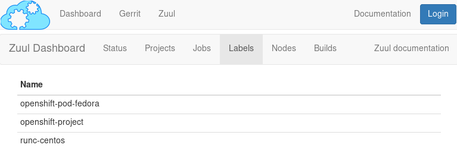

Tech Preview: using OpenShift as a resource provider
####################################################

:date: 2018-08-08
:category: blog
:authors: Tristan de Cacqueray

This post presents a new Tech Preview available in SF version 3.1.
This driver is experimental and shouldn't be used in production as it
is still being developped and reviewed upstream.

TODO: add relevant review.openstack.org links

Configure an OpenShift provider
===============================

Deploy a standalone service
---------------------------

To deploy an OpenShift cluster locally, you can use the *hypervisor-openshift*
component in the arch.yaml file:

.. code-block:: yaml

   inventory:
     - name: openshift01
       ip: 192.168.0.3
       roles:
         - hypervisor-openshift

The install-server needs to be able to connect as root and the port 8443 needs
to be available to the nodepool-launcher service.

After running **sfconfig**, the provider is automatically configured in
Nodepool.

Use the *extra-labels* option in the config project to add extra images:

.. code-block:: yaml

   # /root/config/nodepool/openshift-labels.yaml
   labels:
     - name: openshift-pod-centos
       min-ready: 0

   extra-labels:
     - provider: openshift01
       pool: zuul-ci
       labels:
         - name: openshift-pod-centos
           type: pod
           image: docker.io/centos

Use an existing service
-----------------------

To use an existing OpenShift cluster, you need to add the provider to
the sfconfig.yaml file:

.. code-block:: yaml

   nodepool:
     openshift_providers:
       - name: openshift01
         url: https://openshift.example.com:8443
         token: service-account-with-self-provisioner-cluster-role-policy

After running **sfconfig**, the ~nodepool/kube/.config is automatically
configured, get the context name using this command:

.. code-block:: shell

   sudo -u nodepool oc whoami -c

Then configure a new nodepool provider in the config project:

.. code-block:: yaml

   # /root/config/nodepool/openshift.yaml
   labels:
     - name: openshift-project
       min-ready: 0
     - name: openshift-pod-fedora
       min-ready: 0

   providers:
    - name: openshift01
      driver: openshift
      context: myproject/openshift-example-com:8443/developer
      pools:
        - name: zuul-ci
          labels:
            - name: openshift-project
              type: project
            - name: openshift-pod-fedora
              type: pod
              image: docker.io/fedora:28

Validate the new provider
-------------------------

- Check the labels are available in the zuul dashboard *Labels* page
- Check the nodepool launcher log for errors

Create new Zuul nodeset
=======================

To simplify container job creation, you can define default nodesets, for
example in the sf-jobs project:

.. code-block:: yaml

   # /root/sf-jobs/zuul.d/nodeset.yaml
   - nodeset:
       name: container-project
       nodes:
         - name: project
           label: openshift-project

   - nodeset:
       name: container-fedora
       nodes:
         - name: pod
           label: openshift-pod-fedora

Use a pod to run job
====================

This first example demonstrates the "Containers That Behave Like a Machine"
use-case where a job run on a existing pod with the kubectl connection.
Use the base-openshift-job in a zuul.yaml file:

.. code-block:: yaml

   - job:
       name: demo-pod
       parent: base-openshift-pod
       run: pod.yaml
       nodeset: container-fedora

The pod.yaml playbook will run with the pod in the inventory and the
project is already copied to the workspace:

.. code-block:: yaml

   - hosts: pod
     tasks:
       - pause:
           seconds: 30
       - command: python3 demo.py
         args:
           chdir: "{{ zuul.project.src_dir }}"

.. image:: images/openshift-job-pod.png

Use a container native job
==========================

This second example demonstrates the "Native Container Workflow" use-case
where a job run with an empty project and build a container image with
the speculative git repos.

Software Factory integrates a base job to create the ImageStream and
deploy a pod that is suitable for a simple project. The base_image
job variable let you set the the Source Strategy stream tag to be used
in the Build Config:

.. code-block:: yaml

   - job:
       name: demo-native-py36
       parent: base-openshift-native
       run: native.yaml
       vars:
         base_image: "python:3.6"

The native.yaml playbook will run with a pod built using the speculative
git repos:

.. code-block:: yaml

   - hosts: localhost
     tasks:
       - name: Fetch pods list from pre run
         include_vars:
           file: "{{ zuul.executor.work_root }}/pods.yaml"

       - add_host:
           name: "{{ item.pod }}"
           group: "{{ item.name }}"
           ansible_connection: kubectl
         with_items: "{{ pods }}"

   - hosts: demo-project
     tasks:
       - command: ls
       - command: python demo.py
         register: demo_output
       - debug: var=demo_output.stdout
       - fail:
         when: "'Hello' not in demo_output.stdout"

.. image:: images/openshift-job-pod.png

A follow-up blog post will demonstrates more complex scenario using
a custom parent job to deploy custom definitions.
