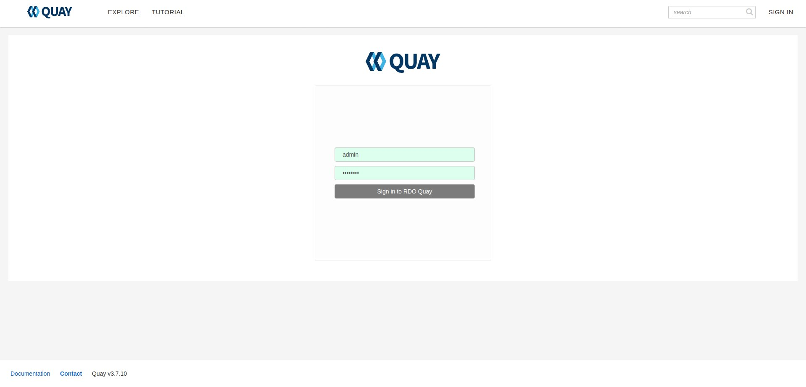
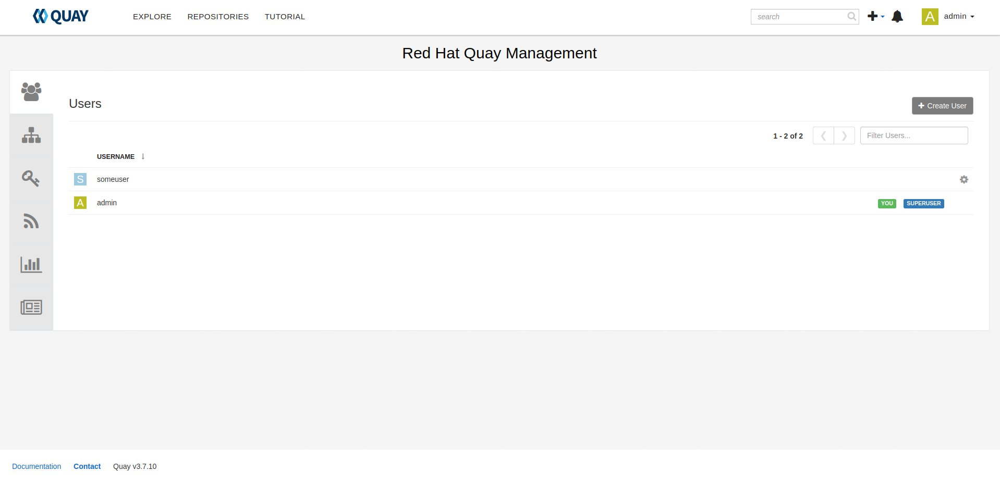
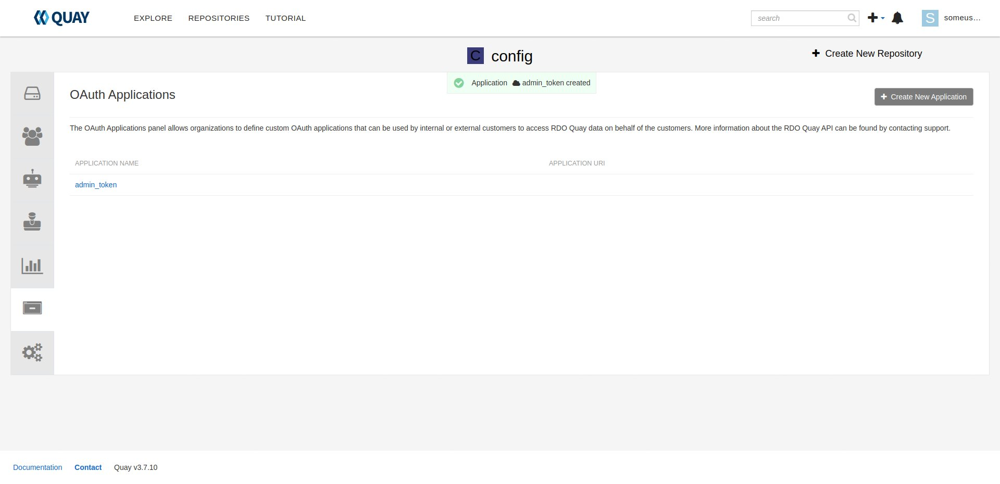
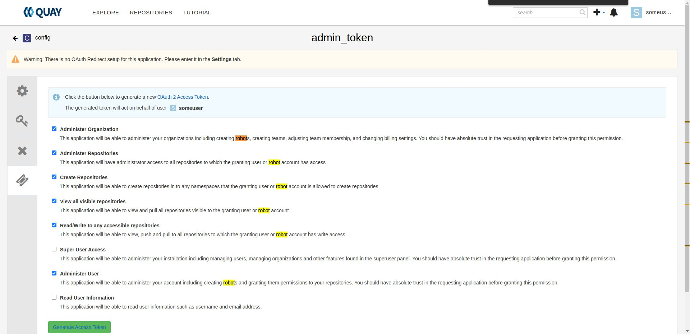
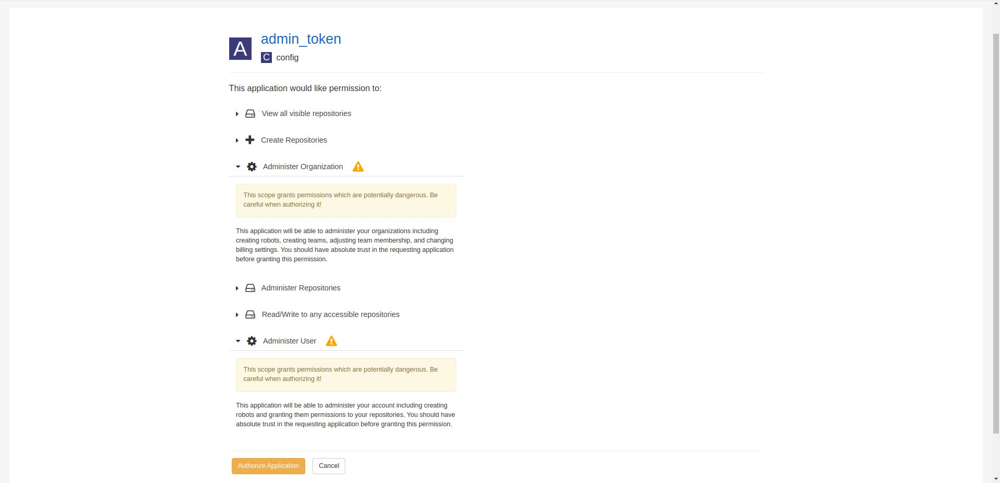
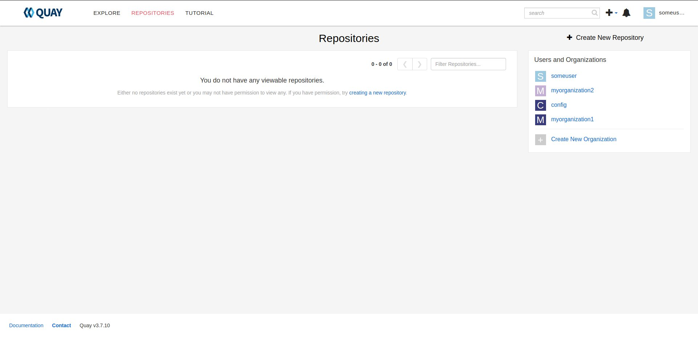
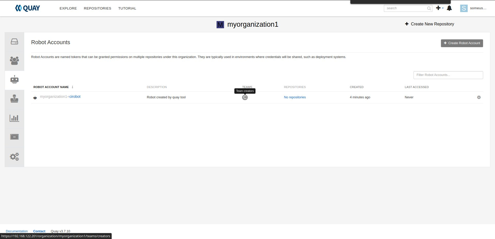
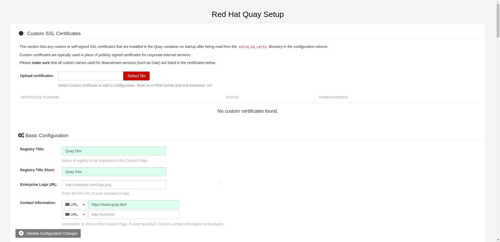

Replacing old container registry with Quay
##########################################

:date: 2022-12-12
:category: blog
:authors: dpawlik

.. _what-:

What is Quay ?
==============

A distributed and highly available container image registry.

.. _additional-services-:

Additional services
===================

The Quay service can communicate with additional services:

- `clair <https://www.redhat.com/en/topics/containers/what-is-clair>` - is an open source project which provides a tool to monitor the
  security of your containers through the static analysis of vulnerabilities
  in appc and docker containers. [1].
- `quay-mirror <https://access.redhat.com/documentation/en-us/red_hat_quay/3/html/manage_red_hat_quay/repo-mirroring-in-red-hat-quay>` - it is a service
  that provides mirroring functionality of external repository and pull
  it into current one.

.. _howto-:

How to deploy ?
===============

The service can be deployed by using dedicated role provided in `software-factory/sf-infra project<https://softwarefactory-project.io/r/plugins/gitiles/software-factory/sf-infra/+/refs/heads/master/roles/rdo/quay/>`
It deploys automatically required services such as:

- redis - an in-memory data structure store, used as a distributed,
  in-memory key–value database, cache and message broker, with
  optional durability,
- PostgreSQL - open source object-relational database.

Below there is an example of the playbook that deploys Quay with
Clair and Quay mirror services. It will also deploy two more superusers,
that would be an owner of own project.
On Quay service located on `rdoproject.org`, we are creating few
users: sf and tripleo, where each of them got their own organizations and
repositories inside the organization.

There are two things related to the below playbook:

* only admin user has password with at least 8 characters.
  Other users password is generated on creating the superuser account.
* To generate token for an organization, after creating a superuser
  account, login into the Quay as this user, create new organization: "config",
  then inside the organization "config", create new application "admin_token",
  with "Administer Organization", "Administer Repositories", "Create Repositories",
  "View all visible repositories", "Read/Write to any accessible repositories" and
  "Administer User" permissions.

* Bootstrap Quay service

.. code-block:: yaml

  - hosts: quay.dev
    vars:
      fqdn: quay.dev
      self_signed_certs: true
      initial_config: false
      quay_validate_cert: false
      database_secret_key: dc52fef2-eed2-4efd-9de6-5af89f86df0a
      secret_key: 46bc0133-09b0-486c-bef7-bbe1575f7672
      # NOTE: password needs to be at least 8 characters
      quay_users:
        admin:
          email: admin@somemail.com
          password: password
          token: ""
        someuser:
          email: someuser@someemail.com
          token: ""
    tasks:
      - name: Setup quay
        include_role:
          name: rdo/quay
          tasks_from: main.yml
    roles:
      - service/hostname

Next steps for creating new project, users, etc. are done in section `Quay - organizations, users, roles...`.

.. _setup-organization-:

Quay - organizations, users, roles...
=====================================

Quay components
---------------

- organizations -organizations provide a way of sharing repositories
  under a common namespace that does not belong to a single user,
  but rather to many users in a shared setting (such as a company),
- teams - organizations are organized into a set of Teams which provide
  access to a subset of the repositories under that namespace.
  Teams have defined global permissions in the organization: member, creator
  and admin. More info `here <https://docs.quay.io/glossary/teams.html>`,
- users - it is a user account that later would connect to the Quay
  by using for example: `podman login` command,
- robots - it is an account which can be shared by multiple repositories
  that are owned by a user organization. That account might be helpful,
  when you create new container images in CI and you would like just to push
  the content to the repository,
- prototypes - it is default permissions in the organization,
- applications - it generates an API `token` possible permissions:
    * administer organization,
    * administer repositories,
    * create repositories,
    * view all visible repositories,
    * read/write to any accessible repositories,
    * super user access,
    * administer user,
    * read user information.

  The applications can be used by for example `pruner` script, to
  set expiration time to the image.
- tokens - a string that can communicate with Quay API that have
  already configured permissions.

Example playbook for creating new project with all needed configuration:

* Create project, user, robot etc.:
  As it was mentioned earlier, token generation are done in application.
  Create application before execute playbook with `quay-project-creation` role.

.. code-block:: yaml

  - hosts: quay.dev
    vars:
      fqdn: quay.dev
      self_signed_certs: true
      initial_config: false
      quay_validate_cert: false
      database_secret_key: dc52fef2-eed2-4efd-9de6-5af89f86df0a
      secret_key: 46bc0133-09b0-486c-bef7-bbe1575f7672
      quay_users:
        # Token for admin is generated during bootstrap.
        # Later it is located in: /var/data/quay/admin_token
        admin:
          email: admin@somemail.com
          password: password
          token: "GXI7D7Y4RY7C6KQA23P435SJZTO126WZ"
        # Password for someuser is located in: /var/data/quay/someuser_token
        # The token is created in created application.
        someuser:
          email: someuser@someemail.com
          token: "33W59Q10MHLWX79G8LAU722DMP2819ZT"
      quay_organizations:
        # The token variable is necessary just for RDO deployment, where
        # new created application token is used by the pruner script to
        # cleanup old images. More information in: `Pruner` section.
        someuser:
          - name: myorganization1
            token: ""
          - name: myorganization2
            token: ""
    tasks:
      - name: Setup quay - reconfigure
        include_role:
          name: rdo/quay
          tasks_from: main.yml
      - name: Configure Quay projects
        include_role:
          name: rdo/quay-project-creation
          tasks_from: main.yml

.. _config-mode-:

Quay config mode
----------------

The Quay service has a dedicated startup mode, that the administrator would
be able to manage service confiuguration via Web interface.

By using `quay` role from from sf-infra project, there is an Ansible
variable: `initial_config`.

Example playbook to start the service in "config mode":

.. code-block:: yaml

  - hosts: quay.dev
    vars:
      fqdn: quay.dev
      self_signed_certs: true
      initial_config: true
      quay_validate_cert: false
      database_secret_key: dc52fef2-eed2-4efd-9de6-5af89f86df0a
      secret_key: 46bc0133-09b0-486c-bef7-bbe1575f7672
      quay_users:
        admin:
          email: admin@somemail.com
          password: password
          token: ""
    tasks:
      - name: Setup quay
        include_role:
          name: rdo/quay
          tasks_from: main.yml
    roles:
      - service/hostname

After playbook finish, the site should be available on `http://quay.dev`
with credentials:

.. code-block:: shell

   username: quayconfig
   password: secret

You can always use SSH tuneling:

.. code-block:: shell

   ssh -L 8443:localhost:443 -L 8080:localhost:80 centos@quay.dev

then the site would be available on `http://localhost:8080`.

.. _quaytool-:

Quay user automation
====================

Python Quay tool
----------------

The Python Quay tool is a Python base script, that helps automate
the Quay deployment.
For example, there is some new Openstack release and each release
got its own dedicated organization just for it. That requires actions:

- create organization,
- create `robot` user,
- create default permissions for robot user (prototype),
- create `creators` team that will allow create new repositories,
- add the robot user to the team.

All of those actions can be done by using the Quay Tool which is
communicating with the Quay API and perform required actions.

The tool repository is available `here <https://softwarefactory-project.io/r/plugins/gitiles/software-factory/python-quay-tool>`.

Example commands that you can find in the tool:

Set image to be public:

.. code-block:: shell

   quaytool --api-url https://quay.dev/api/v1 --token <token> --organization myorganization --visibility public

Specify image repository to be public:

.. code-block:: shell

   quaytool --api-url https://quay.dev/api/v1 --token <token> --organization myorganization --repository test --repository test2 --visibility public

Set all repository to be private, but skip some of them:

.. code-block:: shell

   quaytool --api-url https://quay.dev/api/v1 --token <token> --organization myorganization --skip test3 --skip test4 --visibility public

List all robots in organization:

.. code-block:: shell

   quay_tool --api-url https://quay.dev/api/v1 --organization test --token sometoken --insecure --list-robots

Create robot in organization:

.. code-block:: shell

   quay_tool --api-url https://quay.dev/api/v1 --organization test --token sometoken --create-robot bender

Set write permissions for a user for repositories inside the
organziation:

.. code-block:: shell

   quaytool  --api-url https://quay.dev/api/v1 --organization test --token sometoken --user test+cirobot --set-permissions

Restore deleted tag:

.. code-block:: shell

   quaytool --api-url https://quay.dev/api/v1 --organization test --token sometoken--tag 14ee273e8565960cf6d5b6e26ae92ade --restore-tag

Set the prototype (default permissions) in the organization. By default
it creates prototype with write permissions.

For a user:

.. code-block:: shell

   quaytool  --api-url https://quay.dev/api/v1 --organization test --token sometoken --create-prototype --user test+cirobot

For a team:

.. code-block:: shell

   quaytool  --api-url https://quay.dev/api/v1 --organization test --token sometoken --create-prototype --team creators

.. _pruner-:

Pruner
------

The RDO team is using `pruner` scripts that are communicating with the DLRN (Delorian)
service to get the latest promotion hash, that later the images with tag
containing the hash will be skipped from deletion.

The pruner script is using Quay API. To communicate with the API, first you
need to create a dedicated application in Quay inside your organization with
following permissions:

- Administer Repositories,
- and View all visible repositories.

You can find the pruner scripts used by the RDO project `here <https://softwarefactory-project.io/r/plugins/gitiles/software-factory/sf-infra/+/refs/heads/master/roles/rdo/quay/files/quay_tag_pruner.py>`.
Other scripts and crontab job you can find in the `sf-infra` project
in `roles/rdo/quay`.

.. _swagger-:

Swagger
-------

Swagger is a suite of tools for API developers from SmartBear Software and
a former specification upon which the OpenAPI Specification is based.

You can start running the Swagger tool in the container and communicate
with Quay API.

How to start Swagger:

.. code-block:: shell

   # Start swagger container
   podman run -p 8888:8080 -e API_URL=https://quay.dev/api/v1/discovery docker.io/swaggerapi/swagger-ui

   # If you are using local instance with firewall rules, you can tunel
   # the ssh connection and redirect the port
   # OPTIONAL
   ssh -L 18888:localhost:8888 centos@quay.dev

After running above commands, you should be able to reach the swagger
Web UI interface on URL: `http://quay.dev:8080`.

More information how to use Swagger with Quay you can find `here <https://access.redhat.com/documentation/en-us/red_hat_quay/3/html/red_hat_quay_api_guide/using_the_red_hat_quay_api#accessing_your_quay_api_from_a_web_browser>`.

.. _example-:

Example how to automate Quay organization deployment base on TripleO release
----------------------------------------------------------------------------

The RDO Project has automated the creation of projects, users, robots, prototypes, etc.
There is a dedicated `role <https://softwarefactory-project.io/r/plugins/gitiles/software-factory/sf-infra/+/refs/heads/master/roles/rdo/quay-project-creation/>`.
Example, how to use that role:

.. code-block:: yaml

  - hosts: quay.dev
    vars:
      quay_api_url: https://quay.dev/api/v1
      database_secret_key: dc52fef2-eed2-4efd-9de6-5af89f86df0a
      secret_key: 46bc0133-09b0-486c-bef7-bbe1575f7672
      quay_users:
        admin:
          email: admin@somemail.com
          password: password
          token: "GXI7D7Y4RY7C6KQA23P435SJZTO126WZ"
        tripleo:
          email: someuser@someemail.com
          token: "33W59Q10MHLWX79G8LAU722DMP2819ZT"
      quay_organizations:
        tripleo:
          - name: tripleomastercentos9
            token: "some token generated in tripleomastercentos9 organization application"
            prune_days: 7
          - name: tripleotraincentos8
            token: "some token generated in tripleotraincentos8 organization application"
    tasks:
      - name: Configure Quay Organization
        include_role:
          name: rdo/quay-project-creation
          tasks_from: main.yml

Same actions can be perfomed without the Ansible role.
All steps are described in the `README file <https://softwarefactory-project.io/r/plugins/gitiles/software-factory/python-quay-tool/+/refs/heads/master/README.md#basic-workflow-how-to-setup-new-organziation>`.

.. _doc-:

Documentation
-------------

Quay provides documentation that has also troubleshooting chapter.
The documentation you can find in `here <https://docs.quay.io/>`.
