SF Operator - how hardware is important in Kubernetes
#####################################################

:date: 2023-09-20
:category: blog
:authors: dpawlik

Problem description
===================

As you know, the future release of Software Factory project will be base on the
Kubernetes deployment. On adding new services, there are more and more pods
spawned on the Kubernetes cluster, that might raise some complication, when
the test environment is limited.
After a while, we spotted an issue, that the CI jobs are failing without any
reason - sometimes test was checking if API is up and receive a HTTP 503 error,
sometimes pods were marked as `Running`, where it was not ready. All of those
errors were related to `ReadinessProbe`, `StartupProbe` or `LivenessProbe`,
but from time to time we have an error:

.. code-block:: shell

   panic: Could not create &Secret{ObjectMeta:{nodepool-providers-secrets
   sf    0 0001-01-01 00:00:00 +0000 UTC <nil> <nil> map[] map[] [] [] []},
   Data:map[string][]byte{kube.config: [97 112 105 86 101 114 115 105 (...) 10],},
   Type:,StringData:map[string]string{},Immutable:nil,}: etcdserver: request timed out

Initially the isssue was very rary, but after a while, it comes more and more
often.

What is etcd?
=============

The `etcd` service is a "heart" of the Kubernetes. It is "A distributed,
reliable key-value store for the most critical data of a distributed system".
That service keeps state of the whole Kubernetes cluster, its configuration,
service statuses and others. That service needs to be working without any
issue, because when it has an issue, other components might have an issue.

As it was described in the error message above in `Problem description` chapter,
the error: `etcdserver: request timed out` might suggest that we have an issue
with the "core" service of the Kubernetes, so we performed few tests why the
`etcd` is not working properly in our CI jobs.

Testing environment
===================

Most of our CI jobs related to the sf-operator project are spawning on the
flavor that contains:

* 8 GB RAM
* 40 GB HDD disk
* 8 vCPUs

which is very small part of the physical resources of the hypervisor.
After pushing new change to the Zuul CI, it can happen that all new jobs will
be running on the same host (or even other jobs related to other changes), especially
that some part of the CI jobs are repeating:

* deploy Microshift,
* build image,
* deploy services - it is pulling new images, storing them on the disk etc.

It might happen, that in the same time there can be many jobs doing same operation,
that can take take all disk resources such as IO or R/W operations.

MicroShift
----------

We are using the MicroShift tool for deploying the sf-operator. The "MicroShift
is an experimental flavor of OpenShift/Kubernetes optimized for the device edge.
It targets the niche between minimal, standalone Linux edge devices and
full-fledged OpenShift/Kubernetes edge clusters". `source <https://next.redhat.com/project/microshift/>`__.

For the MicroShift deployment, we are using an unofficial role, which you can find
`here <https://github.com/openstack-k8s-operators/ansible-microshift-role>`__ on the Github.

Is it hardware?
===============

Let's have a theory: what if the disk is cousing troubles in our CI?
First what we check is how the monitoring metrics looks like for specific host,
on which the job was performed and it raise an error.

<FIXME IMG>

The Grafana visualization shows, that the disk IO is near 1K, which is very
low for modern servers. Similar situation is for the R/W operation: both are
also low, but what if not?
We make question to our cloud provider what disks we have in our servers and
if we have configured RAID there. What we receive is: there are 4 x Intel 960 SSD disks,
set in software RAID10 mode.

This caused us to have mixed feelings if the issue is really in the disk,
so we decide to make some benchmark.

Benchmarking servers
====================

There are many tools that can check your disk performance. Our focus was on
two basic tests:

* fio
* phoronix tests suite
* etcd benchmark tool

Fio tool
--------

How we test:

.. code-block:: shell

   curl -LO https://github.com/rancherlabs/support-tools/raw/master/instant-fio-master/instant-fio-master.sh
   bash instant-fio-master.sh

   export PATH=/usr/local/bin:$PATH
   mkdir test-data
   fio --rw=write --ioengine=sync --fdatasync=1 --directory=test-data --size=100m --bs=2300 --name=mytest

Result was:

.. code-block:: shell

   fio --rw=write --ioengine=sync --fdatasync=1 --directory=test-data --size=100m --bs=2300 --name=mytest
   mytest: (g=0): rw=write, bs=(R) 2300B-2300B, (W) 2300B-2300B, (T) 2300B-2300B, ioengine=sync, iodepth=1
   fio-3.35-115-g6795
   Starting 1 process
   Jobs: 1 (f=1): [W(1)][98.7%][w=1967KiB/s][w=876 IOPS][eta 00m:01s]
   mytest: (groupid=0, jobs=1): err= 0: pid=160845: Wed Aug 16 05:56:49 2023
     write: IOPS=618, BW=1388KiB/s (1421kB/s)(100.0MiB/73768msec); 0 zone resets
       clat (usec): min=2, max=20824, avg=49.73, stdev=335.80
        lat (usec): min=2, max=20824, avg=50.21, stdev=335.81
       clat percentiles (usec):
        |  1.00th=[    6],  5.00th=[    8], 10.00th=[    9], 20.00th=[   10],
        | 30.00th=[   11], 40.00th=[   13], 50.00th=[   14], 60.00th=[   16],
        | 70.00th=[   17], 80.00th=[   20], 90.00th=[   29], 95.00th=[  310],
        | 99.00th=[  490], 99.50th=[  873], 99.90th=[ 2802], 99.95th=[ 4293],
        | 99.99th=[20055]
      bw (  KiB/s): min=   44, max= 2717, per=99.92%, avg=1387.57, stdev=770.12, samples=147
      iops        : min=   20, max= 1210, avg=617.98, stdev=342.89, samples=147
     lat (usec)   : 4=0.13%, 10=21.66%, 20=59.34%, 50=11.23%, 100=0.76%
     lat (usec)   : 250=0.40%, 500=5.53%, 750=0.38%, 1000=0.12%
     lat (msec)   : 2=0.25%, 4=0.13%, 10=0.03%, 20=0.01%, 50=0.01%
     fsync/fdatasync/sync_file_range:
       sync (usec): min=275, max=181677, avg=1564.33, stdev=4190.31
       sync percentiles (usec):
        |  1.00th=[   367],  5.00th=[   412], 10.00th=[   441], 20.00th=[   486],
        | 30.00th=[   537], 40.00th=[   676], 50.00th=[   938], 60.00th=[  1074],
        | 70.00th=[  1254], 80.00th=[  1549], 90.00th=[  2343], 95.00th=[  3458],
        | 99.00th=[ 19792], 99.50th=[ 27132], 99.90th=[ 55837], 99.95th=[ 76022],  ### <<<=== here is 99.00th
        | 99.99th=[128451]
     cpu          : usr=0.49%, sys=3.04%, ctx=165143, majf=0, minf=14
     IO depths    : 1=200.0%, 2=0.0%, 4=0.0%, 8=0.0%, 16=0.0%, 32=0.0%, >=64=0.0%
        submit    : 0=0.0%, 4=100.0%, 8=0.0%, 16=0.0%, 32=0.0%, 64=0.0%, >=64=0.0%
        complete  : 0=0.0%, 4=100.0%, 8=0.0%, 16=0.0%, 32=0.0%, 64=0.0%, >=64=0.0%
        issued rwts: total=0,45590,0,0 short=45590,0,0,0 dropped=0,0,0,0
        latency   : target=0, window=0, percentile=100.00%, depth=1Run status group 0 (all jobs):
     WRITE: bw=1388KiB/s (1421kB/s), 1388KiB/s-1388KiB/s (1421kB/s-1421kB/s), io=100.0MiB (105MB), run=73768-73768msec
   Disk stats (read/write):
     vda: ios=4601/115020, sectors=73144/639377, merge=1/796, ticks=5288/85834, in_queue=122603, util=97.44%

To explain that results in few words: `In 99, it has 19792 so it means 19.79ms`,
and it is recommended to have below 10ms.

The result was very similar for different hypervisors, but still we can not assume,
that it is a disk issue, but we were getting closer to favoring this theory.

Phoronix test suite
-------------------

How we test on Centos 9 stream:

.. code-block:: shell

   sudo dnf install -y php-cli php-xml php-json git

   git clone https://github.com/phoronix-test-suite/phoronix-test-suite && cd phoronix-test-suite/
   sudo ./install-sh

   sudo phoronix-test-suite run pts/etcd

In shortcut, results were much more below expected and required by the etcd service.
Whole results you can find `here <https://openbenchmarking.org/result/2308286-NE-ALL32952239>`__.

Etcd benchamrk tool
-------------------

The same benchamrk is done in Phoronix test suite, but below playbook will just
run single tests and it might be helpful for those, who don't want to use
many scenarios, as Phoronix tests suite do.

To visualize difference between etcd on ramdisk and on the disk,
I will run etcd [benchamrk](https://etcd.io/docs/v3.5/op-guide/performance/) tool,
by using simply Ansible playbook:

* benchmark.yaml file

.. code-block:: yaml

   - name: Benchmark etcd
     hosts: somehost.dev
     vars:
       etcd_ramdisk: true
       ramdisk_size: 4096m
       ramdisk_path: "~{{ ansible_user | default(ansible_user_id) }}/etcd/data"
       etcd_version: 3.4.27
     tasks:
       - name: Install required packages
         become: true
         ansible.builtin.package:
           name: golang

       ### RAMDISK
       - name: Configure RAMDISK for etcd
         when: etcd_ramdisk
         block:
           - name: Create directory for etcd
             become: true
             ansible.builtin.file:
               path: "{{ ramdisk_path }}"
               state: directory
               mode: 0700
               owner: "{{ ansible_user | default(ansible_user_id) }}"
               group: "{{ ansible_user | default(ansible_user_id) }}"

           - name: Mount ramdisk
             become: true
             ansible.posix.mount:
               src: tmpfs
               name: "{{ ramdisk_path }}"
               fstype: tmpfs
               state: mounted
               opts: "defaults,size={{ ramdisk_size }}"

           - name: Set proper permissions after mount
             become: true
             ansible.builtin.file:
               path: "{{ ramdisk_path }}"
               state: directory
               mode: 0700
               owner: "{{ ansible_user | default(ansible_user_id) }}"
               group: "{{ ansible_user | default(ansible_user_id) }}"

           - name: Set proper SELinux context
             become: true
             ansible.builtin.command: restorecon -F {{ ramdisk_path }}

       - name: Create directory for etcd
         ansible.builtin.file:
           path: ~/etcd
           state: directory

       - name: Download etcd
         ansible.builtin.get_url:
           url: https://github.com/etcd-io/etcd/releases/download/v{{ etcd_version }}/etcd-v{{ etcd_version }}-linux-amd64.tar.gz
           dest: /tmp/
           mode: "0644"

       - name: Unarchive etcd
         ansible.builtin.unarchive:
           src: "/tmp/etcd-v{{ etcd_version }}-linux-amd64.tar.gz"
           dest: ~/etcd
           remote_src: true
           extra_opts:
             - "--strip-components=1"

       - name: Check if etcd is not already running
         ansible.builtin.wait_for:
           host: 127.0.0.1
           port: 2379
           state: started
           delay: 0
           timeout: 5
         ignore_errors: true
         register: _etcd_running

       - name: Start etcd as subprocess
         when: "'failed' in _etcd_running and _etcd_running.failed"
         ansible.builtin.shell: >
           ~/etcd/etcd
           --snapshot-count=5000
           --auto-compaction-retention=10
           --auto-compaction-mode=revision
           --data-dir {{ ramdisk_path }}
           &> ~/etcd.log
         async: 7200
         poll: 0

       - name: Clone etcd repo
         ansible.builtin.git:
           repo: https://github.com/etcd-io/etcd
           dest: ~/etcd-repo
           version: "v{{ etcd_version }}"

       - name: Install benchmark
         ansible.builtin.shell: |
           go install -v ./tools/benchmark
         args:
           chdir: ~/etcd-repo

       # https://github.com/phoronix-test-suite/phoronix-test-suite/blob/master/ob-cache/test-profiles/pts/etcd-1.0.0/test-definition.xml
       - name: Run benchmark
         ansible.builtin.shell: >
           ~/go/bin/benchmark
           --endpoints=127.0.0.1:2379
           --target-leader
           --conns=100
           --clients=100
           put
           --key-size=8
           --sequential-keys
           --total=4000000
           --val-size=256
           &> ~/benchmark.log
         args:
           chdir: ~/etcd-repo

* inventory file

.. code-block:: shell

   cat << EOF > inventory.yaml
   ---
   all:
     vars:
       blablabla: true
     hosts:
       somehost.dev
         ansible_port: 22
         ansible_host: myipaddress
         ansible_user: centos

and then Ansible execution looks like:

.. code-block:: shell

   ansible-playbook -i inventory.yaml benchmark.yaml

Results on ramdisk
~~~~~~~~~~~~~~~~~~

.. code-block:: shell

   4000000 / 4000000  100.00% 2m14ss

   Summary:
     Total:        134.9707 secs.
     Slowest:      0.0322 secs.
     Fastest:      0.0002 secs.
     Average:      0.0032 secs.
     Stddev:       0.0015 secs.
     Requests/sec: 29636.0538

   Response time histogram:
     0.0002 [1]    |
     0.0034 [2465154]      |∎∎∎∎∎∎∎∎∎∎∎∎∎∎∎∎∎∎∎∎∎∎∎∎∎∎∎∎∎∎∎∎∎∎∎∎∎∎∎∎
     0.0066 [1405963]      |∎∎∎∎∎∎∎∎∎∎∎∎∎∎∎∎∎∎∎∎∎∎
     0.0098 [109453]       |∎
     0.0130 [16145]        |
     0.0162 [2288] |
     0.0194 [535]  |
     0.0226 [279]  |
     0.0258 [145]  |
     0.0290 [31]   |
     0.0322 [6]    |

   Latency distribution:
     10% in 0.0018 secs.
     25% in 0.0023 secs.
     50% in 0.0030 secs.
     75% in 0.0039 secs.
     90% in 0.0049 secs.
     95% in 0.0058 secs.
     99% in 0.0087 secs.
     99.9% in 0.0126 secs.

Results on disk
~~~~~~~~~~~~~~~

.. code-block:: shell

   4000000 / 4000000  100.00% 4m14ss

   Summary:
     Total:        254.7063 secs.
     Slowest:      0.2208 secs.
     Fastest:      0.0007 secs.
     Average:      0.0063 secs.
     Stddev:       0.0053 secs.
     Requests/sec: 15704.3628

   Response time histogram:
     0.0007 [1]    |
     0.0227 [3964476]      |∎∎∎∎∎∎∎∎∎∎∎∎∎∎∎∎∎∎∎∎∎∎∎∎∎∎∎∎∎∎∎∎∎∎∎∎∎∎∎∎
     0.0447 [23334]        |
     0.0667 [6676] |
     0.0887 [2932] |
     0.1108 [782]  |
     0.1328 [639]  |
     0.1548 [259]  |
     0.1768 [672]  |
     0.1988 [178]  |
     0.2208 [51]   |

   Latency distribution:
     10% in 0.0038 secs.
     25% in 0.0045 secs.
     50% in 0.0055 secs.
     75% in 0.0068 secs.
     90% in 0.0090 secs.
     95% in 0.0109 secs.
     99% in 0.0211 secs.
     99.9% in 0.0753 secs.

How to handle such issues
=========================

To handle that problem, we decided to make two things in the same time, especially
for the CI tests, which are:

* check if moving etcd to the ramdisk will help
* improve sf-operator, to retry updating the object when it cause an error

Moving etcd to the ramdisk
--------------------------

As it was mentioned, we are using a MicroShift for deploying the Kubernetes
environment. With that `commit <https://github.com/openstack-k8s-operators/ansible-microshift-role/pull/41>`__,
we added a feature to put the etcd on the ramdisk.
We did not performed any tests, if the result will be better, but we did not
saw any error related to the etcd anymore.

Hypervisor stats
----------------

We have done an experiment, how the hypervisor (L0 host) stats looks
like with etcd on the disk and on ramdisk.

on ramdisk - job has started 6:46 UTC / 8:46 CEST
~~~~~~~~~~~~~~~~~~~~~~~~~~~~~~~~~~~~~~~~~~~~~~~~~

There are only 2 instances spawned on same host

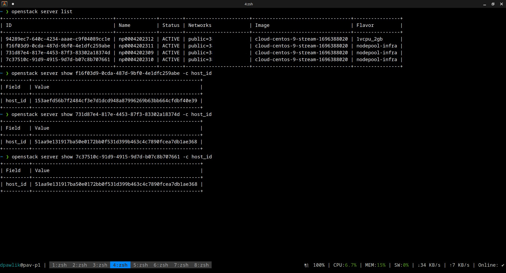

CPU usage - ramdisk
^^^^^^^^^^^^^^^^^^^

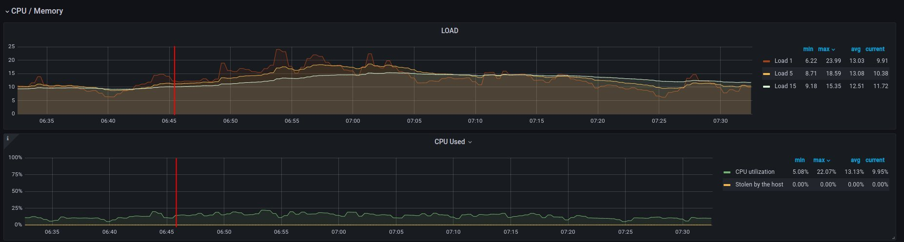

Disk usage - ramdisk
^^^^^^^^^^^^^^^^^^^^

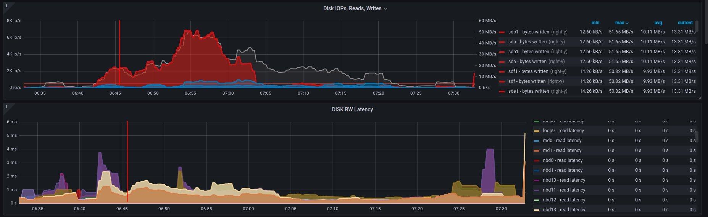

Alternative visualizations for CPU - ramdisk
^^^^^^^^^^^^^^^^^^^^^^^^^^^^^^^^^^^^^^^^^^^^

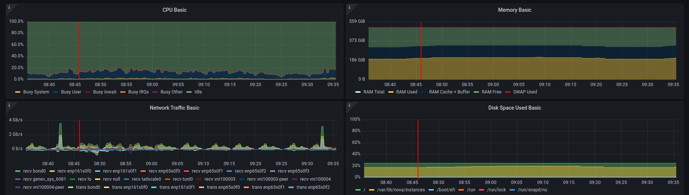

Alternative visualization for disk - ramdisk
^^^^^^^^^^^^^^^^^^^^^^^^^^^^^^^^^^^^^^^^^^^^

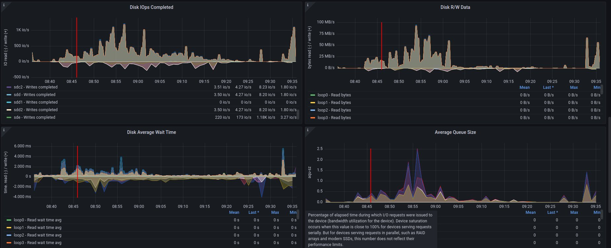

and

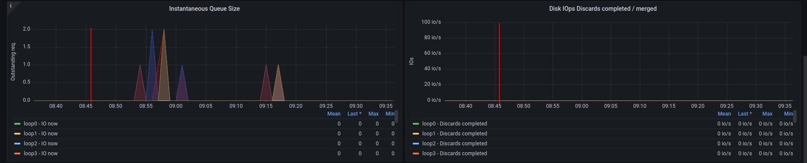

2. on disk - job has started 6:18 UTC / 8:18 CEST
~~~~~~~~~~~~~~~~~~~~~~~~~~~~~~~~~~~~~~~~~~~~~~~~~

There are 3 instances spawned on same host. There were also one more
VM, but it should not affect in tests results.

CPU usage - disk
^^^^^^^^^^^^^^^^

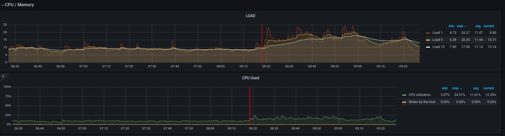

Disk usage - disk
^^^^^^^^^^^^^^^^^

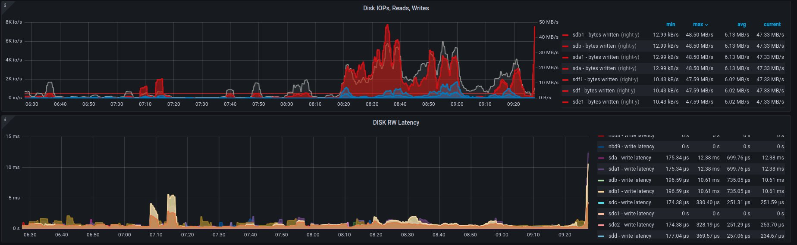

Alternative visualizations for CPU - disk
^^^^^^^^^^^^^^^^^^^^^^^^^^^^^^^^^^^^^^^^^

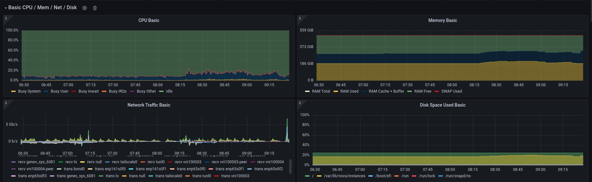

Alternative visualization for disk - disk
^^^^^^^^^^^^^^^^^^^^^^^^^^^^^^^^^^^^^^^^^

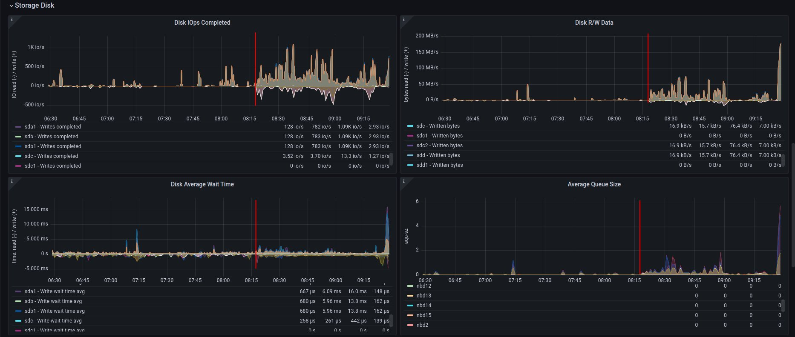

and

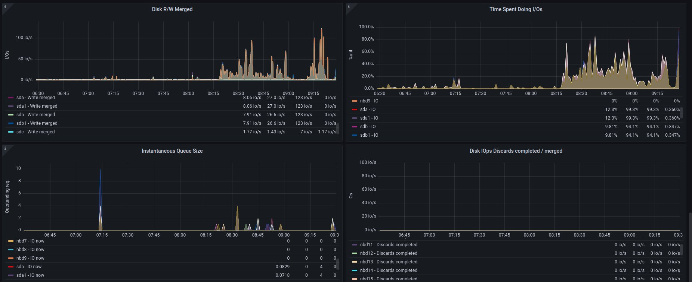

Improvements in sf-operator
---------------------------

The main issue while running reconcile loop was that the object should be
updated, but it was not.
More about that issue will explained in next blog post.
