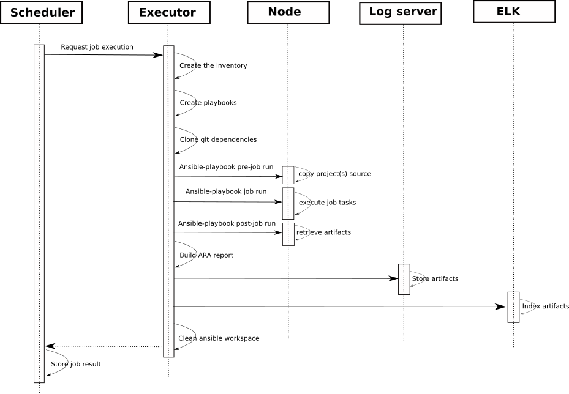
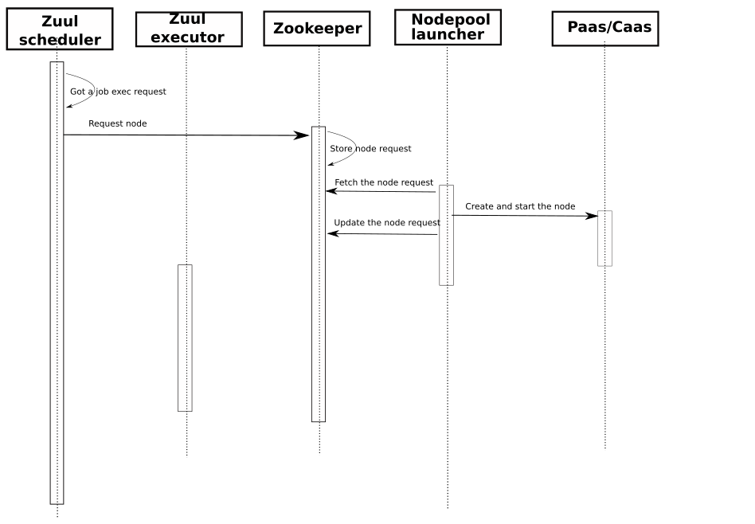

CI/CD workflow offered by Zuul/Nodepool on Software Factory
###########################################################

:date: 2019-01-24
:category: blog
:authors: Fabien Boucher

High level overview of Software Factory
=======================================

Zuul and Nodepool are at the heart of Software Factory. Zuul is a job
scheduler/runner and Nodepool is the node provisioner where Zuul executes jobs.

Software Factory provides, out the box, a fully functional Zuul and Nodepool
platform by providing default settings and addionnal, optional, components like
a logserver or an ELK stack. These components are provided configured to
integrate well with Zuul and Nodepool.

Software Factory components
===========================

The diagram below shows the components provided by a Software Factory
deployment. Grey boxes are mandatory components and blue ones are
optional.

.. image:: images/sf-arch.png

Mandatory components
--------------------

* Apache: HTTP frontend on top of the API and UI.
* Zuul: The job scheduler and runner. It handles base jobs provided by
  Software Factory, as well as user defined jobs. 
* Nodepool: The pool manager. This the Zuul's companion that provides clean
  and re-producible job workspace to Zuul.
* Zookeeper: Coordination service between Zuul and Nodepool.
* MariaDB: Database backend for Zuul and Nodepool.

Optional components
-------------------

* Gerrit: A git hosting and code review service 
* Logserver: A simple job logs and artifacts storage and publication service. 
* ELK: The ElasticSearch, Logstash, Kibana stack. It can be used to
  index job's artifacts and search through.
* ARA: Service to create comprehensive html Zuul/Ansible job execution reports.
* Log-analyse: Service to ease anomalies detection on job failures based on
  baselines of previous succeeded jobs.
* Code-Search: Service that provides a code search engine.
* repoXplorer: Service that provides code contribution metrics.
* Storyboard: A strory tracker.
* cgit: A fast git repositories browser.
* Grafana/InfluxDB: The stack that provide Software Factory usage metrics.
* Paste: A pastie like service.
* Etherpad: A collaborative editor.
* Mumble: An audio chat service.

Software Factory can integrate with existing Code Review system such Gerrit
or Github.

It is worth mentioning that Software Factory relie on a config git repository
(configuration as code) where configuration is validated and deployed via 
Zuul. The *config-chek* job ensures the proposed configuration is valid and
the *config-update* job deploys, after review and approval, the configuration
on Software Factory.

Zuul/Nodepool
-------------

The architecture
................

This diagram shows the Zuul and Nodepool components as well as external
services involved in the architecture.
 
.. image:: images/zuul-nodepool-arch.png

Zuul reads/receives event from code review system such as Gerrit and Github.
Those events are the source stimuli for Zuul to decide to trigger the run
of job. Events are such:

* Pull-Request/Review created
* Pull-Request/Review updated
* Pull-Request/Review commented
* ...

The Zuul's scheduler, based on its configuration, and the received events,
requests services from other Zuul's components. Zuul's mergers prepare the
project (to tested) source code such as rebase or merge the PR/Code-review
ABC on top of master branch of the repository. Zuul's executors, prepare
the Ansible workspace, and run ansible-playbook against the test node(s).
The Zuul web service provides the REST API. The API is mainly used by
the Zuul web UI to provided jobs execution status and projects configuration
overview. The Gearman bus is the communication channel between Zuul's services.

Nodepool manages lifecycle of node or container and communicate with the
Zuul scheduler via the Zookeeper service. Zookeeper stores node requests and
their status. To requires a node to execute a job, Zuul stores a node request
in Zookeeper. Nodepool's launchers look for requests and fullfil them
by spawning a node or a container on the provider. Nodepool will be requested
by Zuul to destroy the node after the job execution.

Furthermore, Nodepool is able to build cloud images. The images are built
from a Disk Image Builder definition and pushed on the cloud image service.

Job execution workflow
......................

This sequence diagram shows Zuul and Nodepool components involved in
the run a single job from the trigger stimuli that is the Code-Review
proposed patch and the job result returned to the path author.

* Zuul executor creates an Ansible workspace

  - Inventory file 
  - Playbook 
  - Add additional roles (pull from git repos)
  - Clone dependent repositories

* Zuul executor run Ansible isolated in bubblewrap
* Ansible run job phases

  - pre-run

    + rsync repo source on the test node
    + validate the test node

  - run
  - post-run

    + build the job ARA report
    + export the logs/artifacts to the logserver
    + export the logs/artifacts to the ELK stack

Nodepool lifecycle workflow
...........................

