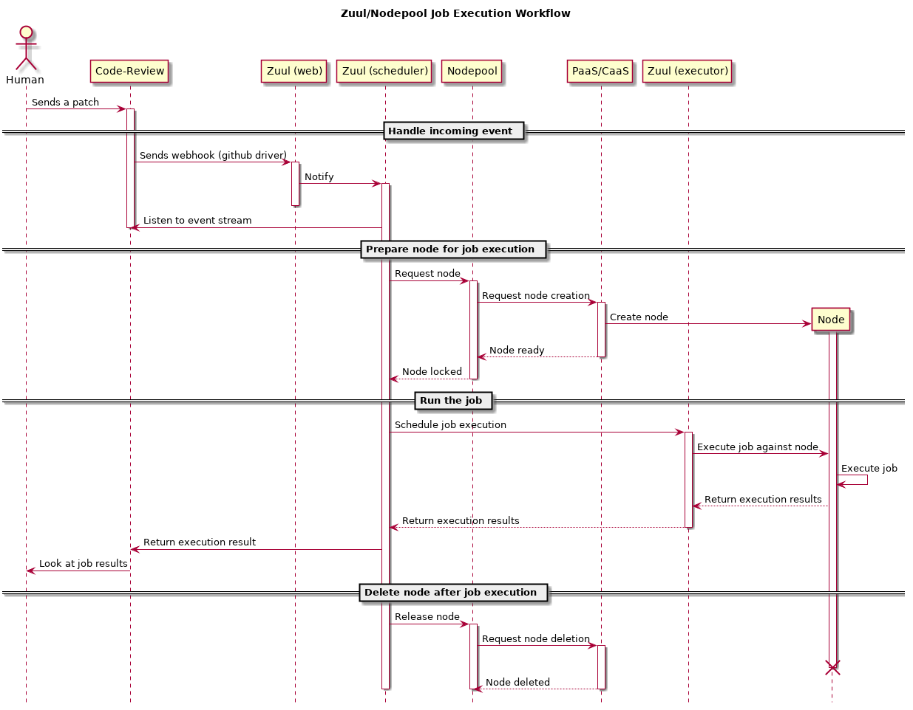
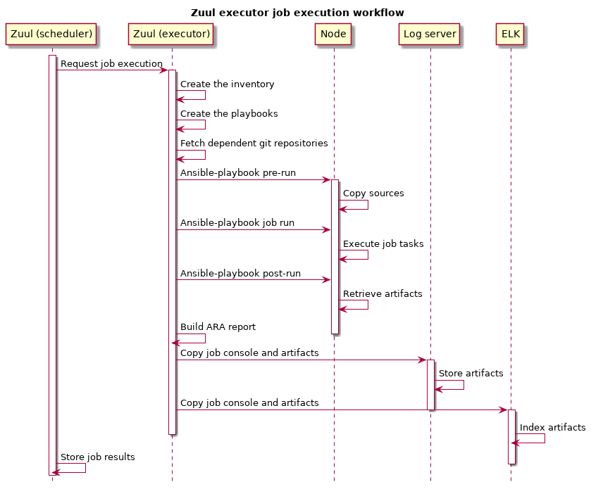

CI/CD workflow offered by Zuul/Nodepool on Software Factory
###########################################################

:date: 2019-01-24
:category: blog
:authors: Fabien Boucher

High level overview of Software Factory
=======================================

Zuul and Nodepool are at the heart of Software Factory.

* Zuul is a job scheduler/runner.
* Nodepool is the node provisioner on which Zuul executes jobs.

Software Factory provides, out the box, a fully functional Zuul and Nodepool
platform by providing default settings and addionnal (optional) components like
a logserver or an ELK stack. These components are deployed and configured to
integrate well with Zuul and Nodepool.

Software Factory components
===========================

The diagram, below, shows the components deployed as part of Software Factory.
Grey boxes are mandatory components and blue boxes components are optional.

.. image:: images/sf-arch.png

Mandatory components
--------------------

These components are essential part of Software Factory and are installed as
part of every deployment.

* Apache: HTTP frontend on top of the APIs and serve WEB UI.
* Zuul: The job scheduler and runner. That is the engine that Sofware Factory
  user will use to define and run jobs.
* Nodepool: The pool manager. This the Zuul's companion that provide clean
  and re-producible node contexts to Zuul for job execution.
* Zookeeper: Coordination service between Zuul and Nodepool.
* MariaDB: SQL database backend.

Optional components
-------------------

* Gerrit: A git hosting and code review service.
* Logserver: A simple job logs/artifacts storage and publication service.
* ELK: The ElasticSearch, Logstash, Kibana stack. It can be used to
  index job's artifacts and search through.
* ARA: Service to create comprehensive html Zuul/Ansible job execution reports.
* Log-analyse: Service to ease anomalies detection on job failures based on
  baselines of previous succeeded jobs.
* Code-Search: Service that provides a code search accross git repositories
  hosted by Software Factory.
* repoXplorer: Service that provides metrics on code contributions.
* Storyboard: A story/issue tracker.
* cgit: A fast git repositories web browser.
* Grafana/InfluxDB: The stack that provide Software Factory usage metrics.
* Paste: A pastie like service.
* Etherpad: A collaborative editor.
* Mumble: An audio chat service.

Software Factory can integrate with existing Code Review system such Gerrit
or Github.

It is worth mentioning that Software Factory relies on a *config* git repository
(configuration as code) where configuration is validated and deployed via
Zuul. This configuration as code workflow is handled by two Zuul jobs:

* The *config-chek* job ensures the proposed configuration is valid before the
  configuration change is merged.
* The *config-update* job deploys, after review and approval,
  the configuration on Software Factory. For instance, a change on the
  Nodepool configuration, will be deployed on the Nodepool services
  and services will be reload without any operator intervention.

Zuul/Nodepool
-------------

The architecture
................

This diagram shows Zuul and Nodepool's components as well as external
services involved in the architecture.

.. image:: images/zuul-nodepool-arch.png

Zuul reads/receives events from code review systems such as Gerrit and Github.
Those events are the source stimuli for Zuul to decide or not the triggering
of job(s). Events are such as:

* Pull-Request/Review created
* Pull-Request/Review updated
* Pull-Request/Review commented
* ...

The Zuul's scheduler, based on its configuration, and the received events,
requests services from other Zuul components:

* Zuul's mergers prepare project(s)'s (to be tested) source code by
  rebasing or merging the PR/Code-review X on top of master branch of
  the repository.
* Zuul's executors, prepare the Ansible workspace, and run ansible-playbook
  against the test node(s).
* The Zuul web service provides the REST API. The API is mainly used by
  the Zuul UI to provide jobs execution status and projects configuration
  overview.

The Gearman bus is the communication channel between Zuul's services.

Nodepool manages lifecycle of nodes/containers and communicate with the
Zuul scheduler via the Zookeeper service. Zookeeper stores node requests and
their status. To acquire a node for a job execution, Zuul stores a node request
in Zookeeper. Nodepool's launchers look for requests and fullfil them
by spawning a node or a container on the PaaS/CaaS or static node provider.
Nodepool will be instructed by Zuul to destroy the ephemeral node(s) after
the job(s) execution.

Furthermore, Nodepool is able to build cloud images. The images are built
from a Disk Image Builder definition and pushed on the cloud image service.

Job execution workflow
......................

This sequence diagram shows Zuul and Nodepool components involved in
the run of a single job from the trigger stimuli (the Code-Review proposed
patch), to the job result returned to the patch author.

1. An event is received (PR/Review created/updated)
2. Zuul requests a node from Nodepool in order to execute a job
3. Nodepool reserves an existing one or spawns a new node and notifies
   that the node is available
4. Zuul executor run the job (an Ansible playbook) against the node
5. Zuul requests the node to be deleted.

If multiple jobs are configured to be run then the scheduler will request
the corresponding amount of nodes to Nodepool. A single job may require
multiple nodes (multi-nodes job), Zuul will fullfil the requirement by
requesting the resources to Nodepool.

Note that fresh nodes are requested from Nodepool for each job execution. This
ensures an healthy workspace and reduce job flakiness. Furthermore Nodepool
is quota awared then it is capable of notifying Zuul to wait for resources
to become available.

Now look at how the executor handles a job execution.

* Zuul executor creates an Ansible workspace with:

  - An inventory file
  - The playbooks (pre-run, run, post-run)
  - Additional roles (pull from git repositories)
  - Fetch dependant repositories

* Zuul Ansible runs Ansible playbooks (job phases) isolated in bubblewrap

  - pre-run

    + rsync repo source on the test node
    + validate the test node

  - run
  - post-run

    + build the job ARA report
    + export the logs/artifacts to the logserver
    + export the logs/artifacts to the ELK stack

Architecture of Zuul job
........................

A Zuul job is a YAML definition that describe (non-exhaustive list):

* The job name
* Its parent job 
* The required Ansible roles for the job playbooks
* The secrets required (if any) (i.e.: passwords/private keys)
* The nodeset, required Nodepool nodes for the job playbooks
* The pre-run phase: the preparation playbook (if any)

  - Any actions that must be performed before the real
    job such as installing dependencies.

* The run phase: the job playbook
* The post-run phase: the post action playbook

  - Any action that must be performed after the real
    job such as artifacts retrieval.

Example of the base Zuul job provided by default with Software Factory.

.. code-block:: YAML

  - job:
      name: base
      parent: null
      description: The base job.
      pre-run: playbooks/base/pre.yaml
      post-run:
        - playbooks/base/post.yaml
      roles:
        - zuul: sf-jobs
        - zuul: zuul-jobs
      timeout: 1800
      attempts: 3
      secrets:
        - site_sflogs
      nodeset:
        nodes:
          - name: container
            label: runc-centos

The pre-run playbook is used to sync repositories sources to the test node.
The post-run playbook is used to fetch artifacts from the test node and
copy them to the log server and index them into ELK.

This base job could be simply inherited by any other jobs.

.. code-block:: YAML

  - job:
      name: tox-pep8
      parent: base
      description: Run tox pep8
      run: playbooks/tox.yaml
      vars:
        target: pep8

This conclude this quick overview of the workflow offered by Zuul and Nodepool
via Software Factory.

