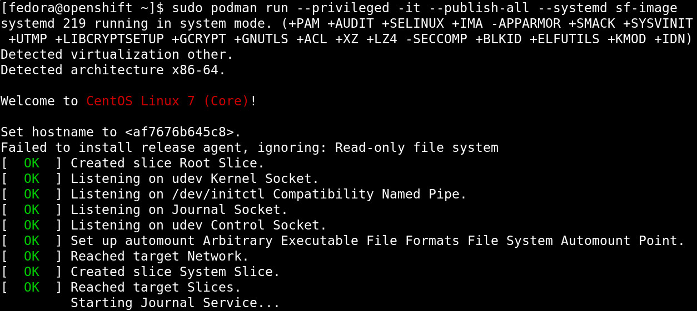
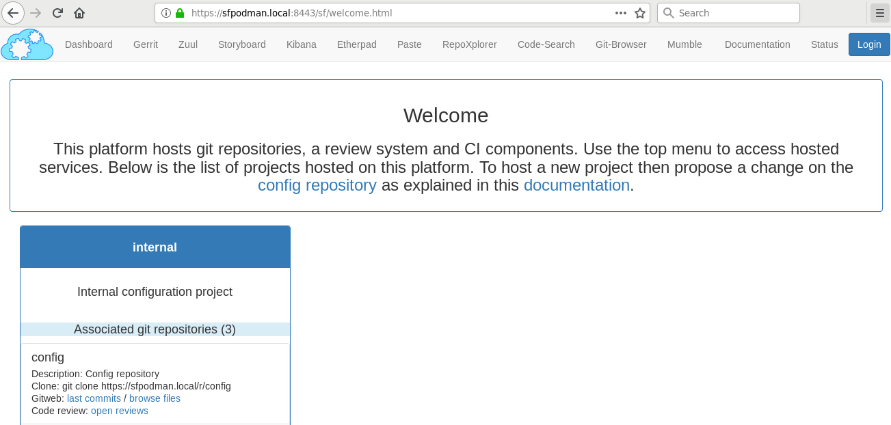

Software Factory Container With Buildah And Podman
##################################################

:date: 2019-01-02
:category: blog
:authors: tristanC

This article explains how to run Software Factory in a container with
Buildah_ and Podman_.

Containerize Software Factory
-----------------------------

We are planning on supporting Software Factory deployment on OKD_ in the
future, however, we are waiting for a proper cloud-native Zuul service to
mitigate the executor root privilege requirements discussed in this thread_.

This article is about containerizing the current Software Factory architecture
**as-is**:

* Using the sfconfig Ansible playbook to install and configure the services,
* Managing the services with systemd, and
* Deploying all in one container.

Our goal is to enable the user to quickly prototype and easily deploy the
services on a personal computer.

Building The Image With Buildah
-------------------------------

Buildah_ is a tool that facilitates building `Open Container Initiative`_ (OCI)
compliant images. Here is the bulk of the image building process:

.. code-block:: bash

   #!/bin/bash -e
   container=$(buildah from centos:latest)
   mountpath=$(buildah mount $container)

   trap "set +e; buildah umount $container; buildah delete $container" EXIT

   # Install sfconfig
   buildah run $container -- yum install -y \
     https://softwarefactory-project.io/repos/sf-release-master.rpm
   buildah run $container -- yum install -y sf-config

   # Run the install playbook
   buildah run $container -- sfconfig --skip-setup

   # Test that zuul is installed
   buildah run $container -- scl enable rh-python35 -- zuul --version
   # -> Zuul version: 3.3.1-1.el7

   # Tag the image
   buildah config --created-by "Software Factory" $container
   buildah config --author "release@softwarefactory-project.io" $container

   buildah commit $container sf-image

The main advantage of this method is its flexibility. The final **commit**
command creates a single layer and the **mountpath** variable enables
direct access to the image content.
Iterating quickly to fix the few issues found when using sf-config inside a
container image (such as fixing SELinux configuration which is not authorized
in a container) has been invaluable.

Here are some useful buildah commands:

* List the containers used: *buildah containers*
* Cleanup stalled build: *buildah delete --all*
* Cleanup images: *buildah rmi -a*

We now have an OCI image with all the Software Factory package installed but
they are not configured yet.

Starting Systemd Inside A Container
-----------------------------------

The recommended strategy is to run one service per container. However,
this requires an orchestration engine and adds some networking and
storage complexicity.

To keep things as simple as possible, we are going to start systemd inside
the container.

First we create a new minimal systemd target without multi-user services
such as agetty:

.. code-block:: text

   # /etc/systemd/system/default.target
   [Unit]
   Description=Software Factory boot target
   Requires=basic.target network.target network-online.target
   Wants=sfconfig.service
   After=basic.target

Then we create a new sfconfig service to trigger the configuration playbook:

.. code-block:: text

   # /lib/systemd/system/sfconfig.service
   [Unit]
   Description=sfconfig configuration script
   Requires=dbus.service sshd.service

   [Service]
   Type=simple
   ExecStart=/usr/libexec/software-factory/sfinit
   TimeoutSec=0
   StandardOutput=tty
   StandardError=tty
   StandardInput=tty
   TTYPath=/dev/pts/0
   TTYReset=yes
   TTYVHangup=yes

And finally we create a **sfinit** script to manage the services configuration
and execute a journalctl process so that services logs are forwarded to the
container logs:

.. code-block:: bash

   #!/bin/bash -i
   # prettify env
   export HOME=/root
   export TERM=xterm
   source /etc/profile

   # fix hostname (hostnamectl doesn't work in podman)
   hostname managesf.sfpodman.local
   sed -e 's/sftests.com/sfpodman.local/' -i /etc/software-factory/sfconfig.yaml
   cat <<EOF> /etc/software-factory/custom-vars.yaml
   provision_demo: true
   gateway_force_ssl_redirection: false
   EOF

   # enable exec in /tmp (TODO: figure out what set it to noexec...)
   mount -o remount,exec /tmp

   # setup services
   sfconfig --skip-install
   journalctl -f &
   exec bash

The above file needs to be added inside the *mountpath* and sfinit needs to be
marked executable. We can now finalize the image creation:

.. code-block:: bash

   # Run these before the commit command
   buildah config --cmd /sbin/init $container
   builadh config --port 80        $container
   builadh config --port 443       $container
   builadh config --port 29418     $container

And test it using this command:

|

Running The Image With Podman
-----------------------------

Podman_ is a container runtime that does not implement a big fat daemon like
the Docker Engine. The advantage of the Podman_ model is that cgroups or
security constraints still control the container processes.

To start software factory:

.. code-block:: bash

   $ podman run --privileged --interactive --tty --publish-all
                --systemd --name my-sf sf-image
   [...]
   PLAY RECAP ********************************************************************
   managesf.sfpodman.local    : ok=528  changed=252  unreachable=0    failed=0

   Friday 04 January 2019  10:15:29 +0000 (0:00:00.071)       0:03:07.513 ********
   ===============================================================================
   sf-mysql : Start mariadb ----------------------------------------------- 12.13s
   sf-gerrit : Start service ----------------------------------------------- 9.37s
   sf-gerrit : Reload gerrit service --------------------------------------- 8.70s
   sf-gerrit : restart gerrit ---------------------------------------------- 8.64s
   sf-gateway : Update dashboards ------------------------------------------ 6.14s
   sf-zuul : Get service configuration via managesf/configurations --------- 5.98s
   sf-repos : Check if repository exists ----------------------------------- 5.16s
   sf-repos : Check if repository exists ----------------------------------- 5.12s
   sf-zuul : Generate tenant-update secrets -------------------------------- 5.03s
   sf-repos : Check if repository exists ----------------------------------- 3.92s
   sf-repos : Create initial resources ------------------------------------- 3.88s
   sf-gerrit : Reindex gerrit when service is not running ------------------ 3.86s
   sf-gerrit : Initialize/Upgrade gerrit when service is not running ------- 3.73s
   sf-repos : Provision demo resources in config repo ---------------------- 2.78s
   sf-zuul : Wait for gearman server --------------------------------------- 2.09s
   sf-zuul : Manually create database to avoid concurrency issue ----------- 1.98s
   sf-postfix : Generate virtual database ---------------------------------- 1.90s
   sf-monit : restart monit ------------------------------------------------ 1.86s
   sf-monit : restart monit ------------------------------------------------ 1.82s
   sf-repos : Make a first admin connexion through SF SSO ------------------ 1.64s
   sfpodman.local: SUCCESS

   Access dashboard: https://sfpodman.local
   Login with admin user, get the admin password by running:
     awk '/admin_password/ {print $2}' /etc/software-factory/sfconfig.yaml

* The *--privileged* flag is required for the zuul-executor services.
* The *--interactive* and *--tty* (or simply *-ti*) flags keep the process
  in the foreground.
* The *--publish-all* flag creates the network port mapping.
* The *--systemd* flag take cares of special configurations needed by the
  systemd init command.
* And the *--name* flag is to name the container for easy reference.

After the configuration is completed, you can set the ip address of the
instance to **sfpodman.local** in your /etc/hosts file and use this
command to get the port mapping:

.. code-block:: bash

   $ podman port my-sf
   443/tcp -> 0.0.0.0:33251
   80/tcp -> 0.0.0.0:38087
   29418/tcp -> 0.0.0.0:36167

After using the services, you can save the state to restart the container with
your change using:

.. code-block:: bash

   $ podman commit my-sf my-sf-image
   // Then use my-sf-image instead of sf-image

Finally you can publish the image to a remote registry using:

.. code-block:: bash

   $ podman login docker.io
   $ podman push sf-image docker://docker.io/my-org/sf-image

Here are some other useful podman commands:

* List available images: *podman images*
* List processes: *podman ps -a*
* Kill all the containers: *podman rm -af*
* Cleanup images: *podman rmi -a*

Conclusion
----------

Using Podman_ and Buildah_, we can build a Software Factory container image that is
surprisingly small, less than **500 MB** and fast to deploy, about: **5 minutes**.
Check it for yourself using this single command:

.. code-block:: bash

   $ podman run --privileged --interactive --tty --publish-all --systemd \
       softwarefactoryproject/sf-minimal:latest

Similarly, we can also build the other Software Factory architectures, for example
the sf-zuul-minimal which doesn't have the gerrit service and the sf-allinone
which features all the supported services such as InfluxDB, Grafana, ELK, lodgeit,
etherpad, mumble, code-search, repoxplorer and storyboard:

.. code-block:: bash

   $ podman run --privileged --interactive --tty --publish-all --systemd \
       softwarefactoryproject/sf-allinone:latest

|

It is worthy to mention that Podman_, Buildah_ and other tools like
Skopeo_ or CRI-O_ re-use common data libraries that support multiple
independent processes to interact with at the same time:
`containers/storage`_ and `containers/image`_.

Altogether, this new toolchain offers an efficient method to work with
open containers without the hassle of frequent docker issues.

Moreover, the maintainers are very re-active: when working on this story,
I encountered a bug with the commit command which got promptly fixed in
`less that 4 hours <https://github.com/containers/libpod/issues/2066>`_.

.. _thread: http://lists.zuul-ci.org/pipermail/zuul-discuss/2018-July/000477.html
.. _OKD: https://www.okd.io/
.. _`containers/storage`: https://github.com/containers/storage
.. _`containers/image`: https://github.com/containers/image
.. _Buildah: https://buildah.io/
.. _Podman: https://podman.io/
.. _Skopeo: https://github.com/containers/skopeo
.. _CRI-O: https://cri-o.io/
.. _`Open Container Initiative`: https://www.opencontainers.org
