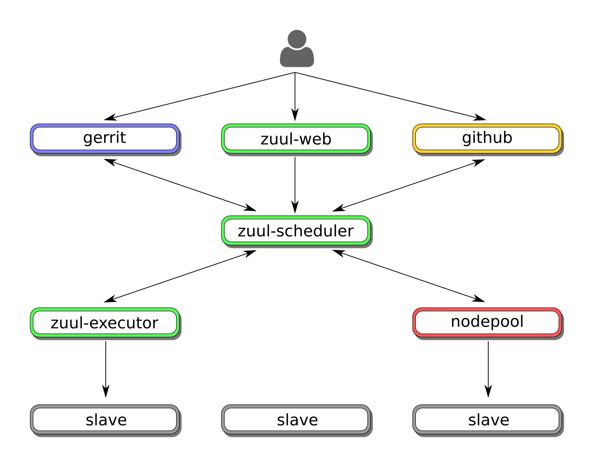

Zuul Hands on - part 1 - What is Zuul ?
---------------------------------------

:date: 2018-06-13
:category: blog
:authors: Nicolas Hicher

This article is the first in a series about learning Zuul by usage. This series
will start with simple use cases then will cover more complex jobs
configurations.

In this first article, we will quickly introduce Zuul components and give some
details about how Zuul is integrated within Software Factory.

You can deploy a Zuul sandbox by using Software Factory. To do so, please read
this `article
<http://www.softwarefactory-project.io/how-to-setup-a-software-factory-sandbox.html>`_,
that explains how to setup a SF sandbox. This article and upcoming ones are based
on a Software Factory deployment, so we highly recommend to deploy this sandbox
to successfully experiment with Zuul.

Zuul project
............
`Zuul <https://docs.openstack.org/infra/zuul/>`_ is an application created by the
OpenStack-infra team to be the gating system for OpenStack projects. The main
role of Zuul is to gate all of OpenStack projects’ source code. Zuul ensures
changes are only merged if they pass the tests jobs. Zuul jobs are created using
ansible playbooks and roles to perform tests.

The major key features of Zuul are:
* Smart gating: avoid a broken master branch.
* Speculative testing: tests jobs are executed on the future states of projects repositories.
* Scaling: Zuul relies on Nodepool to leverage a pool of test nodes.
* Pipelines: the lifecycle of Pull requests/Gerrit changes is defined through pipelines.
* Multi-repository: Zuul can gate projects spread across multiple repositories.
* Parallel testing: Zuul can provision as many jobs as there are nodes available to run them.
* In-repository job configuration: each project can define its pipelines and jobs configuration in a file called .zuul.yaml.
* Pre-merge job loading: Jobs changes are loaded by Zuul and tested before being merged.
* Multi-node job support: Zuul can use execute jobs that need more than one test nodes to execute, for example when testing clients and servers.

All these features will be explained in more depth in following articles.

Zuul components
...............

Zuul consists of multiple components that work together with a Code Review
system. Here is a list of these components:

* Code review system: hosts the changes to gate with Zuul. Zuul supports Gerrit (code reviews) and Github (Pull Requests).
* zuul-scheduler receives events from remote systems, and schedules the execution of jobs
  according to a project's job configuration; then reports job results to the Code
  Review system.
* zuul-executor uses ansible to execute jobs remotely on test nodes provided by Nodepool.
* Nodepool prepares and deploys slaves used to run tests jobs (OpenStack instances
  or OCI containers can be used in a Software Factory deployment).
* zuul-web is the REST API and the Zuul Web frontend.

You can find a full description of all the components in the `documentation
<https://docs.openstack.org/infra/zuul/admin/components.html>`_.

Zuul in Software Factory
........................

Zuul components are configured using the *config* repository, the configuration is
in the *zuul.d* directory within that repository. You can clone this repository on your workstation, it will be used in
the next articles to configure Zuul:

.. code-block:: bash

   git clone -c http.sslVerify=false https://sftests.com/r/config

The main configuration files for Zuul are located in */etc/zuul*:
* zuul.conf is the main configuration file for zuul.
* main.yaml contains the tenants, remote systems and repositories.

The log files for zuul components (scheduler, executor and web) are located in
*/var/log/zuul*.

On your SF deployment, you can access Zuul-web at *https://sftests.com/zuul/t/local/status.html* and
the documentation at *https://sftests.com/docs/*.

.. figure:: images/zuul_web.png
   :width: 80%

Stay tuned for the next article, where we will create our first project in
Software Factory, and gate a first change via Gerrit and Zuul.
