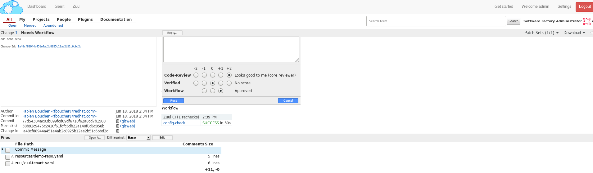
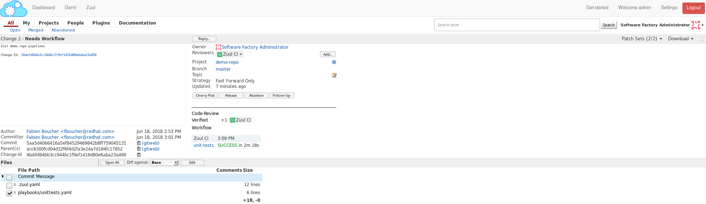
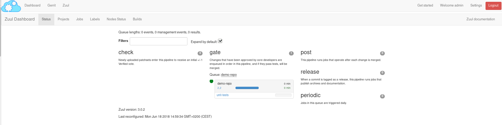
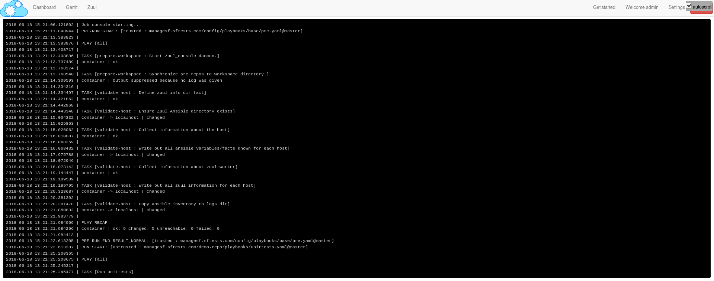

Zuul Hands on - part 2 - Your first gated patch with Zuul
---------------------------------------------------------

:date: 2018-09-17
:category: blog
:authors: Fabien Boucher
:tags: zuul-hands-on-series

In this article, we will create a project and explain how to configure a basic
CI workflow in order to gate your first patch with Zuul. The instructions and
examples below are given for a sandbox deployment but are easy to adapt to any
deployment of Software Factory.

To deploy a Software Factory sandbox please read this `article (How to setup a Software Factory sandbox) <{filename}/blog-zuul-01-setup-sandbox.rst>`_.

This article is part of the `Zuul hands-on series <{tag}zuul-hands-on-series>`_.

Note that most of the links reference *sftests.com* which is the default domain of the sandbox
documented in the *How to setup a Software Factory sandbox* blog post. Make sure to adapt the
links if necessary.

Projects in Software Factory
............................

A project is simply an umbrella entity that consists of one or several code
repositories, akin to a Github organization for example. It is a handy way to
regroup repositories by themes or purpose. A repository must belong to a
project. Don't be confused, in the Zuul terminology, a project is a git
repository.

Create and initialize a demo project
....................................

We need to create a patch on the **config** repository. This patch will consist in a
YAML file that describes the new repository.

For the following example you will need to install git review package on your local machine.

.. code-block:: bash

  dnf install git-review
  or
  yum install git-review
  or
  pip install git-review
  or
  python -m pip install git-review

Clone the config repository
,,,,,,,,,,,,,,,,,,,,,,,,,,,,,

From your host, clone the config repository and configure **git review**:

.. code-block:: bash

  git clone -c http.sslVerify=false https://sftests.com/r/config
  cd config
  git review -s

You will be prompted for your username on SF, use the **admin** username.

Define the demo-repo repository
,,,,,,,,,,,,,,,,,,,,,,,,,,,,,,,

Repositories are defined in the **resources** folder of the config repository.
Each YAML file in this folder can define one or several Software Factory's
resources like a project or a Gerrit repository. You can read more about
the resources definition in `this documentation (sftests.com) <https://sftests.com/docs/user/resources_user.html>`_.

Create the **resources/demo-project.yaml** file and add the following into it:

.. code-block:: yaml

  resources:
    projects:
      demo-project:
        description: Demo project
        source-repositories:
          - demo-repo
    repos:
      demo-repo:
        description: A demo repository
        acl: demo-acl
    acls:
      demo-acl:
        file: |
          [access "refs/*"]
            read = group config-core
            owner = group config-ptl
          [access "refs/heads/*"]
            label-Code-Review = -2..+2 group config-core
            label-Code-Review = -2..+2 group config-ptl
            label-Verified = -2..+2 group config-ptl
            label-Workflow = -1..+1 group config-core
            label-Workflow = -1..+1 group config-ptl
            label-Workflow = -1..+0 group Registered Users
            submit = group config-ptl
            read = group config-core
            read = group Registered Users
          [access "refs/meta/config"]
            read = group config-core
            read = group Registered Users
          [receive]
            requireChangeId = true
          [submit]
            mergeContent = false
            action = merge if necessary
        groups:
          - config-ptl
          - config-core

Run **git review** to send the patch on Gerrit:

.. code-block:: bash

  git add resources/demo-project.yaml
  git commit -m"Add demo repo"
  git review

Two Zuul jobs are attached to the **config** repository. The following
workflow applies to patches on this repository:

* The **config-check** job validates incoming config patches (linting, syntax, etc).
  This job is run at **check** time (when a new patch or a new revision of a
  patch is pushed on Gerrit) and at **gating** time (after the patch is approved
  and just before it is merged).
* Once merged, the **config-update** job is executed, in the *post** pipeline to
  apply the new configuration to Software Factory.

In other words, Zuul ensures the **Configuration as Code** workflow of
Software Factory.

To confirm the repository creation, connect to the `Gerrit interface (sftests.com) <http://sftests.com/r/>`_
as the admin user, then find the **Add demo repo** patch. Make sure **Zuul CI**
has voted **+1 Verified**, then approve and schedule for merging by giving the patch
a **+2 Code-Review** and a **+1 Workflow**.

|

Wait a couple of minutes until the **demo-repo** appears in the
`Gerrit projects list page (sftests.com) <https://sftests.com/r/#/admin/projects/>`_.

Provision the demo-repo source code
,,,,,,,,,,,,,,,,,,,,,,,,,,,,,,,,,,,

We can now clone **demo-repo**:

.. code-block:: bash

  git clone -c http.sslVerify=false https://sftests.com/r/demo-repo
  cd demo-repo
  git review -s

You will be prompted for your username on SF, use the **admin** username.

Let's add some basic code in **demo-repo**; create the following **hello.py** file
in the repository:

.. code-block:: python

  import unittest

  class TestHello(unittest.TestCase):
      def test_hello(self):
          self.assertEqual(hello(), 'Hello Zuul')

  def hello():
      return "Hello Zuul"

  if __name__ == "__main__":
      print(hello())

Push the code to the **demo-repo** repository. Note that we don't use **git review**
here; we simply bypass the review process of Gerrit since no CI testing is configured
for this repository yet. We can do that because of the ACLs we set earlier on
the repository. Note also that the remote is called **gerrit** (which has been
set by *git review -s*).

.. code-block:: bash

  git add hello.py
  git commit -m"Initialize demo-repo project"
  git push gerrit

Configure a Zuul job for demo-repo
..................................

We will now create a job and configure the **demo-repo** project's Zuul pipelines,
so that this job is run at checking and gating times to ensure the quality of a
patch.

Zuul allows jobs and pipelines to be defined in an external repository (this is useful if you
have several repositories that share the same testing needs, for example setting up a
common testing environment), but also to be defined within a code repository itself.
This is the approach we're going to use here.

First, we define a job playbook in **demo-repo**. To do so, create the
**playbook** directory then the file **playbooks/unittests.yaml**:

.. code-block:: yaml

  - hosts: all
    tasks:
      - name: Run unittests
        shell:
          cmd: "sleep 60; python -m unittest -v hello"
          chdir: "{{ zuul.project.src_dir }}"

Note that we are using the **zuul.project.src_dir** variable to set the task's working
directory to the repository's root. Zuul defines a fair amount of variables that
can be used when writing jobs; the full list and descriptions are available
`in the Zuul's documentation (sftests.com) <https://sftests.com/docs/zuul/reference/jobs.html#variables>`_.

In the second step, we define the **unit-tests** Zuul job and attach it to the
project's Zuul pipelines. Zuul looks for a file named **.zuul.yaml** within the
repository; this file defines jobs and pipelines for this repository.

In **demo-repo**, create the file **.zuul.yaml**:

.. code-block:: yaml

  - job:
      name: unit-tests
      description: Run unittest
      run: playbooks/unittests.yaml

  - project:
      check:
        jobs:
          - unit-tests
      gate:
        jobs:
          - unit-tests

Submit the change to Gerrit:

.. code-block:: bash

  git add -A
  git commit -m"Init demo-repo pipelines"
  git review

Note that this time, we don't push directly the change to the repository but we
go through the code review system. This is because Zuul automatically detects
changes to the configuration files within a patch on the repository, and evaluates
them speculatively. In other words, the jobs we added to the check pipeline will
be run to validate the patch, even though this configuration change hasn't been merged yet.

This lets you make sure that your changes to the CI do what you expect before applying
them globally, instead of potentially wrecking the CI for all contributors.

Gating made easy
................

With this rather simple patch, we tell Zuul to:

- run the **unit-tests** job in the **check** pipeline, ie whenever a new
  patch or a change to an existing patch is submitted to Gerrit.
- run the **unit-tests** job in the **gate** pipeline, ie right after a patch has
  been approved but before it is merged. This is to acknowledge any discrepancies
  between the state of the repository when the change was last tested and its
  current state (several patches might have landed in between, with possible
  interferences). We will dive into the details of the gate pipeline in a
  follow-up article.
- call the Gerrit API to merge the patch if the job execution in the **gate**
  pipeline succeeded.

The **unit-tests** job is simple, it tells Zuul to execute the Ansible
playbook **unittests.yaml**, which contains a single task, ie run python's
unittest module on the hello.py file.

The job can be kept simple because it "inherits" automatically from the default
`base job (sftests.com) <https://sftests.com/r/gitweb?p=config.git;a=blob;f=zuul.d/_jobs-base.yaml>`_
which handles all of the grisly details like setting up the test environment and
exporting logs. The **base** job, rather than being inherited, more accurately
encapsulates the unit-tests job, by running a **pre** playbook before unit-tests,
and a **post** playbook after **unit-tests**, regardless of whether the latter
ended in success or failure.

Because we haven't specified an inventory (also called *nodeset*, due to Zuul's
multi-node capabilities), the **unit-tests** job will be run on the default nodeset
defined in the **base** job. By default in Software Factory it consists of a
single OCI container provided by the RunC driver of Nodepool.

Software Factory's **base** job's **post** playbook exports the jobs' logs to the Software
Factory logs server.

Now, check that Zuul has run the job in the check pipeline and has reported a
**+1** in the *Verified Label*, on the patch's Gerrit page.

|

To access a given job's run's logs, simply click on the job name. By default the
**console logs** are saved in **job-output.txt.gz**. The `ARA report <https://ara.readthedocs.io>`_
gives a more condensed view of the playbook's execution. Also have a look at
**zuul-info/inventory.yaml** which contains all Ansible variables available at
playbook runtime.

.. image:: images/zuul-hands-on-part3-c3.png
   :alt: None

|

Just as we did before for the config project, use the Gerrit web interface to approve the
change and let Zuul run the gate job and merge the change.

You should soon see the gate job appear on the `Zuul status page (sftests.com) <https://sftests.com/zuul/t/local/status>`_.

|

Clicking on the job's name brings you to the Zuul job console. The **unittests** playbook
should wait for 60 seconds before starting the **python -m unittests** command
so we should have time to witness the execution of the job in real time in the console.

|

As soon as the **gate** job finishes successfully, Zuul merges the patch
in the **demo-repo** repository.

If you reached that point, congratulations, you successfully configured
Zuul to gate patches on **demo-repo** !

.. image:: images/zuul-hands-on-part3-c6.png
   :alt: None

|

Now, any new patch submitted to the **demo-repo** repository will trigger automatically
this same CI workflow.

Exercises left to the reader
............................

* Send a new patch on demo-project that fails to pass the check pipeline. Then
  fix it by amending it.
* Read the default **base job** in the config repository in `_jobs-base.yaml (sftests.com) <https://sftests.com/r/gitweb?p=config.git;a=blob;f=zuul.d/_jobs-base.yaml;hb=refs/heads/master>`_.
* Read the `pre.yaml (sftests.com) <https://sftests.com/r/gitweb?p=config.git;a=blob;f=playbooks/base/pre.yaml;hb=refs/heads/master>`_ and `post.yaml <https://sftests.com/r/gitweb?p=config.git;a=blob;f=playbooks/base/post.yaml;hb=refs/heads/master>`_ playbooks that the **base job** run prior and
  after every job.
* Look at the `default pipelines definitions (sftests.com) <https://sftests.com/r/gitweb?p=config.git;a=blob;f=zuul.d/_pipelines.yaml;hb=refs/heads/master>`_. Pipelines define strategies
  to trigger jobs, and report job results.

These files are part of how Zuul is integrated into Software Factory, they are
self managed but knowing their existence is quite important for mastering
Zuul.

You can refer to Zuul's `latest documentation <https://zuul-ci.org/docs/>`_ or refer to `the version <http://sftests.com/docs/zuul>`_
included with any Software Factory deployment.

Stay tuned for the next article, where we will use Zuul's jobs library
to take advantage of pre-defined Ansible roles to ease job creation.
