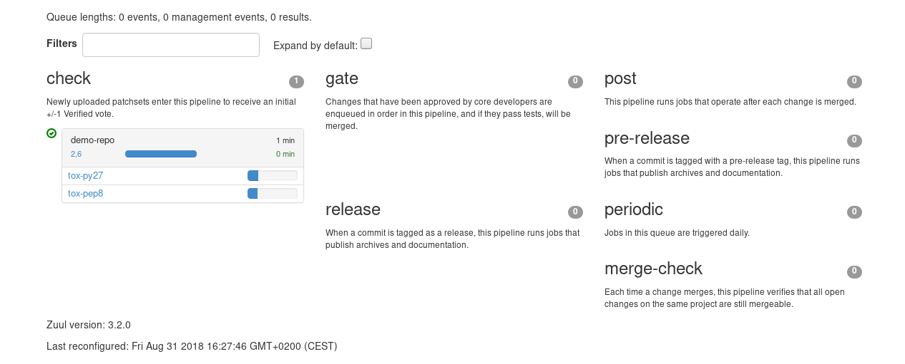

Zuul Hands on - part 3 - Use the Zuul jobs library
--------------------------------------------------

:date: 2018-08-31
:category: blog
:authors: Fabien Boucher
:tags: zuul-hands-on-series

In this article, we will:

- provision a python project with a test suite based on tox and
- explain how to use `zuul-jobs library <https://github.com/openstack-infra/zuul-jobs>`_ in
  order to benefit from jobs maintained by the Zuul community.

To deploy a Software Factory sandbox please read this `article <{filename}/blog-zuul-01-setup-sandbox.rst>`_.

If you previously created the VM snapshot as recommended at the end of the setting
process of the sandbox then it is adviced to restore it. In that case make sure
the system date of the restored VM is correct. If not fix it by running
*systemctl stop ntpd; ntpd -gq; systemctl start ntpd*.

This article is part of the `Zuul hands-on series <{tag}zuul-hands-on-series>`_.

Create a demo repo
..................

Follow this section of the `previous article <{filename}/blog-zuul-03-Gate-a-first-patch.rst#create-the-demo-repo-repository-on-gerrit>`_
to create the **demo-repo**.

Provision the demo-repo source code
,,,,,,,,,,,,,,,,,,,,,,,,,,,,,,,,,,,

Clone **demo-repo** and provision it with `this <{filename}/demo-codes/hoz-4-demo-repo.tgz>`_ demo code.

.. code-block:: bash

  git clone -c http.sslVerify=false https://sftests.com/r/demo-repo
  cd demo-repo
  git review -s # Enter admin as username
  tar -xzf /tmp/hoz-4-demo-repo.tgz -C .

The **demo-repo** source code owns a **tox.ini**, so unittests can be started
by running tox.

.. code-block:: bash

  tox

Push the code to the **demo-repo** repository. Note that we don't use **git review**
here to bypass the review process of Gerrit. Indeed no CI is configured
for this repository yet.

.. code-block:: bash

  git add -A
  git commit -m"Initialize demo-repo project"
  git push gerrit

Use zuul-jobs tox jobs
......................

Software Factory bundles a copy of the upstream zuul-jobs library. You can
browse zuul-jobs's `source code <https://sftests.com/r/gitweb?p=zuul-jobs.git;a=tree>`_ and
its `documentation <https://sftests.com/docs/zuul-jobs/>`_.

As the **demo-repo** source code comes with a tox file we can benefit from
the **tox-py27** and **tox-pep8** jobs defined in **zuul-jobs**.

In **demo-repo**, create the file **.zuul.yaml**:

.. code-block:: yaml

  - project:
      check:
        jobs:
          - tox-py27
          - tox-pep8
      gate:
        jobs:
          - tox-py27
          - tox-pep8

Then submit the change on Gerrit:

.. code-block:: bash

  git add .zuul.yaml
  git commit -m"Init demo-repo pipelines"
  git review

Both jobs will be started in parallel by Zuul, let's have a look to the
`status <https://sftests.com/zuul/t/local/status.html>`_ page.

|

In addition to the console log you will find in the artifacts, inside
the **tox/** directory, the logs of the execution stages of tox.

As of now the zuul-jobs library is pretty small and mainly supports classical
CI tasks for Python projects like pypi export, tox execution or even
sphinx doc build. However the library could be a source of good examples
to write your own jobs.

Stay tuned for the next article.
