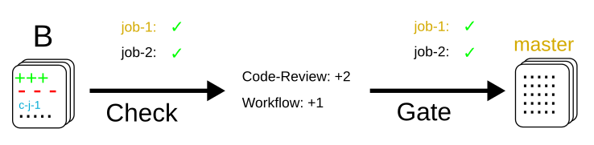
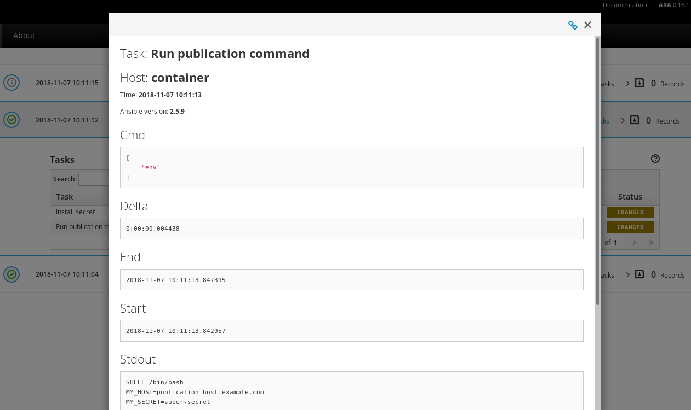
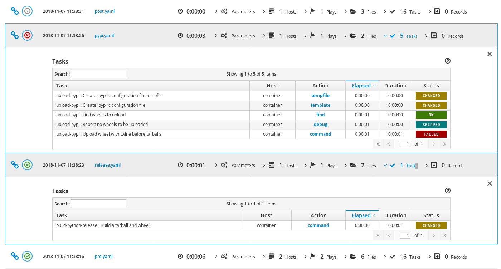

Zuul Hands on - part 5 - Job Secrets
------------------------------------

:date: 2018-11-20
:category: blog
:authors: tristanC
:tags: zuul-hands-on-series

In this article, we will explain how to use job secrets stored directly
in the git repositories of projects.

This article is part of the `Zuul hands-on series <{tag}zuul-hands-on-series>`_.

The examples and commands that follow are intended to be run on a Software Factory
sandbox where a **demo-repo** repository exists. You should have such an environment
after following the previous articles in this series:

- To deploy a Software Factory sandbox please read the `first article of the series <{filename}/blog-zuul-01-setup-sandbox.rst>`_.
- To create the **demo-repo** repository, please follow the sections `Clone the config repository <{filename}/blog-zuul-03-Gate-a-first-patch.rst#clone-the-config-repository>`_
  and `Define the demo-repo repository <{filename}/blog-zuul-03-Gate-a-first-patch.rst#define-the-demo-repo-repository>`_ sections.

Incidentally, most of the links reference *sftests.com* which is the default
domain of the sandbox. Make sure to adapt the links if necessary.

If you have already deployed a Software Factory sandbox and created a snapshot as
suggested, you can restore this snapshot in order to follow this article on a clean environment.
In that case make sure the virtual machine's time is correct post
restoration. If not fix it by running

.. code-block:: bash

  systemctl stop ntpd; ntpd -gq; systemctl start ntpd

Projects Types: config vs untrusted
...................................

Zuul defines two categories of projects:

* **config** projects, and
* **untrusted** projects.

The main difference is that config projects are **protected** and changes to
their Zuul configuration **are not tested speculatively**.
Untrusted projects' configuration changes are tested speculatively before
being merged, while config project configuration are only effective after
being merged.

Let's vizualize the difference on some workflow diagrams:

Untrusted projects
******************

Let's assume *A* is an incoming patch to an **untrusted** project. *A*
modifies the *job-1* being run in the **check** gate (*job-1*,
the modified job is pictured in orange below). Merging this change will look
like this in terms of workflow:

.. image:: images/zuul-hands-on-part6-untrusted-project-workflow.png

|

The change gets tested speculatively, therefore the change to *job-1*
is used immediately in the **check** and **gate** pipeline, **before** being
merged.

Config projects
***************

Let's assume now that *A* is an incoming patch on a **config** project.
Merging this change will look like this in terms of workflow:

|

This time, the change to *job-1* is not applied in the **check** or **gate**
pipeline. The rationale here is that changes to a config project are impactful
and need to be reviewed by humans before being run automatically. If they
were run as soon as the check pipeline, nothing would prevent a malicious user
from leaking passwords used in the jobs, for example.

Once A is merged, subsequent patches get tested with the new changes:

|

Regarding secrets, the main difference between **untrusted** and **config**
projects is that for security reasons, untrusted projects' secrets shall only
be used in post-review_ pipelines such as the pre-defined
**"periodic"** or **"post"**.

Using a secret in a config project
..................................

A typical use case is a secret needed by a publishing or deployment job.
Actually, the **base** job (built-in in Software Factory) is using a secret to
upload job logs to the log server defined in the config project's
**zuul.d/_secret_sflogs.yaml** file, and used by the base job defined in
**zuul.d/_jobs-base.yaml** file.

To encrypt a custom secret, you can use the `zuul-client`_ script
from the Zuul source repository. This script needs
the tenant name and project name to retrieve the project's public key and
properly encrypt the secret. We will use it to encrypt a custom secret
for the config project.

You can install from source here `zuul-client`_ , or through pip:

.. code-block:: bash

   pip install zuul-client

.. code-block:: bash

   zuul-client -v --insecure --zuul-url https://sftests.com/zuul encrypt --project config --tenant local
   <write your secrets here and exit with Ctrl+D>
   ...
   DEBUG:urllib3.connectionpool:https://sftests.com:443 "GET /zuul/api/tenant/local/key/config.pub HTTP/1.1" 200 800
   DEBUG:zuul-client:Calling openssl
   DEBUG:zuul-client:calling "openssl version"
   DEBUG:zuul-client:calling "openssl rsa -text -pubin -in /tmp/tmpti0h47uu"
   writing RSA key
   INFO:zuul-client:Public key length: 4096 bits (512 bytes)
   INFO:zuul-client:Max plaintext length per chunk: 470 bytes
   INFO:zuul-client:Input plaintext length: 10 bytes
   INFO:zuul-client:Number of chunks: 1
   DEBUG:zuul-client:calling "openssl rsautl -encrypt -oaep -pubin -inkey /tmp/tmpti0h47uu" with each data chunk:
   DEBUG:zuul-client:      chunk 1

   - secret:
       name: <name>
       data:
         <fieldname>: !encrypted/pkcs1-oaep
           - joTrPXkIVs9mp9Kh88ly1HAE64Ygu5yRxlrPslb8vG7qNA2isRdvhwO5I5+4WhfjNK43q
             HjCdeIc9LmqZHi5cglYiHHjHZYNhDXatOUt+T7fotyb+VMkXrZj8EiHINgggbJH+/lHBU
             YFhyqjBojyTq1TQUl7FiexTfZS2KFU1st5GgPNcxJJQ2g4lcyXuWNFauC5C4PU08mn1mi

   # You can also check and get the public key manually:
   curl -k https://sftests.com/zuul/api/tenant/local/key/config.pub

Use the --infile option if the secret is a certificate file or a SSH key.
Write the output to a new zuul configuration file in the config
project like that:

.. code-block:: yaml

   # config/zuul.d/my-secret.yaml
   ---
   - secret:
       name: my-publication-secret
       data:
         # Extra cleartext data can be added to a secret
         hostname: publication-host.example.com
         password: !encrypted/pkcs1-oaep
           - joTrPXkIVs9mp9Kh88ly1HAE64Ygu5yRxlrPslb8vG7qNA2isRdvhwO5I5+4WhfjNK43q
             HjCdeIc9LmqZHi5cglYiHHjHZYNhDXatOUt+T7fotyb+VMkXrZj8EiHINgggbJH+/lHBU
             YFhyqjBojyTq1TQUl7FiexTfZS2KFU1st5GgPNcxJJQ2g4lcyXuWNFauC5C4PU08mn1mi

Then the secret can be attached to a job like so:

.. code-block:: yaml

   # config/zuul.d/my-job.yaml
   ---
   - job:
       name: my-publication-job
       run: playbooks/my-publication.yaml
       secrets:
        - name: publication_secret
          secret: my-publication-secret

Finally, when the playbook is executed, the secret content will be decrypted
and available as the secret name dictionary:

.. code-block:: yaml

   # config/playbooks/my-publication.yaml
   ---
   - hosts: all
     tasks:
       # Copy secret to a configuration file
       - name: Install secret
         copy:
           content: "{{ publication_secret.password }}"
           dest: ".publication-secret"
         no_log: true

       # Uses as an environment variable
       - name: Run publication command
         command: env
         environment:
           MY_SECRET: "{{ publication_secret.password }}"
           MY_HOST: "{{ publication_secret.hostname }}"

       - name: Remove secret file
         file:
           path: ".publication-secret"
           state: absent

Commit the 3 files and merge them in the config project:

.. code-block:: console

   git add -A
   git commit -m "Provide my publication job"
   git review
   # and approve the change on Gerrit and wait for the change to be merged

Then we can test that the new job by adding it to the demo-repo's pipeline.

.. code-block:: yaml

   # demo-repo/.zuul.yaml
   - project:
       check:
         jobs:
           - my-publication-job

Commit this file in the demo-repo project and use git-review to trigger the
job execution:

.. code-block:: console

   git add .zuul.yaml
   git commit -m "Configure project pipelines"
   git review

|

To open the same menu as the image above go to `Zuul's Build page (sftests.com) <https://sftests.com/zuul/t/local/builds>`_. Here in the top lines of the table you can find the **my-publication-job** in the job column, click on SUCCESS in the Result column. You will find below Artifacts, and under it **ARA report** click on it.
On this page will be all playbook tasks. **Expand Run publication command** task.

As you can see, the job can be used by any project and the playbook is
executed with the secret decrypted. The **env** command is leaking
the secret content, thus when writing job that uses secret,
it is recommended to make sure the secret is not exposed
during the job execution.

Because the job is defined in a config project, a malicious user can
not submit a review with a new playbook task to dump the secret
content because the job's content is not evaluated speculatively.
Read below for more `Security Considerations`_.

Using an untrusted-project secret
.................................

Secrets don't have to be set exclusively in config projects. In this example
we are going to create a publish-to-pypi job for the demo-repo
project so that it is published to pypi on release. To do that we will
use the **build-python-release** and **upload-pypi** roles from zuul-jobs_.

Clone the **demo-repo** and provision it with
`this demo code <{filename}/demo-codes/hoz-4-demo-repo.tgz>`_ .

The default release process uses wheel packaging, thus you will have
to update the setup.py to use setuptools:

.. code-block:: python

   # demo-repo/setup.py
   import setuptools

   setuptools.setup(name='demo')

Also make sure the following packages are installed on the node running the job.
The sandbox is using the runC driver to run tests so install the packages
on the Software Factory instance directly:

.. code-block:: bash

   sudo yum install -y python-wheel python-twine

Go back to demo-repo project and encrypt a fake pypi account password (since we don't want to actually
publish this demo project) using this command:

.. code-block:: bash

   zuul-client -v --insecure --zuul-url https://sftests.com/zuul encrypt --tenant local --project demo-repo

Create this demo-repo zuul configuration and replace the password payload with
the output of `zuul-client` :

.. code-block:: yaml

   # demo-repo/.zuul.yaml
   ---
   - secret:
       name: my-pypi-secret
       data:
         username: my-pypi-account
         password: !encrypted/pkcs1-oaep
           - vY1AfQZimyeFgKchVZYoF9hTcF511U6wS7PZFrzX/+po15a45Nt4mia/RNz/3+dRhi8ip
             6xIBD8S7JzrwmfovGg1fDPtNwSFO+awZ5f/B6aH35X0nuC5OQ3Jeu641inhNonuSKJ6Sh
             ...

   - job:
       name: my-upload-pypi
       description: Release wheel to pypi using my-pypi-account
       run: playbooks/publish/release.yaml
       post-run: playbooks/publish/pypi.yaml
       secrets:
         - name: pypi_info
           secret: my-pypi-secret

   - project:
       check:
         jobs:
           - tox-pep8
       gate:
         jobs:
           - tox-pep8
       release:
         jobs:
           - my-upload-pypi

Create the run playbook:

.. code-block:: yaml

   # demo-repo/playbooks/publish/release.yaml
   ---
   - hosts: all
     roles:
       - build-python-release

And the post playbook:

.. code-block:: yaml

   # demo-repo/playbooks/publish/pypi.yaml
   ---
   - hosts: all
     roles:
       - role: upload-pypi
         when: zuul_success | bool

Commit the 3 files and merge them in the demo-repo project:

.. code-block:: console

   git add -A
   git commit -m "Provide my upload-pypi job"
   git review
   # and approve the change on Gerrit and wait for the change to be merged

To test the publication job, push a new tag:

.. code-block:: bash

   cd demo-repo
   git tag -a -m 0.0.1 0.0.1
   git push gerrit 0.0.1

Resulting in:

.. image:: images/zuul-hands-on-part6-c2.png

|

The error is expected because the password was incorrect.

To restart the job, you can use the `zuul reenqueue` command (on the Software
Factory instance):

.. code-block:: bash

   zuul enqueue-ref --tenant local --trigger gerrit \
        --pipeline release --project demo-repo \
        --ref refs/tags/0.0.1 \
        --newrev git-commit-sha1

To update the tag content, it's recommended to push a new tag
as Zuul doesn't handle reference deletion gracefully.

The job can be used by any project, but only in a
**post-review** pipeline (e.g. **post** or **release**). Attempting
to modify the release playbook and adding the job to
a check pipeline will result in a Zuul configuration
error to prevent malicious access to the secret.

.. _`Security Considerations`:

Security considerations
.......................

Here are some security considerations when using secrets
in Zuul jobs:

- Secrets may only be used by jobs defined within the same project.
- Config project secrets can be used in check pipelines, but
  be careful to prevent unexpected usage. For example, secrets
  shouldn't be written to disk in a pre run as a job's user may be
  able to access them during the speculative run phase.
- Be wary when holding a node that have used a secret because the secret may be
  recovered from the swap or the filesystem journal.
- Publication jobs can use the **post-review** job attribute
  to prevent usage in the check pipeline. Note that **post-review** is
  automatically set for untrusted projects' jobs using secrets.
- Jobs that have access to protected resources can be restricted
  to specific projects using the **allowed-projects** job attribute.

.. _zuul-client: https://zuul-ci.org/docs/zuul-client/
.. _post-review: https://zuul-ci.org/docs/zuul/latest/config/pipeline.html#attr-pipeline.post-review
.. _zuul-jobs: https://zuul-ci.org/docs/zuul-jobs/
