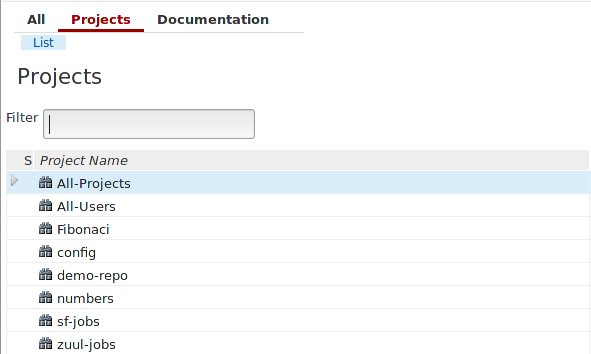
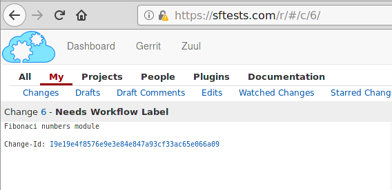

Zuul Hands on - part 6 - Cross project dependencies
---------------------------------------------------

:date: 2019-05-27
:category: blog
:authors: zcaplovi
:tags: zuul-hands-on-series

In this article, we will explain how Zuul permits users to specify dependencies across projects.

This article is part of the `Zuul hands-on series <{tag}zuul-hands-on-series>`_.

All examples and demo projects were done on the Software Factory sandbox (more about it in the `first article of the series <{filename}/blog-zuul-01-setup-sandbox.rst>`). 

To demonstrate how to establish a depenedency across projects we have created two projects (*Fibonaci*, having the module and *numbers* which has the Python code using the Fibonaci module). 

We have "populated" them with these files:
- fibo.py (a sample module for Fibonaci series from `python.org <https://docs.python.org/3/tutorial/modules.html>`_)
.. code-block:: python

  # Fibonacci numbers module

  def fib(n):    # write Fibonacci series up to n
      a, b = 0, 1
      while a < n:
          print(a, end=' ')
          a, b = b, a+b
      print()

  def fib2(n):   # return Fibonacci series up to n
      result = []
      a, b = 0, 1
      while a < n:
          result.append(a)
          a, b = b, a+b
      return result

- numbers.py (trivial Python code to print numbers from Fibonaci series lower than 500 using the module from fibo.py)

.. code-block:: python

  #! /usr/bin/python3
  import fibo

  numbers = fibo.fib(500)
  print (numbers)

Gerrit review was initiated for the file fibo.py from the *Fibonaci* project:

To ensure the dependency between the numbers.py and the module in fibo.py, we included the **Depends-On: <change-url>** in the footer of the commit message:

.. code-block:: git

  commit db5afc6ea3caf02aeb84fe4fff04e87216a91e80
  Author: Someone <someone@somewhere.com>
  Date:   Wed May 22 16:19:02 2019 +0200

  Print Fibonaci numbers lower than 500
   
  Depends-On: https://sftests.com/r/#/c/6/

The dependency can be seen also in Gerrit:

.. image:: images/zuul-hands-on-part7-dependency.png

More details about Cross-Project Testing and Cross-Project Dependencies can be found in the `Zuul CI documentation <https://zuul-ci.org/docs/zuul/user/gating.html#cross-project-dependencies>`_.
