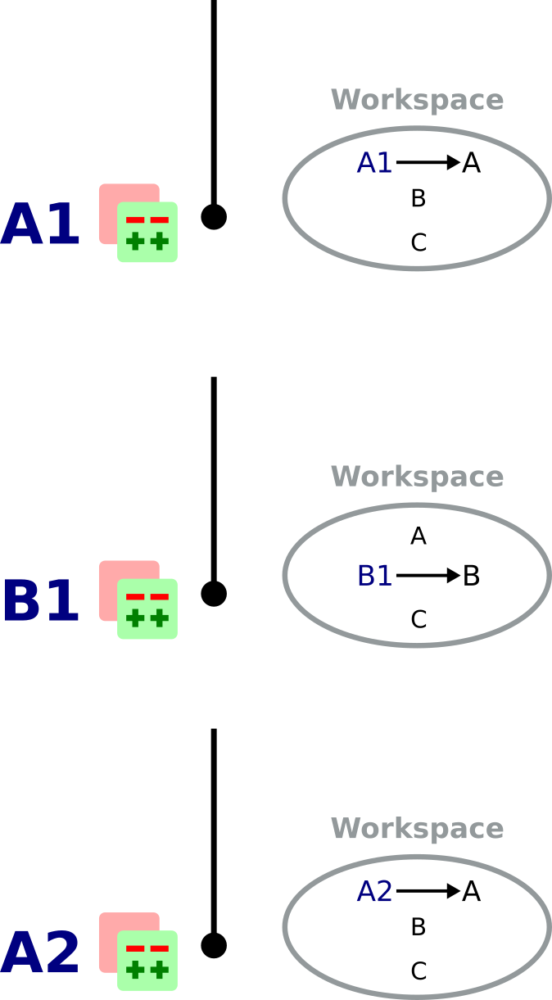
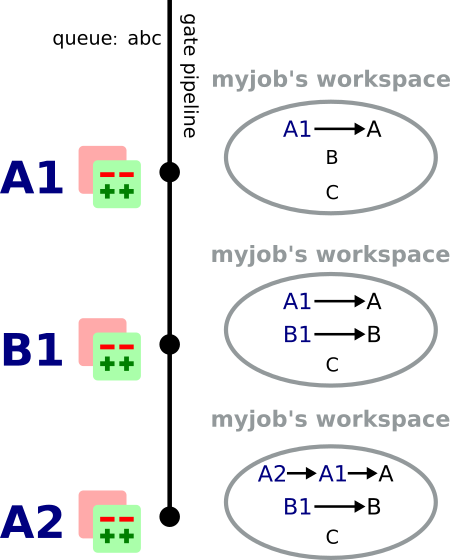
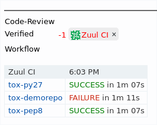
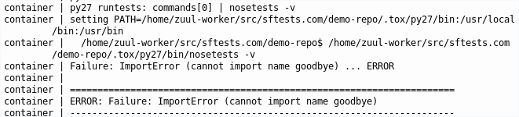

Zuul Hands on - part 6 - Cross project dependencies
---------------------------------------------------

:date: 2019-10-01
:category: blog
:authors: Zoltan Caplovi
:tags: zuul-hands-on-series

In this article, we will explain how project dependencies work in Zuul.

This article is part of the `Zuul hands-on series <{tag}zuul-hands-on-series>`_.

The examples and commands that follow are intended to be run on a Software Factory
sandbox where a **demo-repo** repository exists. You should have such an environment
after following the previous articles in this series:

- To deploy a Software Factory sandbox please read the `first article of the series <{filename}/blog-zuul-01-setup-sandbox.rst>`_.
- To create the **demo-repo** repository, please follow the sections `Clone the config repository <{filename}/blog-zuul-03-Gate-a-first-patch.rst#clone-the-config-repository>`_
  and `Define the demo-repo repository <{filename}/blog-zuul-03-Gate-a-first-patch.rst#define-the-demo-repo-repository>`_ sections.

Incidentally, most of the links reference *sftests.com* which is the default
domain of the sandbox. Make sure to adapt the links if necessary.

If you have already deployed a Software Factory sandbox and created a snapshot as
suggested, you can restore this snapshot in order to follow this article on a clean environment.
In that case make sure the virtual machine's time is correct post
restoration. If not fix it by running

.. code-block:: bash

  systemctl stop ntpd; ntpd -gq; systemctl start ntpd

The Case for Cross-Project Testing
..................................

Software tends to be less and less monolithic, and even before that trend took off
most software projects depended on third party libraries or external frameworks.
Even from an architectural standpoint, it isn't rare to see projects split into
functional subcomponents, like frontends, client libraries, or servers. And with
the advent of containerized applications and micro-services, it becomes more and
more complex to ensure that every cog in the system works well with the other.

Zuul was designed with dependency testing in mind, and can help a
development team make sure that changes to any subcomponents
won't break the whole project.

Zuul's Dependent Pipelines vs Independent Pipelines
...................................................

We've introduced the notion of pipelines in Zuul `in a previous article of the series <{filename}/blog-zuul-05-the-gate-pipeline.rst>`_.
It's time to explore the subject further and explain how pipelines can be
**Dependent** or **Independent**.

Shared workspaces
'''''''''''''''''

Zuul can be configured to incorporate branches (usually master but not necessarily)
of other projects into its workspace for a given job. This can be done with the
``required-projects`` stanza in a job definition, for example:

.. code:: yaml

  ---
  - job:
    name: sf-ci
    parent: base
    description: The sf ci tests
    post-run: playbooks/get-logs.yaml
    timeout: 10800
    required-projects:
      - software-factory/sf-ci
      - software-factory/sfinfo
    nodeset:
      nodes:
        - name: install-server
          label: cloud-centos-7

Whenever the job ``sf-ci`` is being run, Zuul will also pull the *sf-ci* and
*sfinfo* projects into the job's workspace. Of course, these projects need to
be known to Zuul through its tenants and projects configuration.

It is also possible to include other projects known to Zuul with the "`Depends-On`_"
stanza, as we will explain below. In that case, the jobs must handle the case where
such projects are present in the workspace.

Independent Pipelines
'''''''''''''''''''''

When a pipeline is **Independent**, changes that land in that pipeline are tested
independently from each other, meaning that the tests are not sharing a common
workspace during testing. This is fine when doing preliminary validation, like
in the **check** pipeline.

As an example, let's assume three projects A, B, C defined in Zuul; their **check** and **gate**
pipelines are configured to execute a job called *myjob* which requires A, B and C.

Let's also assume three patches landing in the check pipeline in the following order:

* A1 on project A
* B1 on project B
* A2 on project A

*myjob*'s respective workspaces will be:

In that case patches are tested independently and the builds can be run in parallel.

Dependent Pipelines
'''''''''''''''''''

When a pipeline is **Dependent**, it means that it can define **queues** to which
projects can be associated. All the patches of projects that belong to the same queue
are tested together, in their order of landing in the pipeline; it means that
they are included into each new workspace as patches get tested.Typically,
**gate**-type pipelines should be defined as dependent in order to catch
dependency problems before they get merged.

Let's now assume projects A, B and C belong to queue "abc" on the gate pipeline.
When patches A1, B1 and A2 land in the gate pipeline in that order, this is what
the respective workspaces for *myjob* will look like:

A **Dependent** pipeline will catch any problem introduced by incompatibilities
brought by new patches.

Depends-On
..........

What if a patch needs an unmerged dependency to pass the check pipeline? This
can happen, for example, when an incoming patch on a client library expects an
implementation of the server API that is still being reviewed. Independent pipelines
allow cross-dependency testing as well by using the **Depends-On** keyword. By
adding a line like::

    Depends-On: path/to/patch

In the commit message or the Pull Request's description, you can make Zuul aware
that a patch must be added to the workspace. Of course, this propagates to dependent
pipelines as well.

This is a very powerful feature that allows developers to work on several components
in parallel, regardless of how fast patches get merged. With any other CI system,
a developer would have to wait until the dependency gets merged before s.he can
get feedback on his/her patch from the CI!

Zuul's Depends-On supports GitHub or Pagure Pull Requests URIs, Gerrit review
URIs or Change-IDs, or any other git source defined in Zuul's configuration.

Let's test it
.............

We will set up two Python projects:

- demo-repo, the main project
- demo-lib, a module demo-repo needs

Provision the demo-repo source code
''''''''''''''''''''''''''''''''''''

As always, let's start with a fresh version of **demo-repo**. It is assumed that
this project already exists; if not `follow the instructions here <{filename}/blog-zuul-03-Gate-a-first-patch.rst#clone-the-config-repository>`_.

Clone **demo-repo** and provision it with `this demo code <{filename}/demo-codes/hoz-4-demo-repo.tgz>`_.

.. code-block:: bash

  git clone -c http.sslVerify=false https://sftests.com/r/demo-repo
  cd demo-repo
  git rm -r *
  git review -s # Enter admin as username
  tar -xzf /tmp/hoz-4-demo-repo.tgz -C .
  git add -A
  git commit -m"Initialize demo-repo project"
  git push gerrit

Define the demo-lib repository
'''''''''''''''''''''''''''''''

From your host, clone the config repository and configure **git review**:

.. code-block:: bash

  git clone -c http.sslVerify=false https://sftests.com/r/config
  cd config
  git review -s  # Enter admin as username

Edit the **resources/demo-project.yaml** file to add the "demo-lib" project:

.. code-block:: yaml

  resources:
    projects:
      demo-project:
        description: Demo project
        source-repositories:
          - demo-repo
          - demo-lib
    repos:
      demo-repo:
        description: A demo repository
        acl: demo-acl
      demo-lib:
        description: A dependency for the demo repository
        acl: demo-acl
    acls:
      demo-acl:
        file: |
          [access "refs/*"]
            read = group config-core
            owner = group config-ptl
          [access "refs/heads/*"]
            label-Code-Review = -2..+2 group config-core
            label-Code-Review = -2..+2 group config-ptl
            label-Verified = -2..+2 group config-ptl
            label-Workflow = -1..+1 group config-core
            label-Workflow = -1..+1 group config-ptl
            label-Workflow = -1..+0 group Registered Users
            submit = group config-ptl
            read = group config-core
            read = group Registered Users
          [access "refs/meta/config"]
            read = group config-core
            read = group Registered Users
          [receive]
            requireChangeId = true
          [submit]
            mergeContent = false
            action = merge if necessary
        groups:
          - config-ptl
          - config-core

Run **git review** to send the patch on Gerrit:

.. code-block:: bash

  git add resources/demo-project.yaml
  git commit -m"Add demo-lib repo"
  git review

As admin, approve the patch on sftests.com's Gerrit UI.

Once the changes have been applied, clone **demo-lib** and provision it with `this code <{filename}/demo-codes/hoz-7-demolib-repo.tgz>`_ .

.. code-block:: bash

  git clone -c http.sslVerify=false https://sftests.com/r/demo-lib
  cd demo-lib
  git rm -r *
  git review -s # Enter admin as username
  tar -xzf /tmp/hoz-4-demolib.tgz -C .
  git add -A
  git commit -m"Initialize demo-lib project"
  git push gerrit

Define initial CI on the projects
'''''''''''''''''''''''''''''''''

We will add some simple tox validation using the Zuul jobs library.

Create the following .zuul.yaml file in demo-lib and demo-repo:

.. code-block:: YAML

  - project:
      check:
        jobs:
          - tox-py27
          - tox-pep8
      gate:
        jobs:
          - tox-py27
          - tox-pep8

For each project, commit the file, create a review and approve it in Gerrit:

.. code-block:: bash

  git add -A
  git commit -m"Initialize CI"
  git review

Add the dependency relationship between demo-lib and demo-repo
''''''''''''''''''''''''''''''''''''''''''''''''''''''''''''''

Let's make the demo-repo project able to import the demolib module. In the
demo-repo project:

* Edit ``requirements.txt``:

.. code-block:: bash

  nose
  git+https://sftests.com/r/demo-lib.git

* Edit ``hello/hello.py``:

.. code-block:: python

  from demolib import hello

  class Hello():
      def run(self):
          return hello()

  if __name__ == "__main__":
      print(Hello().run())

Commit all, create a review, approve it in Gerrit:

.. code-block:: bash

  git add -A
  git commit -m"Import demolib"
  git review

Define a dependent job
''''''''''''''''''''''

Since we want demo-repo to depend on demo-lib, we want to make sure changes on
demo-lib will not break demo-repo. In our case, that means we want to run the unit
tests with tox on demo-repo whenever a new patch is submitted on demo-repo, **or**
on demo-lib.

In order to do this, let's add a new job definition in demo-repo's .zuul.yaml:

.. code-block:: YAML

  - job:
      name: tox-demorepo
      description: tox test for demo-repo with dependencies
      parent: tox-py27
      required-projects:
        - demo-repo
        - demo-lib
      vars:
        zuul_work_dir: "{{ zuul.projects['sftests.com/demo-repo'].src_dir }}"

  -project:
     check:
       jobs:
         - tox-demorepo
         - tox-pep8
     gate:
       jobs:
         - tox-demorepo
         - tox-pep8

Let's break the new job down a bit:

* **parent**: the job inherits from the existing ``tox-py27`` job. We can do this
  because the ``tox-*`` jobs from Zuul's library were written with dependency
  support in mind; we just have to specify which projects must be in the workspace.
* **required-projects**: this is simply the list of projects we must include in
  the workspace.
* **vars.zuul_work_dir**: we override Zuul's working directory, so that the tox
  tests are always run for demo-repo regardless of which project triggers this
  job. By default, ``zuul_work_dir`` would be the path to the project for which
  the job was triggered. We'll explain the new value below.

Commit all, and upload a review:

.. code-block:: bash

  git add -A
  git commit -m"Add dependent job"
  git review

Wait until the check pipeline completes, and let's take a closer look at what is
happening. First, let's have a look at the Ansible variables that were set by
Zuul for this job: go to https://sftests.com/zuul/t/local/builds and click on
the last successful build of tox-demorepo (it should in the first or second row
of the table), then click the log url and ``zuul-info``, then ``inventory.yaml``.
Have a look at the ``zuul`` object:

.. code-block:: YAML

  zuul:
    _inheritance_path:
    - '<Job base branches: None source: config/zuul.d/_jobs-base.yaml@master#3>'
    - '<Job unittests branches: None source: zuul-jobs/zuul.yaml@master#4>'
    - '<Job tox branches: None source: zuul-jobs/zuul.yaml@master#15>'
    - '<Job tox-py27 branches: None source: zuul-jobs/zuul.yaml@master#58>'
    - '<Job tox-demorepo branches: None source: demo-repo/.zuul.yaml@master#1>'
    - '<Job tox-demorepo branches: None source: demo-repo/.zuul.yaml@master#11>'
    branch: master
    build: fa9996bbdab64e69838d300c8ac0a58d
    buildset: 75fc274cc856422b92e5ac9f87b1ca7a
    change: '14'
    change_url: https://sftests.com/r/14
    child_jobs: []
    executor:
      hostname: managesf.sftests.com
      [...]
    items:
    - branch: master
      change: '14'
      change_url: https://sftests.com/r/14
      patchset: '1'
      project:
        canonical_hostname: sftests.com
        canonical_name: sftests.com/demo-repo
        name: demo-repo
        short_name: demo-repo
        src_dir: src/sftests.com/demo-repo
    job: tox-demorepo
    jobtags: []
    message: QWRkIGRlcGVuZGVudCBqb2IKCkNoYW5nZS1JZDogSTc0MWE5YjU2ZWIzYTcxYWIzNTBmOWU0OTczODgxN2FjZTg0NWM2NDEK
    patchset: '1'
    pipeline: check
    project:
      canonical_hostname: sftests.com
      canonical_name: sftests.com/demo-repo
      name: demo-repo
      short_name: demo-repo
      src_dir: src/sftests.com/demo-repo
    projects:
      sftests.com/demo-lib:
        canonical_hostname: sftests.com
        canonical_name: sftests.com/demo-lib
        checkout: master
        name: demo-lib
        required: true
        short_name: demo-lib
        src_dir: src/sftests.com/demo-lib
      sftests.com/demo-repo:
        canonical_hostname: sftests.com
        canonical_name: sftests.com/demo-repo
        checkout: master
        name: demo-repo
        required: true
        short_name: demo-repo
        src_dir: src/sftests.com/demo-repo
    ref: refs/changes/14/14/1
    resources: {}
    tenant: local
    timeout: 1800
    voting: true
  zuul_work_dir: '{{ zuul.projects[''sftests.com/demo-repo''].src_dir }}'

``zuul.projects`` is a dictionary of all the required projects we declared in the
job's definition. For each required project, the path to the checked out code is
in ``src_dir``. These variables are available at the job's level, meaning that
you can write your playbooks using these. This should also explain the specific
value we chose for ``zuul_work_dir``.

Finally, approve the change from Gerrit's UI.

Add tox-demorepo to demo-lib's CI
'''''''''''''''''''''''''''''''''

Edit .zuul.yaml in demo-lib:

.. code-block:: YAML

  - project:
      check:
        jobs:
          - tox-py27
          - tox-demorepo
          - tox-pep8
      gate:
        jobs:
          - tox-py27
          - tox-demorepo
          - tox-pep8

Note that here, we want to keep testing demo-lib as an isolated module; which is
why we're keeping the ``tox-py27`` job. Also, jobs are shared globally within a
Zuul project, which is why we can reuse tox-demorepo from demo-repo.

As usual, commit, review and approve on Gerrit:

.. code-block:: bash

  git add -A
  git commit -m"Add dependent job in demo-lib CI"
  git review

Scenario 1: Catch problems with dependencies early on
''''''''''''''''''''''''''''''''''''''''''''''''''''''

In this scenario we will create a patch on demo-lib that breaks demo-repo.

Create a new branch on demo-lib:

.. code-block:: bash

  git checkout -b uhoh

Edit demolib/__init__.py:

.. code-block:: Python

  def hello():
      return "Hello Dana"

Edit tests/test_demolib.py:

.. code-block:: Python

  import unittest

  from demolib import hello

  class TestHello(unittest.TestCase):
      def test_hello(self):
          self.assertEqual(hello(), 'Hello Dana')

Commit and upload for review:

.. code-block:: bash

  git add -A
  git commit -m"No Zuul, only Dana"
  git review

Wait a few minutes, and you should see the following CI results from the check
pipeline:

Even though this patch passes demo-lib's unit tests, we can see with ``tox-demorepo``
that this patch would break demo-repo at the current state of the master branch.

Scenario 2: using Depends-On
''''''''''''''''''''''''''''

In this scenario we will create a patch on demo-repo that requires another patch
on demo-lib.

First, let's add a function to demo-lib. Create a new branch on the demo-lib
repo:

.. code-block:: bash

  git checkout master && git pull origin master && git checkout -b goodbye

Edit demolib/__init__.py:

 .. code-block:: Python

   def hello():
       return "Hello Zuul"

   def goodbye():
       return "Bye Zuul"

Commit and upload for review:

.. code-block:: bash

   git add -A
   git commit -m"Bye Zuul"
   git review

We won't merge this yet. But take note of the URL of the patch in Gerrit; it
should be something like https://sftests.com/r/{patch_number} (in my case it is
https://sftests.com/r/17 )

Now let's create a patch in demo-repo to use our new function. Create a new
branch on demo-repo:

.. code-block:: bash

  git checkout master && git pull origin master && git checkout -b goodbye

Edit hello/hello.py:

.. code-block:: Python

  from demolib import hello, goodbye

  class Hello():
    def run(self):
        return hello()

    def bye(self):
        return goodbye()

  if __name__ == "__main__":
    print(Hello().run())

Commit and upload for review:

.. code-block:: bash

  git add -A
  git commit -m"Bye Zuul"
  git review

The check pipeline will return a failure, since we're using a version of
demo-lib that wasn't merged yet. Indeed, in the logs for the tox-demorepo job,
we see:

Let's amend our commit message to specify the unmerged dependency we need:

.. code-block:: bash

  git commit --amend

Add the line ``Depends-On: https://sftests.com/r/{patch_number}`` to the commit
message, where {patch_number} is the number of the unmerged patch on demo-lib.

Upload for review:

.. code-block:: bash

  git review

The check pipeline will show the dependency:

.. image:: images/hoz-7-check-Depends-On.gif

This time the tests pass; we effectively managed to validate a change before its
dependency was merged.

As exercises left to the reader:

* try and see what happens when you attempt to approve the patch on demo-repo
  without approving the dependency on demo-lib first;
* approve the patch on demo-lib then the one on demo-repo in rapid succession,
  and observe the gate pipeline.

Conclusion
..........

In this article we've learned how Zuul can handle dependencies between projects,
so that side effects can be detected early. It can also be used to speed up the
development of features, as patches can use unmerged dependencies in their
workspace:

* Dependencies can be declared at job level with the ``required-projects`` directive.
* Zuul also provides an ansible variable called zuul.projects which can be used
  in a playbook to perform actions on dependencies that were checked out by Zuul
  automatically, either at master, or any defined branch, or even on an unmerged
  patch.

You should know enough by now to set up your own dependency-aware CI with Zuul.
So happy testing !
